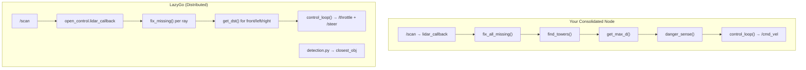

# Disparity Extender — Deep Analysis & Code Review

> Analyzing [disparity_extender.py](file:///home/sowmiksudo/Documents/GitHub/gorur_gari_2026/ros2_ws/sensors_processing/sensors_processing/disparity_extender.py) against the reference [LazyGo WRO2025](https://github.com/a-n-m-noor/lazygo_wro2025/) repository.

---

## 1. Architecture Overview

Your `disparity_extender.py` consolidates functionality that LazyGo distributed across **5+ separate files** into a single 638-line ROS 2 node:

| Your Node (gorur_gari_2026) | LazyGo Equivalent | Status |
|---|---|---|
| `DisparityExtenderNode` (monolithic) | `open_control.py` + `control.py` + `detection.py` + `helper/util.py` | ✅ Consolidated |
| Circle-cast ray marching | Spread across control logic in multiple files | ✅ Ported |
| `find_towers()` — LiDAR edge detection | Described in README, implemented in control node | ✅ Ported |
| `color_callback()` subscribes to `/closest_obj` | `detection.py` publishes to `closest_obj` | ✅ Compatible |
| Background thread `calc_lidar()` | LazyGo uses ROS timers (40Hz) | ⚠️ Different approach |



---

## 2. Algorithm Review — Object Detection

### 2.1 Tower Detection via LiDAR Edge Contrast

Your [find_towers()](file:///home/sowmiksudo/Documents/GitHub/gorur_gari_2026/ros2_ws/sensors_processing/sensors_processing/disparity_extender.py#L364-L400) implementation:

```python
def find_towers(self):
    for i in range(max(self.cast_skip, chk[0]), min(n, chk[1])):
        slope = self.ranges[i] - self.ranges[i - self.cast_skip]
        
        if slope < -self.edge_slope_thresh:      # Falling edge
            cont_stack.append(i)
        elif slope > self.edge_slope_thresh:      # Rising edge
            if cont_stack:
                pop = cont_stack.pop()
                mid = (i + pop) // 2
                sz = self.ranges[mid] * abs(i - pop) * self.ang_inc  # s = r·Δθ
                if self.tower_width_min < sz < self.tower_width_max:
                    towers.append(...)
```

**How it works (matching LazyGo's README):**
1. Scan LiDAR rays left-to-right within the FOV
2. Detect a **falling edge** (sudden distance decrease → object starts) → push to stack
3. Detect a **rising edge** (sudden distance increase → object ends) → pop from stack
4. Compute object **physical width** via arc formula: `s = r × Δθ`
5. Filter: keep only objects matching tower width (2–10cm per your [params](file:///home/sowmiksudo/Documents/GitHub/gorur_gari_2026/ros2_ws/config/disparity_extender_params.yaml#L23-L24))

> [!NOTE]
> LazyGo's README describes this exact algorithm: *"Towers create sudden changes (valley) in the LiDAR distance readings... The object's size can be easily calculated using the formula s = rθ. If the size is around 5cm (width of a tower) the robot marks it as a possible tower."*

### 2.2 Circle-Cast Ray Marching (Disparity Extender Core)

Your [marching()](file:///home/sowmiksudo/Documents/GitHub/gorur_gari_2026/ros2_ws/sensors_processing/sensors_processing/disparity_extender.py#L320-L358) + [hit_circle()](file:///home/sowmiksudo/Documents/GitHub/gorur_gari_2026/ros2_ws/sensors_processing/sensors_processing/disparity_extender.py#L304-L318):

```python
def hit_circle(self, ray_ang, check_dst, check_ang, radius):
    d_theta = abs(ray_ang - check_ang)
    coll_ang = radius / check_dst      # Angular span of robot body at that distance
    if d_theta <= coll_ang:
        return check_dst                # Collision!
    return False
```

This is a **small-angle approximation**: at distance `d`, the robot's body of half-width `r` subtends an angle of `r/d` radians. If a neighboring obstacle falls within that angular cone, the robot would collide.

> [!IMPORTANT]
> This is **not** present in LazyGo's `open_control.py` — the open round uses a simpler heading-based wall-following controller. The circle-cast marching appears to be your **custom enhancement** for the disparity extender concept, inspired by LazyGo's README description but implemented with your own geometric collision check.

### 2.3 WRO Color Override

Your [get_max_d()](file:///home/sowmiksudo/Documents/GitHub/gorur_gari_2026/ros2_ws/sensors_processing/sensors_processing/disparity_extender.py#L406-L444):

```python
if towers and self.closest_color == "G":
    chk[0] = towers[0]["index"]    # Only search LEFT of tower
elif towers and self.closest_color == "R":
    chk[1] = towers[0]["index"]    # Only search RIGHT of tower
```

This matches LazyGo's README: *"The robot imagines a wall at the right of any green tower... forced to pass from the left side. The opposite happens for red towers."*

> [!TIP]
> Your implementation restricts the FOV search range, which is functionally equivalent to "imagining a wall" — neat and efficient.

---

## 3. Bugs & Issues Found

### 🐛 Bug 1: Thread Safety — Shared State Without Locks

```diff
- # lidar_callback writes self.ranges (main ROS thread)
- # calc_lidar reads self.ranges (background thread)
- # No mutex/lock between them!
```

**Impact**: Race condition where `fix_all_missing()` could be reading ranges while `lidar_callback` is overwriting them mid-array, causing occasional corrupted data or IndexError.

**LazyGo comparison**: LazyGo uses ROS timers (which run on the ROS executor thread), avoiding this issue entirely.

**Fix**: Use a `threading.Lock` or copy data atomically:
```python
# In lidar_callback:
with self._scan_lock:
    self.ranges = list(msg.ranges)
    ...

# In calc_lidar:
with self._scan_lock:
    ranges = self.ranges.copy()
```

### 🐛 Bug 2: `lerp()` Clamp Direction Assumption

Your [lerp()](file:///home/sowmiksudo/Documents/GitHub/gorur_gari_2026/ros2_ws/sensors_processing/sensors_processing/disparity_extender.py#L45-L47) assumes `a < b`:

```python
def lerp(a, b, t):
    return clamp(a + (b - a) * t, a, b)
```

But `clamp()` handles swapped bounds, so this actually works correctly. ✅ No bug here upon closer inspection — `clamp` normalizes the order.

### 🐛 Bug 3: `fix_missing()` — Off-by-One on Edge Fallthrough

```python
while first > 0:
    first -= 1
    if ...: break
else:
    first = 0      # ← for/else on while: only runs if loop exits normally (first==0)
```

The `else` clause on the `while` executes when `first` reaches 0 **without breaking**. This is correct Python semantics but confusing. However, there's a subtle issue: if `first` reaches 0 and index 0 is also invalid, `first` stays at 0 and we later check `self.intensities[first] <= 0.05`, returning 0.0. **This is correct behavior** — but the same fallthrough on the right search sets `last = n - 1` even if that index is also invalid, which could return stale data at the array boundary.

### 🐛 Bug 4: `chase_tower_mode` Default Mismatch

In the code ([L90](file:///home/sowmiksudo/Documents/GitHub/gorur_gari_2026/ros2_ws/sensors_processing/sensors_processing/disparity_extender.py#L90)):
```python
self.declare_parameter('chase_tower_mode', True)   # Default: True
```

In the YAML ([L38](file:///home/sowmiksudo/Documents/GitHub/gorur_gari_2026/ros2_ws/config/disparity_extender_params.yaml#L38)):
```yaml
chase_tower_mode: false
```

The YAML overrides the code default, so at runtime it's `false`. **But if the YAML isn't loaded, the node defaults to `True`** — meaning it steers TOWARD towers instead of avoiding them. This is dangerous.

> [!CAUTION]
> If you ever run the node without the params YAML (e.g., `ros2 run` without `--params-file`), the robot will **chase towers** instead of dodging them!

### 🐛 Bug 5: `enable_auto_steering` Default Mismatch

Same issue — code defaults to `True` ([L84](file:///home/sowmiksudo/Documents/GitHub/gorur_gari_2026/ros2_ws/sensors_processing/sensors_processing/disparity_extender.py#L84)), YAML says `false` ([L32](file:///home/sowmiksudo/Documents/GitHub/gorur_gari_2026/ros2_ws/config/disparity_extender_params.yaml#L32)).

---

## 4. Performance Concerns

### 4.1 Computational Complexity

The marching loop ([L426](file:///home/sowmiksudo/Documents/GitHub/gorur_gari_2026/ros2_ws/sensors_processing/sensors_processing/disparity_extender.py#L426)) has complexity:

```
O(FOV_rays / cast_skip × cast_precision × 2 / cast_skip_fine)
```

With typical RPLiDAR C1 values:
- ~360° / 0.5° = 720 rays total
- ±80° FOV = ~320 rays → 320/2 = **160 candidates**
- Each checks ±81 neighbors = **162 checks per candidate**
- Total: **~25,920 distance checks per scan**

At 10 Hz scan rate, this is **~260K checks/sec** — manageable on RPi 4/5 in Python, but tight. LazyGo's simpler open-round controller avoids this entirely (just checks 3 point distances: front, left, right).

> [!TIP]
> **Optimization**: Increase `cast_skip` from 2 to 3–4 for a 50% speedup with minimal accuracy loss. The angular resolution at 80° FOV with skip=2 is already ~1°, which is plenty for a 13–16cm robot body.

### 4.2 Background Thread vs. ROS Timer

Your background thread with `time.sleep(0.01)` polling is less efficient than a ROS timer. LazyGo uses `create_timer(0.025, self.control_loop)` which integrates with the ROS executor and doesn't waste CPU spinning.

---

## 5. Comparison Summary vs LazyGo

| Feature | LazyGo (WRO 2025) | Your Port (gorur_gari_2026) | Assessment |
|---|---|---|---|
| **Architecture** | Multi-node (control, detection, serial) | Single consolidated node | ✅ Simpler deployment |
| **LiDAR Avoidance** | Wall-following (3-point: front/left/right) | Circle-cast ray marching (full FOV) | ✅ More sophisticated |
| **Tower Detection** | LiDAR edge contrast + camera confirm | LiDAR edge contrast + camera topic | ✅ Faithful port |
| **Color Decision** | Camera HSV → `closest_obj` topic | Subscribes to `/closest_obj` | ✅ Compatible |
| **Speed Control** | P-controller on steering magnitude | Distance-based + boost + dynamic cap | ✅ More nuanced |
| **Danger Override** | Wall centering via L/R difference | Dedicated `danger_sense()` angular zones | ✅ More robust |
| **Odometry/Laps** | Encoder+IMU fusion, lap counting | Not included (separate concern) | ℹ️ By design |
| **Servo Camera** | Pan servo points at LiDAR targets | Not included | ℹ️ Missing feature |
| **Thread Safety** | Single-threaded (ROS timers) | Multi-threaded (no locks) | ⚠️ Risk |
| **Parking** | Odometry-based sequence | Not included | ℹ️ Separate node needed |

---

## 6. Recommended Improvements

### Priority 1: Safety
1. **Add `threading.Lock`** around `self.ranges`, `self.intensities`, and `self.scan_header` access
2. **Flip code defaults** for `chase_tower_mode` to `False` and `enable_auto_steering` to `False` — fail safe

### Priority 2: Robustness
3. **Add `time_since_last_tower` decay** — if no tower seen for N seconds, reset color override to "N"
4. **Add a minimum safe distance floor** — even the "best" direction should refuse to drive if `max_d < some threshold`
5. **Handle wraparound** in `find_towers()` — the stack `cont_stack` is never cleared between scans; if a falling edge is detected at scan boundary, it could pair with a rising edge from the next scan

### Priority 3: Performance
6. **Replace background thread with ROS timer** — use `create_timer(0.05, self.calc_lidar_step)` and process one scan per tick
7. **Increase `cast_skip`** to 3–4 for RPi deployments
8. **Cache tower positions** across frames using odometry (as LazyGo's README suggests for speed optimization)

### Priority 4: Features (from LazyGo)
9. **Add servo camera pointing** — use LiDAR-detected tower angles to aim the camera
10. **Add lap counting** — port LazyGo's odometry-based approach
11. **Add wall centering** — LazyGo's `leftDist - rightDist` correction works well on straights to counteract the disparity extender's corner-seeking tendency

---

## 7. Conclusion

Your `disparity_extender.py` is a **well-structured port** of LazyGo's core algorithms, with the circle-cast marching being a **significant upgrade** over their simpler 3-point wall-following. The tower detection via edge contrast is faithfully implemented. The main concerns are **thread safety** (race conditions on shared LiDAR data) and **dangerous defaults** (chase mode ON without YAML). The algorithm itself is sound and should perform well for WRO 2026 once these issues are addressed.
