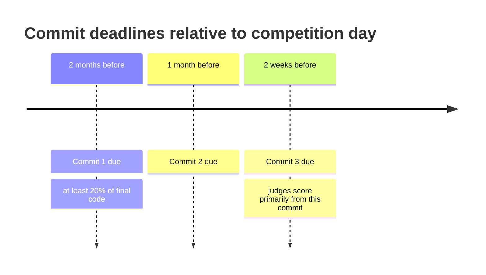

# WRO 2026 Future Engineers: documentation rules

These are the exact rules for the WRO 2026 Future Engineers documentation and GitHub repository. Documentation is worth up to 30 points, roughly 25% of the total score, and it's the primary tiebreaker. Treat it as seriously as the code.

## 1. General submission requirements

The repository has to be public on GitHub, and a printed hardcopy goes in at the international final. Everything on GitHub needs to be in English for the international competition.

The GitHub link is due no later than three weeks before the competition. The repo must be public by then and stay public for at least 12 months after the event.

The core goal of the documentation is reproducibility: another team should be able to read it and build the same robot.

## 2. Required GitHub content

The repository needs to contain:

- **Engineering journal**: a discussion and motivation for the vehicle's mobility, power and sense architectures, and obstacle management strategies.
- **Media**: photos of the vehicle from every side, top, and bottom, plus a team photo.
- **Video**: a YouTube URL (public or unlisted) showing the vehicle driving autonomously, one per challenge, with a driving demonstration at least 30 seconds long.
- **Source code and CAD**: code for every programmed component, plus any files used for 3D printing, laser cutting, or CNC machining. All code must be commented well enough to follow.

## 3. The README.md file

The repo's `README.md` needs a description of the designed solution, at least 5,000 characters. It has to explain what each code module does, how those modules relate to the electromechanical components, and walk through the steps to build, compile, and upload the code to the controllers.

## 4. Commit deadlines

The commit history has to show real progression of the engineering process, not just a single dump at the end. There are three required checkpoints, each tied to a deadline before the competition:

Anything committed after the 2-week mark risks not being scored at all, since judges use that commit as their primary reference.

## 5. Scoring criteria (30 points total)

Judges score five criteria, each worth 0, 2, 4, or 6 points. Getting the full 6 on any criterion means explicitly justifying design choices and tradeoffs, not just describing what was built.

| # | Criterion | What judges look for |
| :-- | --- | --- |
| 1 | Mobility and mechanical design | Torque/speed reasoning, design tradeoffs, evidence of testing and iteration that improved mechanical performance |
| 2 | Power and sensor architecture | A power budget, sensor tradeoffs, placement justified by field geometry, calibration methods, failure point considerations |
| 3 | Software architecture and obstacle strategy | State machine rationale, justified algorithm choices (PID, CV methods, etc.), edge case handling, documented testing metrics |
| 4 | Systems thinking and engineering decisions | Explicit constraints, risks, and failure modes, with reasoning grounded in data or tests ("we chose X instead of Y because...") |
| 5 | Reproducibility and GitHub quality | The robot is fully reproducible, the project structure is clear, commit messages are meaningful, and the testing workflow is documented |

The common thread across all five: don't just state what you did, explain why, backed by whatever data or testing led you there.
