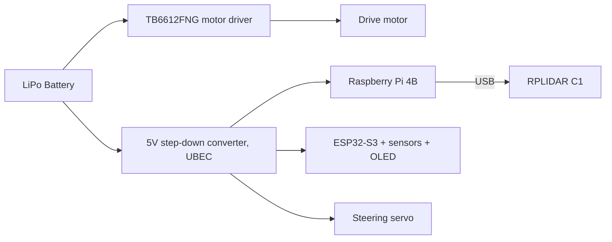
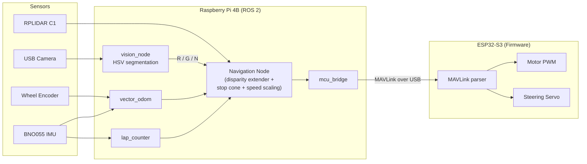

# Gorur Gari 2026 — Engineering Journal

This is the narrative companion to the [GitHub repository](https://github.com/muztahiddurjoy/gorur_gari_2026): the *why* behind the design in the code and CAD, not a restatement of it. The [`README`](./README.md) is the reference; this journal is the story of how we got there, organized around the five criteria the judges score against.

**For judges:** the appendix workflow gives 15–20 minutes per team — open the repo, scan this journal for the five headings below, check the evidence, score. The contents page points straight at each one; nothing here requires reading the whole document in order.

## Contents

1. [Mobility and Mechanical Design](#1-mobility-and-mechanical-design)
2. [Power and Sensor Architecture](#2-power-and-sensor-architecture)
3. [Software Architecture and Obstacle Strategy](#3-software-architecture-and-obstacle-strategy)
4. [Systems Thinking and Engineering Decisions](#4-systems-thinking-and-engineering-decisions)
5. [Reproducibility and GitHub Quality](#5-reproducibility-and-github-quality)
6. [Test Log](#6-test-log)
7. [Outstanding Artifacts](#7-outstanding-artifacts)

---

## 1. Mobility and Mechanical Design

**Full detail:** [`README.md § Mobility Management`](./README.md#mobility-and-mechanical-design) · **CAD:** [`cad_files/`](./cad_files/)

The car is a four-wheeled, rear-wheel-drive layout with front-wheel Ackermann steering — the layout rules 11.3–11.4 effectively require (no differential drive, no omni wheels, both rear wheels on one physically coupled axle). Reproducible from here: [`firmware/pin-map.md`](./firmware/pin-map.md) and [`firmware/include/config.h`](./firmware/include/config.h) fully specify how the drivetrain is driven.

### Drivetrain reasoning

- **Motor + gearbox**: a single DC gear motor through a **30:1 gearbox**, driven by a TB6612FNG at **20 kHz** PWM — above the audible range. This wasn't the first frequency we tried: at a lower, audible PWM frequency the motor whined constantly at low speed and delivered noticeably rougher torque exactly where the parking maneuver needs it to be smooth. Moving to 20 kHz fixed both in one change (see [`firmware/include/config.h`](./firmware/include/config.h)).
- **Steering**: a metal-gear micro servo with a **±60°** physical lock, firmware-clamped so no command from the navigation stack can exceed the mechanical limit regardless of what the software asks for. 90° is defined as straight ahead in firmware; the ROS side maps its normalized steering command onto that range.
- **Encoder placement**: the quadrature encoder sits on the motor shaft, *before* the gearbox — 11 pulses per revolution × 4 edges × the 30:1 ratio gives a nameplate **1320 counts per output-shaft revolution**, far more resolution than mounting it on the wheel would give.

### Testing that changed the design

- **PWM frequency**: chosen from a direct bench comparison (audible whine + rough low-speed torque vs. silent + smooth) — not a datasheet default.
- **Encoder calibration**: the nameplate figure of 1320 counts/rev did not survive contact with the actual tick stream. Measured against a marked wheel rotation, one wheel revolution reads **363 counts**, and a tape-measure distance test on top of that still showed a small residual error, corrected with a scale factor of **0.976**. This number now drives `vector_odom` (see [`ros2_ws/config/bot_config.yaml`](./ros2_ws/config/bot_config.yaml)), and it is why the wheel diameter is a launch parameter instead of a hardcoded constant — a millimeter of measurement error compounds into centimeters of homing error over three laps.
- **Encoder wiring**: A and B channels are deliberately wired opposite to the board's silkscreen. Wired "correctly", the decoder counted *down* while the car drove forward, which flipped the sign of every odometry distance. Swapping two physical pins in [`firmware/include/pins.h`](./firmware/include/pins.h) was the fix, chosen over negating the value in three separate places downstream — one wrong assumption fixed at the source instead of patched at every consumer.

### Torque and speed budget

| Parameter | Value | Source |
| :-- | :-- | :-- |
| Gearbox ratio | 30:1 | `ENCODER_COUNTS_PER_REV` comment, `firmware/include/config.h` |
| Encoder resolution (nameplate) | 1320 counts/rev | `firmware/include/config.h` |
| Encoder resolution (measured) | 363 counts/rev | bench calibration, see above |
| Cruise speed (straights) | 0.6 m/s | disparity extender speed scaling, `README.md` |
| Min speed (full steering lock) | 0.25 m/s | disparity extender speed scaling, `README.md` |
| Steering lock | ±60° | servo mechanical stop |
| Homing stop radius | 5 cm | competition requirement, `vector_odom` target |

`[NEEDS DATA]` — motor stall torque / no-load RPM at the operating voltage, and the resulting theoretical top speed and gradeability from the 30:1 ratio and wheel diameter, are not yet in this table. Pull them from the motor's datasheet or a bench stall-current/no-load-RPM test and add a row here; that reasoning is worth real points under this criterion.

---

## 2. Power and Sensor Architecture

**Full detail:** [`README.md § Power and Sense Management`](./README.md#power-and-sensor-architecture) · **Wiring:** [`circuit_diagram/`](./circuit_diagram/)

### Rail design and why

The drive motor draws directly off the battery through its own driver; everything digital sits behind a separate 5V regulator. That split is deliberate: when the motor stalls or the servo hits its end stop, the resulting current spike stays on the battery side of the converter instead of sagging the rail the Pi and ESP32 depend on to keep the control loop alive. This is a common cause of unexplained resets in battery-powered robots, and splitting the rails at design time is cheaper than debugging a brownout at the venue.

### Voltage distribution

| Component | Voltage supplied | Power source / converter |
| :-- | :-- | :-- |
| Raspberry Pi 4B | 5V | Step-down converter (UBEC) |
| RPLIDAR C1 | 5V | Raspberry Pi USB port |
| ESP32-S3 | 5V | Step-down converter (UBEC) |
| Steering servo | 5V | Step-down converter (UBEC) |
| Drive motor | Battery voltage | TB6612FNG, direct from battery |
| BNO055, OLED | 3.3V | ESP32-S3 board regulator |

### Sensor placement, justified by the mat geometry

- **RPLIDAR C1**: mounted centered over the chassis, high enough that the scan plane clears the walls' lip and the car's own wiring, but low enough to still intersect the 10 cm tall traffic pillars. Both constraints come directly from the mat's physical dimensions, not a default mounting height.
- **BNO055 IMU**: mounted flat, near the car's center of rotation — off-center placement would have cornering forces (centripetal acceleration) contaminate the heading estimate that `vector_odom` and `lap_counter` both depend on.
- **USB camera**: front-facing with a slight downward tilt so pillars fill more of the frame at the ranges the color decision actually needs to happen. Auto-focus is disabled via `v4l2-ctl` before every run — a lens hunting for focus mid-corner produces exactly the blurry frame the vision pipeline can least afford.
- **Wheel encoder**: pre-gearbox on the motor shaft (see §1) for resolution.
- **Sonar slots**: four HC-SR04 mounting points (front/rear/left/right) are wired and reserved but disabled in `config.h` — the LiDAR made them redundant for obstacle sensing, but the mounting points and header pins cost nothing to keep for a fallback sensor path.

### Calibration method

- **Encoder scale factor**: nameplate count → measured tick count over a marked wheel rotation → tape-measure distance check → correction factor (0.976), detailed in §1.
- **HSV color thresholds** (`vision_node`): tuned interactively at the venue with [`tune_hsv.py`](./ros2_ws/autonomy/autonomy/tune_hsv.py) rather than fixed in advance, because pillar color detection is sensitive to venue lighting. This is a repeatable procedure, not a one-time value: re-run it whenever the lighting changes.
- **Wheel diameter**: measured before each run rather than hardcoded, and passed as a launch parameter — see §1 for why.

### Known failure points

- **I2C bus lockups**: the BNO055 can take up to 650 ms to boot, and drive-motor electrical noise can hang the bus mid-run. Mitigated with a non-blocking retry loop that re-initializes the IMU/OLED in the background without stalling the control loop (see [`README.md § When things go wrong`](./README.md)).
- **Stale commands**: if the Pi stops publishing velocity, the firmware's idle timeout brings the car to a stop rather than continuing on the last known throttle.
- **Motor current spikes**: addressed structurally by the rail split above, rather than by software.

`[NEEDS DATA]` — a measured current draw per rail (idle and under load) and a resulting power/runtime budget against the LiPo's capacity are not yet recorded here. This is the single biggest "4 → 6" gap in this section per the rubric: measure current draw for the Pi+LiDAR rail, the ESP32+sensors+servo rail, and the motor under stall, and fill in the table below.

| Rail | Idle current | Peak/stall current | Measurement method |
| :-- | :-- | :-- | :-- |
| Pi 4B + RPLIDAR C1 | `[NEEDS DATA]` | `[NEEDS DATA]` | multimeter/USB power meter in series |
| ESP32-S3 + sensors + servo | `[NEEDS DATA]` | `[NEEDS DATA]` | multimeter in series on the UBEC output |
| Drive motor | `[NEEDS DATA]` | `[NEEDS DATA]` | multimeter/clamp meter, stall test |

---

## 3. Software Architecture and Obstacle Strategy

**Full detail:** [`README.md § Algorithm and Software`](./README.md#algorithm-and-software) · **Code:** [`ros2_ws/`](./ros2_ws/), [`firmware/`](./firmware/)

### Node graph

### State machine, with rationale

The open-round node is a five-state machine (`STANDBY → ARMING → RUNNING → HOMING → FINISHED`), detailed in [`README.md § Open Round`](./README.md). Two rationale points worth calling out here specifically:

- **`enable_auto_steering` defaults off.** A bare `ros2 run` of the navigation node physically cannot move the car. This exists because of one runaway bench test — the fix wasn't "be more careful," it was "make the unsafe state unreachable by default."
- **A single node owns the run clock.** `run_timer` subscribes to the state machine's transitions (not just its 1 Hz heartbeat) so the stopwatch starts within ~0.1 ms of the RUNNING transition instead of drifting up to a second late on the heartbeat alone. The microcontroller never computes time itself — it only formats a number it's handed — because a second clock source that can silently disagree with the first is worse than no redundancy at all.

### Algorithms, justified

- **Disparity extender** (obstacle avoidance): borrowed from F1TENTH, adapted to the WRO mat. Wherever two neighboring LiDAR rays disagree by more than 25 cm (a wall or pillar edge), the closer obstacle is extended sideways by half the car's width plus a safety margin, so any gap that still looks open after smearing is genuinely wide enough for the car. Chosen over a pure "steer at the farthest point" approach because the farthest point can sit directly behind an obstacle edge the car's body would clip.
- **Pillar detection**: pairs of range-jump edges 3–25 cm apart, closer than 2 m, are pillar candidates. The 2 m cutoff isn't arbitrary — beyond it, a 5 cm pillar is hit by too few LiDAR rays to measure reliably, so the algorithm declines to guess rather than act on noise.
- **Color decision**: LiDAR finds *where*, `vision_node`'s HSV segmentation finds *what color*, and the navigation node fuses the two — red passes right, green passes left. Small blobs are filtered out specifically so a red object off the mat (e.g. in the audience) can't steer the car.
- **Vector odometry**: see §1/§2 — direction from the IMU, distance from the encoder, fused into a running position vector used to drive home.

### Edge cases handled

- **Ambiguous/low-confidence color**: `N` (none) is a valid vision output and the navigation node has defined behavior for it, rather than assuming a color.
- **All-directions-blocked**: the stop cone (15 cm inside a 20° forward cone) halts the car rather than trusting an extrapolated "open" direction that the raw scan doesn't actually support.
- **Stale odometry / blocked homing path / overshoot**: the homing phase has explicit guards for each (see [`README.md`](./README.md)), rather than a single "drive to the vector and hope."
- **Static friction at launch**: `mcu_bridge` briefly doubles the throttle command for the first second from standstill to break static friction, then hands back to normal control — without it, low-speed starts sometimes just hummed in place.

`[NEEDS DATA]` — tuning metrics belong here: lap-completion consistency across N test runs, pillar-detection precision/recall or misdetection rate before/after an HSV re-tune, and homing accuracy (final distance from start, averaged over multiple runs). None of these exist yet as recorded numbers — see the [Test Log](#6-test-log) below, which is the place to start capturing them from here on.

---

## 4. Systems Thinking and Engineering Decisions

### Explicit constraints we designed around

- **Rules 11.3–11.4** (no differential drive, no omni wheels, coupled rear axle) fixed the drivetrain topology before any software was written.
- **No wireless in the competition build** (rules on remote control / autonomy): the RC mode is compiled out entirely at build time for competition firmware, not just disabled by a runtime flag — the `[env:esp32-s3-devkitc-1-rc]` build environment with `-D ENABLE_RC_CAR` is commented out of [`firmware/platformio.ini`](./firmware/platformio.ini) for the competition build. A runtime flag can be flipped by accident; a compile-time exclusion cannot.
- **Single start button, single clock, single navigation node active at a time**: `open_round_run` and `disparity_extender`/`custom_disparity_extender` are documented as mutually exclusive because both publish `/cmd_vel` and would fight over the wheel if run together.
- **Judge time budget**: this journal's own structure (rubric headings, contents page, criteria map in the README) is itself a systems decision — the constraint is a 15–20 minute read, so the documentation is organized for scanning, not narrative order.

### "We chose X instead of Y because [reason]"

| Decision | Alternative considered | Why we didn't take it |
| :-- | :-- | :-- |
| MAVLink 2 with CRC over the Pi↔ESP32 link | Plain text serial | Plain serial worked until the drive motor ran; electrical noise garbled characters, and a garbled steering command is a crashed car. A checksummed frame just gets dropped instead of obeyed. |
| Swap encoder A/B pins in firmware | Negate the odometry value in software | The wrong sign was one root cause; negating it downstream would have meant fixing it in three separate places instead of one. |
| 20 kHz motor PWM | Datasheet-typical lower PWM frequency | Audible whine and rough low-speed torque on the bench, both gone at 20 kHz. |
| Separate `run_timer` node that commands nothing | Timing embedded in the navigation node | Keeps a nice-to-have (the stopwatch) from ever being able to affect steering, even if it crashes. |
| Wheel diameter as a launch parameter | Hardcoded constant | A millimeter of measurement error compounds into centimeters of homing error over three laps; re-measuring per session is cheap insurance. |
| Interactive HSV tuner at the venue | Fixed color thresholds tuned once in the lab | Venue lighting is not lab lighting; a fixed threshold set in one room is a liability in another. |
| Reserved but unpopulated sonar mounts | No fallback sensor path | The LiDAR made sonar redundant for normal operation, but the mounting cost nothing and keeps a fallback path open if LiDAR coverage ever proves insufficient at a given venue. |

### Risk / failure-mode table

| Failure mode | Likelihood | Impact | Mitigation |
| :-- | :-- | :-- | :-- |
| I2C bus hang (IMU/OLED) from motor noise | Medium | High (loses heading) | Non-blocking background re-init loop; steering/throttle keep running while it recovers |
| Stale `/cmd_vel` (Pi-side node crash/hang) | Low | High (uncommanded motion) | Firmware idle timeout stops the car if commands stop arriving |
| Motor stall current sagging the logic rail | Medium | High (Pi/ESP32 brownout) | Separate battery-direct rail for the motor vs. regulated rail for logic (§2) |
| HSV thresholds wrong for venue lighting | High | Medium (misread pillar color) | On-site `tune_hsv.py` re-calibration procedure |
| Wheel diameter drift (tire wear, different wheel) | Low | Medium (homing error) | Diameter measured and set as a launch parameter each session |
| Two navigation nodes launched together | Low (procedural) | High (`/cmd_vel` conflict) | Documented as mutually exclusive in `README.md`/journal; not currently enforced in code |

`[NEEDS DATA]` — the "two navigation nodes launched together" row is currently a documentation-only mitigation, not a code-level guard (e.g., a mutex node or launch-file exclusivity check). Worth either fixing in code or noting explicitly as an accepted, documented risk.

### Iteration cycles

The repository's own commit history is the primary evidence for this — each of the "testing that changed the design" items in §1–§3 (PWM frequency, encoder calibration, encoder pin swap, MAVLink adoption) was a design that changed *because* of a specific test result, not a first-guess that happened to work. Continue recording each iteration in the [Test Log](#6-test-log) as it happens, so this section stays backed by dated evidence rather than being reconstructed from memory close to the deadline.

---

## 5. Reproducibility and GitHub Quality

### What's already in place

- **README ≥ 5000 characters**, in English, covering module breakdown, electromechanical mapping, and build/upload instructions (see [`README.md`](./README.md) and [`QUICKSTART.md`](./QUICKSTART.md)).
- **Config-driven tuning**: nearly all runtime behavior (wheel diameter, PID/steering gains, HSV thresholds, pillar size bounds, wall-hugging distance) lives in [`ros2_ws/config/bot_config.yaml`](./ros2_ws/config/bot_config.yaml) and `vision_params.yaml`, not buried as magic numbers in code — a judge (or a teammate) can see every tunable value in one file.
- **Bench-safe defaults**: every driving node has an enable flag that defaults to off, so cloning the repo and running a node cold cannot move the car.
- **A documented testing workflow**: RViz configs, a debug image topic, an interactive HSV tuner, a debug mode that runs full perception without sending drive commands, and [`lazysim`](./lazysim/) — a Gazebo simulation presenting the same ROS interface as the real robot, adapted from Team LazyGo's simulator ([`LazyGo_WRO2025`](https://github.com/A-N-M-Noor/LazyGo_WRO2025/)) and used for testing only.
- **Comments aimed at readers without ROS tooling**: source is plain, readable Python/C++ text (not a binary IDE project format), since judges may not have EV3/Spike/Scratch-equivalent tooling for this stack — it doesn't apply here, but the underlying requirement (code readable as text) is met by construction.

### Commit schedule this repository must hit

| When | What | Status |
| :-- | :-- | :-- |
| 2 months before the event | Commit 1: ≥1/5 of final code | `[TRACK]` |
| 1 month before the event | Commit 2 | `[TRACK]` |
| 3 weeks before the event | Repo link submitted to organizers | `[TRACK]` |
| 2 weeks before the event | Commit 3 — the commit judges score | `[TRACK]` |
| At the event | Hardcopy of this journal handed in | `[TRACK]` |
| +12 months after the event | Repo must still be public | `[TRACK]` |

Anything pushed after the 2-week commit may not count toward the score — treat that date, not the competition date, as the real deadline. Fill in actual target dates once the organizers announce them, and check each row off as it's done.

### Still to strengthen here

- **Meaningful, dated commit messages** rather than "update" / "fix stuff" — this is a habit, not a doc; the fastest way to secure this half of the criterion is to keep commit messages specific about *what changed and why* going forward.
- **Release notes / tags** at each of the three required commits, marking what stage of the build each one represents.

---

## 6. Test Log

Every tuning session, PID sweep, HSV re-calibration, or mechanical change belongs here, with what changed, what was measured, and what was kept — this is the only way to honestly claim numbers like "lap consistency improved from 60% to 85% over 20 runs" instead of reconstructing them from memory near the deadline. `[NEEDS DATA]` for every row below; start filling this in from the next bench session.

| Date | Subsystem | What changed | What we measured | Kept? |
| :-- | :-- | :-- | :-- | :-- |
| `[NEEDS DATA]` | | | | |

---

## 7. Outstanding Artifacts

Things the rules require that are not yet in this repository, and that no amount of documentation editing can substitute for:

- **CAD / STL / laser / CNC files** — [`cad_files/`](./cad_files/) currently exists but is empty.
- **Photos** — front, back, left, right, top, bottom, and a team photo. Referenced as placeholders in `README.md` under `./assets/`, but the `assets/` folder does not currently exist in the repository.
- **YouTube links** — one video per challenge (Open and Obstacle), each showing at least 30 seconds of actual autonomous driving, public or link-accessible. `README.md § Performance Videos` is currently a placeholder.
- **Current-draw / power-budget measurements** — see §2.
- **Quantified tuning metrics** (lap consistency, misdetection rate, homing accuracy) — see §3 and §6.
- **Hardcopy of this journal** — printed and brought to the international final as the offline fallback.

None of these can be produced from the existing code or documentation; they require the team to shoot photos/video, export CAD, and run and record real bench/field tests.
