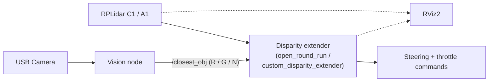
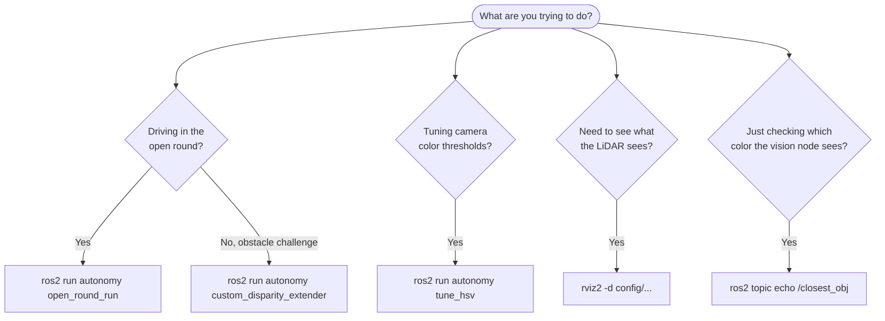

# Gorur Gari 2026 - ROS 2 Workspace Quick Start

This is a cheat sheet of the commands you'll actually run day to day: launching the driving nodes, bringing up visualization, and tuning the vision pipeline. Everything assumes you're on the robot (or a machine with the workspace built) and have sourced ROS 2 Humble.

## How the pieces fit together



The LiDAR feeds the disparity extender directly. The camera feeds a separate vision node, which just publishes the detected pillar color; the disparity extender reads that color to decide which side of an obstacle to pass on. RViz2 is optional and only used for visualization or debugging.

## Which command do I need?



---

## 1. Core autonomous driving and LiDAR

### Run the disparity extender navigation node

```bash
cd ~/Documents/GitHub/gorur_gari_2026/ros2_ws
source install/setup.bash
ros2 run sensors_processing disparity_extender --ros-args --params-file config/disparity_extender_params.yaml
```

### Visualize in RViz2

```bash
cd ~/Documents/GitHub/gorur_gari_2026/ros2_ws
source install/setup.bash
rviz2 -d config/disparity_view.rviz
```

### Launch the RPLidar (C1 / A1)

```bash
ros2 launch rplidar_ros rplidar_c1_launch.py
```

---

## 2. Vision node and debugging

### Disable camera auto-focus first

Auto-focus will drift the image mid-run, which throws off color detection. Set it explicitly before starting the vision node (adjust `/dev/video2` to your actual camera port):

```bash
v4l2-ctl -d /dev/video2 --set-ctrl=focus_automatic_continuous=0
v4l2-ctl -d /dev/video2 --set-ctrl=focus_absolute=0
```

### Launch the USB camera node

```bash
cd ~/Documents/GitHub/gorur_gari_2026/ros2_ws
source install/setup.bash
ros2 run usb_cam usb_cam_node_exe --ros-args -r __ns:=/camera -p video_device:=/dev/video2
```

### Run the vision processing node

```bash
cd ~/Documents/GitHub/gorur_gari_2026/ros2_ws
source install/setup.bash

# Default mode: publishes pillar detection to /closest_obj
ros2 run autonomy vision_node --ros-args --params-file config/vision_params.yaml

# Full debug mode: forces debug image publishing (costs more CPU)
ros2 run autonomy vision_node --ros-args --params-file config/vision_params.yaml -p efficient_mode:=false
```

---

## 3. Vision debugging and tuning tools

### Watch the detected pillar color

```bash
# 'R' for red, 'G' for green, 'N' for none
ros2 topic echo /closest_obj
```

### View the debug image stream

Shows the processed mask and bounding boxes on top of the camera feed:

```bash
ros2 run rqt_image_view rqt_image_view /vision/debug_image
```

### Interactive HSV color threshold tuner

There are three ways to run it, depending on what's convenient at the time:

```bash
# Option A: via ROS 2, from inside ros2_ws
cd ~/Documents/GitHub/gorur_gari_2026/ros2_ws
source install/setup.bash
ros2 run autonomy tune_hsv

# Option B: direct Python, from ros2_ws
cd ~/Documents/GitHub/gorur_gari_2026/ros2_ws
python3 autonomy/autonomy/tune_hsv.py --webcam 2

# Option C: direct Python, from the repository root
cd ~/Documents/GitHub/gorur_gari_2026
python3 draft_vision_node_pillar_color_detection/src/wro_autodrive/wro_autodrive/tune_hsv.py --webcam 2
```

---

## 4. Open round

### Visualize

```bash
cd ~/Documents/GitHub/gorur_gari_2026/ros2_ws
source /opt/ros/humble/setup.bash
source install/setup.bash
rviz2 -d config/open_round_view.rviz
```

### Run in debug mode

Starts without waiting for the physical start button and without sending steering commands, so you can watch the node's decisions before trusting it to drive:

```bash
cd ~/Documents/GitHub/gorur_gari_2026/ros2_ws
source /opt/ros/humble/setup.bash
source install/setup.bash

ros2 run autonomy open_round_run --ros-args \
  -p require_button_start:=false \
  -p enable_auto_steering:=false
```

---

## 5. Custom disparity extender (obstacle challenge)

Set `enable_drive:=false` for bench testing. This lets the node run its full perception and decision loop without ever sending a drive command, which is the safe way to check its behavior before putting the robot on the ground.

```bash
ros2 run autonomy custom_disparity_extender --ros-args \
    --params-file config/bot_config.yaml \
    -p enable_drive:=false
```
