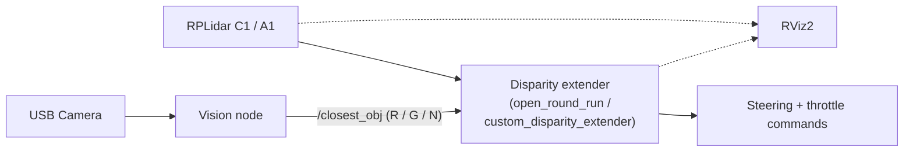
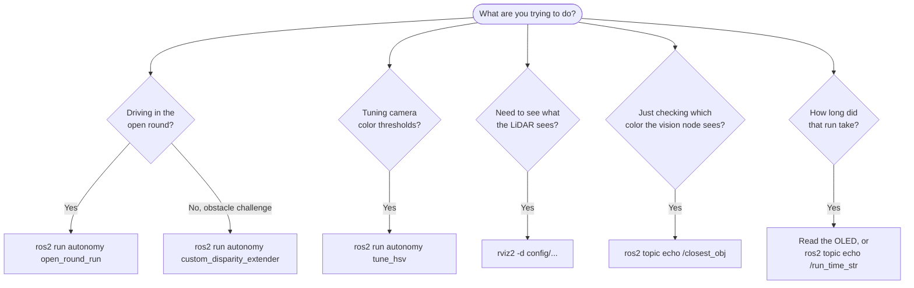

# Gorur Gari 2026 - ROS 2 Workspace Quick Start

This is a cheat sheet of the commands you'll actually run day to day: launching the driving nodes, bringing up visualization, and tuning the vision pipeline. Everything assumes you're on the robot (or a machine with the workspace built) and have sourced ROS 2 Humble.

## How the pieces fit together



The LiDAR feeds the disparity extender directly. The camera feeds a separate vision node, which just publishes the detected pillar color; the disparity extender reads that color to decide which side of an obstacle to pass on. RViz2 is optional and only used for visualization or debugging.

## Which command do I need?



---

## 0. Reading the status lights

Before reaching for a laptop, look at the two lights on the ESP32-S3. Between them they answer "is the Pi actually talking to the microcontroller, and is the car about to move".

The devkit's **onboard WS2812** (GPIO 48) carries the whole picture:

| Colour | Meaning | If that is not what you expect |
| --- | --- | --- |
| Red | No ROS 2 bridge has announced itself since the ESP32 booted | `mcu_bridge` is not running, or it never got the port — check `/dev/esp32_s3` |
| Green | Bridge connected, drivetrain idle | — |
| Flashing blue | Motor driving, steering near centre | If the car is meant to be stopped, something is still publishing `/cmd_vel` |
| Flashing purple | Motor driving with the wheels turned | Same, plus the steering is off centre |

The **plain LED** (GPIO 36) lights on the same connect message and blinks three times, once a second, after a start button press. Those blinks are the start delay the ROS 2 side holds the car still for, so the car starts moving the moment they stop.

Two things worth knowing before you debug the wrong end:

- The connect notice is sent **once**, about a second after `mcu_bridge` opens the port. If you reset the ESP32 while `mcu_bridge` is already running, both lights stay in the disconnected state until you restart the node.
- Nothing ever sends a *disconnect* notice, so if `mcu_bridge` dies the pixel stays green. Red means "never connected since boot", not "not connected right now".

---

## 1. Core autonomous driving and LiDAR

### Run the disparity extender navigation node

```bash
cd ~/Documents/GitHub/gorur_gari_2026/ros2_ws
source install/setup.bash
ros2 run sensors_processing disparity_extender --ros-args --params-file config/disparity_extender_params.yaml
```

### Visualize in RViz2

```bash
cd ~/Documents/GitHub/gorur_gari_2026/ros2_ws
source install/setup.bash
rviz2 -d config/disparity_view.rviz
```

### Launch the RPLidar (C1 / A1)

```bash
ros2 launch rplidar_ros rplidar_c1_launch.py
```

---

## 2. Vision node and debugging

### Disable camera auto-focus first

Auto-focus will drift the image mid-run, which throws off color detection. Set it explicitly before starting the vision node (adjust `/dev/video2` to your actual camera port):

```bash
v4l2-ctl -d /dev/video2 --set-ctrl=focus_automatic_continuous=0
v4l2-ctl -d /dev/video2 --set-ctrl=focus_absolute=0
```

### Launch the USB camera node

```bash
cd ~/Documents/GitHub/gorur_gari_2026/ros2_ws
source install/setup.bash
ros2 run usb_cam usb_cam_node_exe --ros-args -r __ns:=/camera -p video_device:=/dev/video2
```

### Run the vision processing node

```bash
cd ~/Documents/GitHub/gorur_gari_2026/ros2_ws
source install/setup.bash

# Default mode: publishes pillar detection to /closest_obj
ros2 run autonomy vision_node --ros-args --params-file config/vision_params.yaml

# Full debug mode: forces debug image publishing (costs more CPU)
ros2 run autonomy vision_node --ros-args --params-file config/vision_params.yaml -p efficient_mode:=false
```

---

## 3. Vision debugging and tuning tools

### Watch the detected pillar color

```bash
# 'R' for red, 'G' for green, 'N' for none
ros2 topic echo /closest_obj
```

### View the debug image stream

Shows the processed mask and bounding boxes on top of the camera feed:

```bash
ros2 run rqt_image_view rqt_image_view /vision/debug_image
```

### Interactive HSV color threshold tuner

There are three ways to run it, depending on what's convenient at the time:

```bash
# Option A: via ROS 2, from inside ros2_ws
cd ~/Documents/GitHub/gorur_gari_2026/ros2_ws
source install/setup.bash
ros2 run autonomy tune_hsv

# Option B: direct Python, from ros2_ws
cd ~/Documents/GitHub/gorur_gari_2026/ros2_ws
python3 autonomy/autonomy/tune_hsv.py --webcam 2

# Option C: direct Python, from the repository root
cd ~/Documents/GitHub/gorur_gari_2026
python3 draft_vision_node_pillar_color_detection/src/wro_autodrive/wro_autodrive/tune_hsv.py --webcam 2
```

---

## 4. Open round

### Visualize

```bash
cd ~/Documents/GitHub/gorur_gari_2026/ros2_ws
source /opt/ros/humble/setup.bash
source install/setup.bash
rviz2 -d config/open_round_view.rviz
```

### Run in debug mode

Starts without waiting for the physical start button and without sending steering commands, so you can watch the node's decisions before trusting it to drive:

```bash
cd ~/Documents/GitHub/gorur_gari_2026/ros2_ws
source /opt/ros/humble/setup.bash
source install/setup.bash

ros2 run autonomy open_round_run --ros-args \
  -p require_button_start:=false \
  -p enable_auto_steering:=false
```

The run stopwatch follows this node's state machine — see [section 7](#7-timing-a-run).

---

## 5. Custom disparity extender (obstacle challenge)

Set `enable_drive:=false` for bench testing. This lets the node run its full perception and decision loop without ever sending a drive command, which is the safe way to check its behavior before putting the robot on the ground.

```bash
ros2 run autonomy custom_disparity_extender --ros-args \
    --params-file config/bot_config.yaml \
    -p enable_drive:=false
```

---

## 6. Running it in simulation (testing only)

`lazysim` runs the whole stack against a simulated car, which is handy when the real one isn't on the bench. It is adapted from **Team LazyGo**'s simulator ([`LazyGo_WRO2025`](https://github.com/A-N-M-Noor/LazyGo_WRO2025/)) and is **for testing and development purposes only** — it never takes part in a competition run.

```bash
cd ~/Documents/GitHub/gorur_gari_2026
colcon build --base-paths lazysim ros2_ws \
             --build-base ros2_ws/build --install-base ros2_ws/install \
             --symlink-install
source ros2_ws/install/setup.bash

ros2 launch lazysim open_round_sim.launch.py        # three laps, then home
ros2 launch lazysim obstacle_round_sim.launch.py    # with traffic pillars
ros2 launch lazysim sim.launch.py                   # simulator only, drive it yourself
```

There is no physical start button in sim, so trigger it over a service call:

```bash
ros2 service call /lazybot/press_start std_srvs/srv/Trigger
```

Full details, launch arguments, and the list of what is and isn't modeled are in [`lazysim/README.md`](./lazysim/README.md).

---

## 7. Timing a run

The open round launch file starts `run_timer` for you, and the run time shows up on the car's OLED as the bottom line — nothing to run, nothing to press. This section is for when you want the number somewhere other than the display.

### Watch the clock from a laptop

```bash
# MM:SS.d, updated ten times a second
ros2 topic echo /run_time_str

# IDLE before the run, RUNNING during it, STOPPED once the car parks
ros2 topic echo /run_timer_state

# elapsed seconds, if you want to plot or record it
ros2 topic echo /run_time
```

### Run the stopwatch on its own

Useful when you started the driving node by hand instead of through the launch file:

```bash
cd ~/Documents/GitHub/gorur_gari_2026/ros2_ws
source install/setup.bash
ros2 run autonomy run_timer --ros-args --params-file config/bot_config.yaml
```

It only measures — it publishes no drive command at all — so it is safe to start and stop at any point, including mid-run.

### Reading the OLED line

| Line | What it means |
| --- | --- |
| `Time --:--.-` | No run yet, or the timer was re-armed for the next one |
| `Time 01:23.4` | Running |
| `Time 01:23.4 ?` | The ROS 2 side stopped sending — the number is the last one received, not the current time |
| `Time 01:23.4 END` | The run is over; this is the final time |

A `?` means look at the Pi, not the car: either `run_timer` or `mcu_bridge` has stopped. The car itself is unaffected — the clock is display-only and no driving code reads it.

### Timing something other than the open round

`run_timer` follows a state topic, and which states start and stop it are parameters. To point it at a different state machine:

```bash
ros2 run autonomy run_timer --ros-args \
  -p state_topic:=/some_other/state \
  -p start_states:="['RUNNING']" \
  -p stop_states:="['FINISHED']" \
  -p reset_states:="['STANDBY']"
```

Anything not named in one of those three lists leaves the clock alone, which is how `HOMING` keeps counting without being mentioned. Note that `disparity_extender` (obstacle round) does not publish a state topic yet, so the obstacle round is not timed — see [`run_timer.md`](./ros2_ws/autonomy/docs/run_timer.md).
