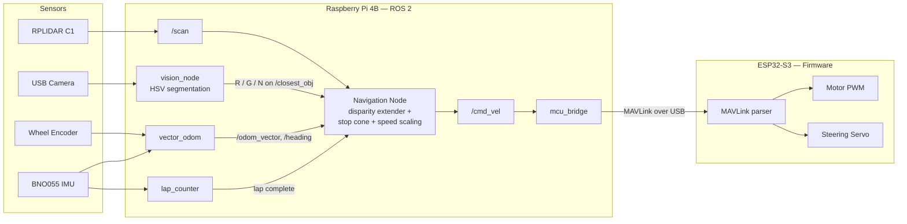
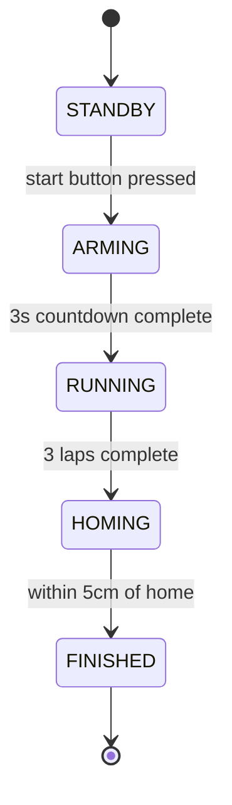
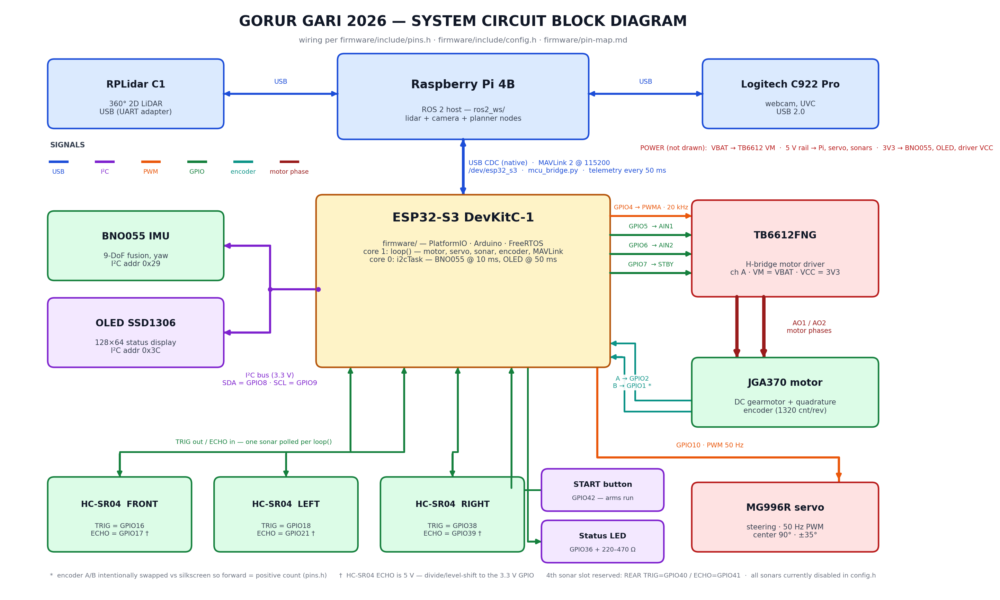

<div align="center">
  
  <!-- Placeholder: add a team banner image at assets/banner.png -->
</div>

**Team Gorur Gari** is a robotics team from Bangladesh, competing in the **Future Engineers** category of the **World Robot Olympiad 2026**. The name means "cow cart" in Bengali. We thought it would be funny to give the most stubbornly traditional vehicle imaginable a LiDAR and teach it to drive itself.

Our car runs a full **ROS 2** stack on a Raspberry Pi, talks to an ESP32-S3 over **MAVLink**, and navigates with a 360-degree LiDAR. If you only have a few minutes, the most interesting parts are probably our [Vector Odometry](#odometry-and-returning-home), the [Disparity Extender](#avoidance-using-lidar) we use for obstacle avoidance, and the way we [detect the traffic pillars with LiDAR and confirm their color with a camera](#obstacle-round).

This repository contains all the code, wiring diagrams, documentation, photos, and everything else about our team and the robot.

## Table of Contents

- [`Team Introduction`](#team-introduction)
- [`Mission Overview for WRO Future Engineers Rounds`](#mission-overview-for-wro-future-engineers-rounds)
- [`Performance Videos`](#performance-videos)
- [`Repository`](#repository)
- [`Key Features`](#key-features)
- [`Components and Hardware`](#components-and-hardware)
- [`Algorithm and Software`](#algorithm-and-software)
- [`Mobility Management`](#mobility-management)
- [`Power and Sense Management`](#power-and-sense-management)
- [`Getting It Running`](#getting-it-running)

## Team Introduction

<!-- Placeholder: add member photos to the assets folder and fill in the details below -->

<table>
  <tr>
    <td width="33%" align="center">
      <br>
      <strong>Dipanjan Roy Dipro</strong><br>
      Mechanical and CAD Design<br>
      <a href="mailto:member1@example.com">[email address]</a>
    </td>
    <td width="33%" align="center">
      <br>
      <strong>Muztahid Rahman</strong><br>
      ROS2, ESP32 Firmware and Electronics<br>
      <a href="mailto:member2@example.com">[email address]</a>
    </td>
    <td width="33%" align="center">
      <br>
      <strong>Shayer Mahmud Sowmik</strong><br>
      Vision and Navigation Algorithm<br>
      <a href="mailto:member3@example.com">[email address]</a>
    </td>
  </tr>
</table>

## Mission Overview for WRO Future Engineers Rounds

<table>
  <tr>
    <td width="50%" valign="top" align="center"><h3>Round 1: Open Challenge</h3></td>
    <td width="50%" valign="top" align="center"><h3>Round 2: Obstacle Challenge</h3></td>
  </tr>
  <tr>
    <td valign="top">The car has to complete three full laps around the track on its own. The inner walls are placed randomly before the run, so the width of the driving corridor changes from round to round and nothing can be hard-coded. After the third lap the car has to stop where it started.</td>
    <td valign="top">Same track, but now red and green traffic pillars are scattered along the way. The car must pass <strong>red pillars on the right</strong> and <strong>green pillars on the left</strong>, without knocking any of them over, and finish with a parallel parking maneuver in the marked parking zone.</td>
  </tr>
</table>

Both rounds start the same way: the judge says go, we press the start button on the car, and from that moment on nobody touches it.

## Performance Videos

Coming soon...

## Repository

This repository includes all the files, designs, and code for our WRO 2026 robot.

### File Structure

Here's a breakdown of the project folders:

- **[`firmware`](./firmware/)**: PlatformIO project for the ESP32-S3. Handles the motor, steering servo, encoder, IMU, OLED display, and the MAVLink serial link — everything that has to happen in real time.
- **[`ros2_ws`](./ros2_ws/)**: The ROS 2 workspace that runs on the Raspberry Pi. Contains our three packages — `controls`, `autonomy`, and `sensors_processing` — plus launch files and tuning configs.
- **[`mav_msg`](./mav_msg/)**: The MAVLink message definitions (XML) shared between the Pi and the microcontroller, so both sides always agree on what the bytes mean.
- **[`circuit_diagram`](./circuit_diagram/)**: Wiring diagrams and the ESP32 pin map, plus the script that generates them.
- **[`QUICKSTART.md`](./QUICKSTART.md)**: Copy-paste commands for running and debugging each part of the stack.
- **[`WRO_2026_Rules_Summary.md`](./WRO_2026_Rules_Summary.md)**: Our condensed version of the rulebook.

<!-- Placeholder: add t-photos (team photos) and v-photos (vehicle photos from all six sides) folders before submission -->

## Key Features

- **`Two-brain architecture`**: A Raspberry Pi does the thinking (LiDAR, camera, path planning) while an ESP32-S3 does the doing (motor PWM, servo, encoder counting). Neither one can block the other.
- **`MAVLink instead of raw serial`**: Every packet between the Pi and the microcontroller carries a CRC checksum, so electrical noise from the motor can corrupt a byte without ever corrupting a steering command.
- **`Vector odometry homing`**: The car remembers where it started and drives back to that exact spot after three laps, instead of just reversing for a fixed time and hoping.
- **`LiDAR-first perception`**: Walls, gaps, and even the traffic pillars are found in the laser scan. The camera only answers one question: is that pillar red or green?
- **`Self-healing I2C bus`**: If motor noise knocks the IMU or the display off the I2C bus, the firmware quietly re-initializes them without ever stalling the control loop.
- **`Removable RC mode for testing`**: A compile-time flag turns the car into a WiFi RC car with a web joystick, which made chassis testing painless. It is fully compiled out of the competition build, where all wireless stays off.

## Components and Hardware

<!-- Placeholder: add component photos to the assets folder and fill in the prices -->

<table>
  <thead>
    <tr>
      <th>Image</th>
      <th>Component</th>
      <th>Role / Function</th>
    </tr>
  </thead>
  <tbody>
    <tr>
      <td><div align="center"></div></td>
      <td>Raspberry Pi 4B</td>
      <td>High-level processing: ROS 2 Humble, LiDAR processing, vision, and path planning.</td>
    </tr>
    <tr>
      <td><div align="center"></div></td>
      <td>ESP32-S3 DevKitC-1</td>
      <td>Real-time control: motor PWM, steering servo, encoder counting, IMU reading, start button, status LED, and OLED display.</td>
    </tr>
    <tr>
      <td><div align="center"></div></td>
      <td>RPLIDAR C1</td>
      <td>360-degree laser scanner. Our primary sensor for walls, gaps, and pillar detection.</td>
    </tr>
    <tr>
      <td><div align="center"></div></td>
      <td>Bosch BNO055 IMU</td>
      <td>Absolute heading. Its onboard sensor fusion gives us a stable yaw angle without us having to filter raw gyro data ourselves.</td>
    </tr>
    <tr>
      <td><div align="center"></div></td>
      <td>USB HD Camera</td>
      <td>Tells red pillars from green ones. Auto-focus is disabled in software so the image stays sharp while the car moves.</td>
    </tr>
    <tr>
      <td><div align="center"></div></td>
      <td>DC gear motor with quadrature encoder</td>
      <td>Drives the rear axle. The encoder on the motor shaft is what makes our odometry possible.</td>
    </tr>
    <tr>
      <td><div align="center"></div></td>
      <td>TB6612FNG motor driver</td>
      <td>H-bridge between the microcontroller and the drive motor.</td>
    </tr>
    <tr>
      <td><div align="center"></div></td>
      <td>Metal-gear micro servo</td>
      <td>Turns the front wheels through the Ackermann steering linkage.</td>
    </tr>
    <tr>
      <td><div align="center"></div></td>
      <td>SSD1306 0.96" OLED display</td>
      <td>Shows live status on the car itself, invaluable when there is no laptop connected.</td>
    </tr>
    <tr>
      <td><div align="center"></div></td>
      <td>LiPo battery</td>
      <td>Main power source. [Placeholder: cell count and capacity]</td>
    </tr>
    <tr>
      <td><div align="center"></div></td>
      <td>5V step-down converter (UBEC)</td>
      <td>Regulates battery voltage down to a clean 5V rail for the Pi and the electronics.</td>
    </tr>
  </tbody>
</table>

## Algorithm and Software

ROS 2 underpins our whole control system, letting us split the problem into small nodes that each do one thing. Here is the short version of how sensor data becomes a steering command:



### Two brains, one car

The Raspberry Pi and the ESP32-S3 talk over a native USB serial link using the **MAVLink 2** protocol, with message definitions we wrote ourselves (in [`mav_msg`](./mav_msg/)). We started with plain text serial, and it worked — until the drive motor was running. Electrical noise would occasionally garble a character, and a garbled steering command is a crashed car. MAVLink frames carry a 16-bit checksum, so a corrupted packet is simply dropped instead of obeyed.

One hard-earned lesson lives in [`platformio.ini`](./firmware/platformio.ini): the Arduino core on the ESP32 logs I2C errors to the same serial port the MAVLink frames go out on. A single stray log line in the middle of a packet was enough to desync the parser on the Pi side, so the competition build silences the core logs entirely and sends our own debug output to a separate UART.

### Odometry and returning home

The rules say the car must stop where it started. Instead of guessing with timers, `vector_odom` fuses two signals:

- **Distance**: from the wheel encoder
- **Direction**: from the BNO055's absolute heading

Each encoder tick is turned into a small displacement vector pointing in the current heading direction, and all the vectors are summed up. At any moment the car knows its position as one straight-line vector from the start point. After the third lap, `open_round_run` simply drives that vector backwards until the car is within **5 cm** of home.

Calibrating this taught us not to trust datasheets. On paper, the encoder gives 1320 counts per revolution. Measured at the actual tick stream, one wheel revolution is **363 counts**, and even then a tape-measure test showed a small residual error we correct with a scale factor of 0.976. Measure everything.

### Open Round

The open round node is a state machine with five states:



- **STANDBY**: Everything is initialized and the LiDAR is spinning, but the node publishes zero velocity. A config flag (`enable_auto_steering`) defaults to *off*, so the car physically cannot move from a bare `ros2 run`. This is a safety habit we picked up after one runaway test.
- **ARMING**: Pressing the start button begins a 3-second countdown while the status LED blinks once per second.
- **RUNNING**: The car drives its laps steering toward open space (see the disparity extender below), with a **wall-hugging correction** layered on top. A proportional controller nudges the heading to hold about 35 cm from the outer wall on straights, limited to a 12-degree trim so it can never fight the main steering.
- **HOMING**: Lap counting is done by `lap_counter`, which watches the IMU heading and counts 90-degree corners. Once three laps are in, the node computes the vector back to the start point and drives it, slowing down over the last 60 cm.
- **FINISHED**: The car stops and keeps republishing zero velocity so the microcontroller can never latch onto a stale throttle command.

One small but important trick: when the car starts from standstill, `mcu_bridge` briefly doubles the throttle command for the first second (a "launch boost") to break static friction. Then it hands control back to the normal command. Without it, low-speed starts would sometimes just hum in place.

### Avoidance using LiDAR

For navigation we use a **disparity extender**: an idea borrowed from F1TENTH racing, tuned for the WRO mat. The intuition is simple: the LiDAR sees a gap, but the car is not a point. It has width. So wherever two neighboring LiDAR rays disagree by more than 25 cm (an "edge", the corner of a wall or a pillar), we extend the closer obstacle sideways in the scan by half the car's width plus a safety margin. After this smearing, any gap that still looks open is *genuinely* open for a car of our size, and we simply steer toward the deepest one.

Two extra guards sit on top:

- A **stop cone**: if anything shows up within 15 cm inside a 20-degree cone dead ahead, the car stops rather than trusting the math.
- **Speed scaling**: the commanded speed drops with the steering angle. From 0.6 m/s on straights down to 0.25 m/s at full lock, so the car never carries straight-line speed into a tight turn.

### Obstacle Round

The traffic pillars are only 5 cm wide, which makes them a distinctive shape in a laser scan. The detector looks for pairs of edges (sudden range jumps) and measures the width of the segment between them. Anything between **3 cm and 25 cm** wide, closer than 2 m, is a pillar candidate. Beyond 2 m, a 5 cm pillar is hit by so few rays it cannot be measured reliably, so we don't try.

The LiDAR tells us *where* the pillar is, but not its color. That's the camera's whole job: `vision_node` segments the image in HSV space and publishes a single character — `R`, `G`, or `N` for nothing — on `/closest_obj`. The navigation node combines the two: red pillar means pass on the right, green means pass on the left. Tiny blobs are ignored so a red banner in the audience cannot steer the car.

Color thresholds shift with venue lighting, so we wrote [`tune_hsv.py`](./ros2_ws/autonomy/autonomy/tune_hsv.py), an interactive tool with sliders that lets us re-tune the HSV ranges at the venue in a couple of minutes.

### Debugging tools

A few things that saved us many hours:

- **RViz configs** ([`ros2_ws/config`](./ros2_ws/config/)): visualize the scan, the detected pillars, and the chosen steering direction live.
- **A debug image topic** from the vision node: showing exactly what the camera thinks is a pillar, bounding boxes and all.
- **The OLED display** on the car: showing status without a laptop.
- **The removable RC mode**: for driving the chassis around by hand during mechanical testing.

## Mobility Management

### The chassis

The car is a four-wheeled, rear-wheel-drive design with front-wheel Ackermann steering. This is the same layout as a real car, and the layout the rules effectively require (no differential drive, no omni wheels, both rear wheels on one physically coupled axle).

| Parameter | Value |
| :--- | :--- |
| Length | 210 mm |
| Width | 120 mm |
| Height | [Placeholder] |
| Weight | [Placeholder] |

<!-- Placeholder: add chassis/CAD photos here -->

### Drive motor and gearbox

A single DC gear motor drives the rear axle. We drive it through the TB6612FNG at a **20 kHz PWM frequency** (above the audible range), which got rid of the annoying motor whine at low speeds and noticeably smoothed out low-speed torque, which matters for the parking maneuver.

The quadrature encoder sits on the motor shaft, before the gearbox, so it gets multiple counts per degree of wheel rotation — plenty of resolution for odometry.

One detail worth confessing: the encoder's A and B channels are wired *opposite* to the board's silkscreen. On purpose. Wired "correctly", the decoder counted down when the car drove forward, which flipped the sign of every distance in the odometry. Swapping the pins in [`pins.h`](./firmware/include/pins.h) was cleaner than negating values in three different places.

### Steering

A metal-gear micro servo drives the front steering linkage, with a physical lock of about **60 degrees to each side**. The firmware treats 90 degrees as straight ahead. The ROS side maps the normalized steering command onto that range. Software clamps guarantee the servo can never be commanded past its mechanical limits, no matter what the navigation node asks for.

The drive wheel diameter is deliberately a launch parameter rather than a constant — we measure the wheels before a run, because a millimeter of error in diameter compounds into centimeters of odometry error over three laps.

## Power and Sense Management

### Power distribution

Everything runs off a single LiPo battery, split into separate rails so the noisy loads cannot brown out the sensitive ones:

```
[ LiPo Battery ]
      ├──> TB6612FNG motor driver ──> drive motor
      └──> 5V step-down converter (UBEC)
                ├──> Raspberry Pi 4B ──USB──> RPLIDAR C1
                ├──> ESP32-S3 + sensors + OLED
                └──> steering servo
```

The important decision here: the drive motor draws directly from the battery through its own driver, while everything digital lives behind the regulator. When the motor stalls or the servo hits its end stop, the current spike stays on the battery side of the converter.

### Voltage Distribution Table

<!-- Placeholder: verify these values against the final wiring -->

| Component | Voltage supplied | Power source / converter |
| :--- | :--- | :--- |
| Raspberry Pi 4B | 5V | Step-down converter (UBEC) |
| RPLIDAR C1 | 5V | Raspberry Pi USB port |
| ESP32-S3 | 5V | Step-down converter (UBEC) |
| Steering servo | 5V | Step-down converter (UBEC) |
| Drive motor | Battery voltage | TB6612FNG, direct from battery |
| BNO055, OLED | 3.3V | ESP32-S3 board regulator |

### Sensors and where they sit

- **RPLIDAR C1**: mounted centered over the chassis, high enough that the scan plane clears the walls' lip and wiring but still sees the 10 cm tall traffic pillars. It streams to the Pi over USB at 460,800 baud.
- **BNO055 IMU**: mounted flat, near the car's center of rotation, so cornering forces do not contaminate the heading. It shares the ESP32's I2C bus with the OLED.
- **USB camera**: front-facing with a slight downward tilt so pillars fill the frame at the distances that matter. Continuous auto-focus is turned off with `v4l2-ctl` before every run, because a lens that hunts for focus mid-corner produces exactly the blurry frame you least want.
- **Wheel encoder**: on the motor shaft, feeding the ESP32's pulse counter.
- **Sonar slots**: the firmware and wiring have four reserved HC-SR04 positions (front, rear, left, right). They are currently disabled in config. The LiDAR made them redundant, but the mounting points cost nothing to keep.
- **Start button and status LED**: the entire competition interface. One button to start, one LED to show what state the car is in.

The full wiring is documented in [`circuit_diagram`](./circuit_diagram/) and the exact pin assignments in [`firmware/pin-map.md`](./firmware/pin-map.md):

<div align="center">
  
</div>

### When things go wrong

We spent a lot of time on the boring failure cases, because a robot that works 9 runs out of 10 loses on the 10th:

- **I2C lockups**: The BNO055 takes up to 650 ms to boot, and motor noise can hang the bus mid-run. The stock driver gives up forever after the first failed transaction. Our firmware instead runs a non-blocking retry loop: if the IMU or OLED stops answering, it re-initializes them in the background while steering and throttle keep working.
- **Stale commands**: If the Pi stops sending velocity for any reason, the firmware's idle timeout brings the car to a stop rather than continuing at the last known throttle.
- **Button bounce**: The start button is debounced in firmware, so one press means exactly one start.
- **No wireless, provably**: WiFi and Bluetooth are disabled in the competition firmware build (the RC test mode is excluded at compile time), and the Pi's radios are switched off, as the rules require.

## Getting It Running

You need Ubuntu 22.04 with **ROS 2 Humble**, plus **PlatformIO** for the firmware.

**1. Clone the repository**

```bash
git clone https://github.com/muztahiddurjoy/gorur_gari_2026.git
cd gorur_gari_2026
```

**2. Flash the ESP32-S3**

```bash
cd firmware
pio run --target upload
```

**3. Build the ROS 2 workspace**

```bash
cd ../ros2_ws
rosdep install --from-paths . --ignore-src -r -y
colcon build --symlink-install
source install/setup.bash
```

**4. Launch a round**

```bash
# Open Challenge
ros2 launch launch/gorurgari_open_round.launch.py

# Obstacle Challenge
ros2 launch launch/gorurgari_obstacle_round.launch.py
```

After launch the car sits in standby until the start button on the car is pressed. All tuning lives in [`ros2_ws/config/bot_config.yaml`](./ros2_ws/config/bot_config.yaml) — one file, commented, no magic numbers buried in code. For bench testing, every driving node has an enable flag that defaults to off, so nothing moves unless you explicitly ask it to. More copy-paste commands for individual nodes and debugging tools are in [`QUICKSTART.md`](./QUICKSTART.md).

---

*Built by Team Gorur Gari for the World Robot Olympiad 2026, Future Engineers category.*
