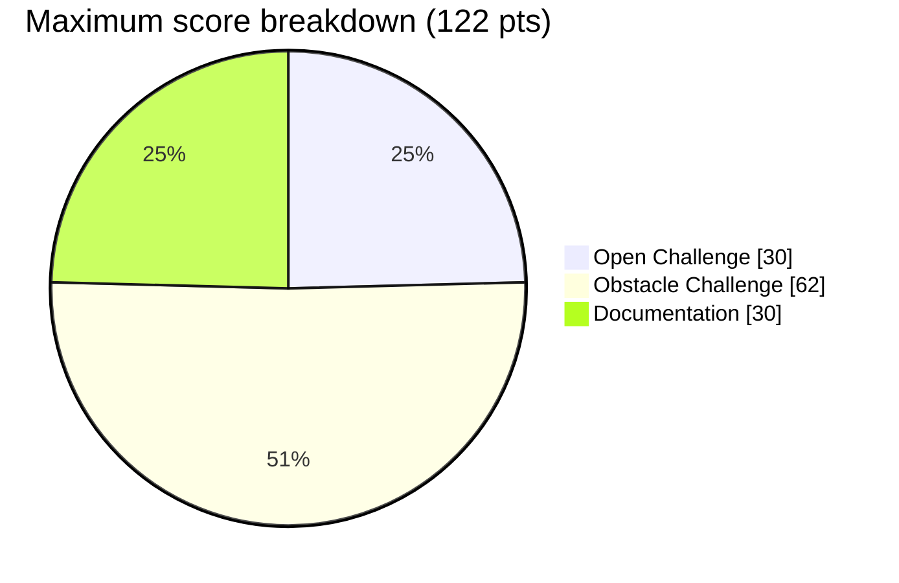
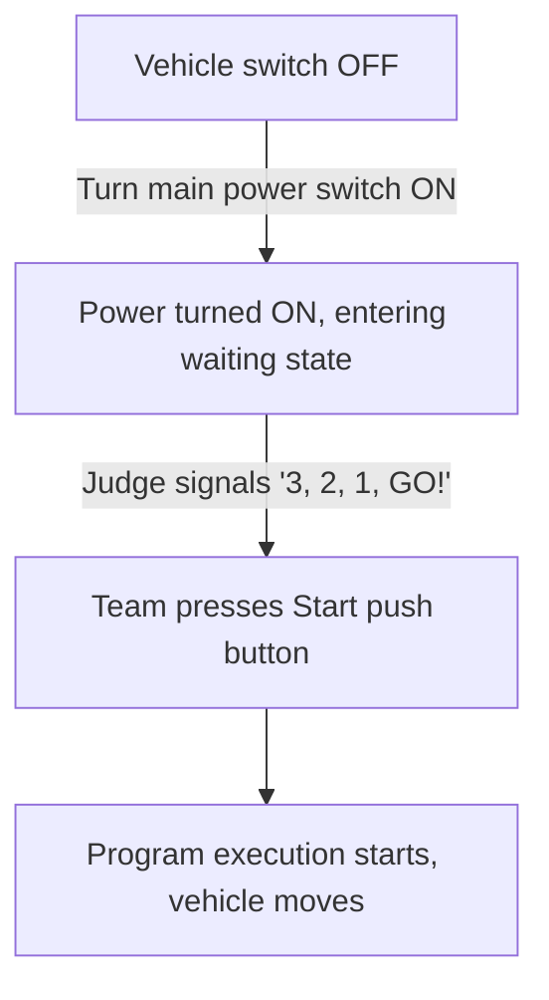
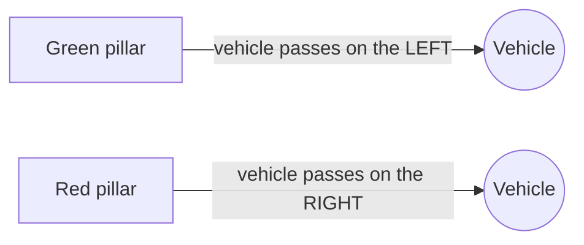
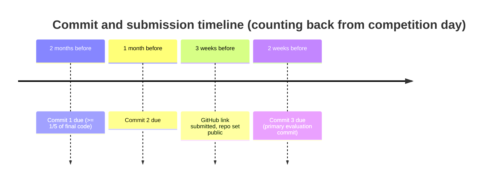

# WRO 2026 Future Engineers: Self-Driving Cars, Rulebook & Project Guidelines Summary

> **Document summary**: A breakdown of the official *World Robot Olympiad (WRO) 2026 Future Engineers, Self-Driving Cars* General Rules (`WRO-2026-Future-Engineers-Self-Driving-Cars-General-Rules (1).pdf`), tailored for team **gorur_gari_2026** to guide vehicle design, software architecture, competition operations, and GitHub documentation compliance.

---

## 1. Overview and competition format

- **Category**: WRO Future Engineers, Self-Driving Cars (Age 14-22, born 2004-2012 for the 2026 season).
- **Team composition**: 2-3 students plus 1 coach (the coach must be at least 18 years old).
- **Core format**: Time Attack autonomous racing, one car on the track per attempt.
- **Total maximum score**: **122 points**
  - Roughly 75% of that is vehicle field performance (92 pts max: 30 pts Open + 62 pts Obstacle).
  - Roughly 25% is the Engineering Journal and GitHub documentation (30 pts max).
- **Surprise rule**: A surprise rule is expected for the international finals. Organizers can modify or add specific challenge rules shortly before the event.

The score is split three ways, so documentation is not an afterthought, it's worth about as much as an entire round:

---

## 2. Vehicle regulations and hardware constraints (critical)

### Physical dimensions and weight

| Parameter | Maximum limit | Notes / enforcement |
| :--- | :--- | :--- |
| **Length** | **300 mm** | Checked during vehicle check and repair times |
| **Width** | **200 mm** | Checked during vehicle check and repair times |
| **Height** | **300 mm** | Checked during vehicle check and repair times |
| **Weight** | **1.5 kg** | Strictly enforced at vehicle check |

### Drivetrain and kinematics requirements

- **Kinematic structure**: Must be a **4-wheeled vehicle** with **exactly one driving axle** (FWD, RWD, or 4WD) and **one steering actuator** (for example a servo motor driving Ackermann steering).
- **Prohibited configurations**:
  - No differential drive robots (skid-steer, or two-wheel drive that turns via differential motor speeds).
  - No electronic differentials (one motor per side used to steer or turn).
  - No omni-wheels, ball casters, or spherical wheels.
- **Driving motors**: Maximum of **2 driving motors**. Both must be physically coupled, directly or via a shared gearbox/axle, to the driven wheels. They cannot be driven independently per wheel.

### Electronics, controllers, and wireless restrictions

- **Controllers**: Any single-board computer (SBC, e.g. Raspberry Pi 4/5, Jetson Nano) and/or single-board microcontroller (SBM, e.g. Arduino, ESP32, STM32). Multiple controllers are allowed.
- **Sensors**: Unlimited quantity, brand, or type (LiDAR, depth/RGB cameras, ToF distance sensors, IMU, color/line sensors). Smartphones are allowed as cameras or processors.
- **Wireless rule (strict)**: All wireless communication (Wi-Fi, Bluetooth, RF) must be disabled during competition rounds. If it's built into the SBC/SBM, it has to be turned off in the OS or firmware. Only wired communication between components is allowed.

---

## 3. Mandatory start and control button procedure

The vehicle must strictly implement the two-button startup procedure:

1. **Power switch**: Exactly **1 main switch** to power on the SBC/microcontroller.
2. **Start button**: Exactly **1 physical push button** (or a single screen touch / EV3 button) to start program execution.
3. **No interaction**: No sensor calibration, physical pre-adjustments to pass data, switch-configuration coding, or wireless triggering is permitted before or during the start.

---

## 4. Challenge round specifications

### 4.1 Open Challenge (duration: 3 minutes)

- **Goal**: Complete **3 full laps** in the randomly chosen challenge direction (clockwise or counter-clockwise) as fast as possible, then stop autonomously.
- **Track layout**:
  - Distance between walls is set per round to either **600 mm (narrow)** or **1000 mm (wide)**, ±100 mm.
  - No traffic signs (pillars) are present.
  - **Outer wall rule**: The vehicle must not touch the outer boundary wall during Open Challenge rounds.
- **Finish condition**: Stop completely inside the finish section within 15 seconds of completing 3 laps, or cross into the corner section past the finish.

---

### 4.2 Obstacle Challenge (duration: 3 minutes)

- **Goal**: Complete **3 full laps** navigating around red and green traffic sign pillars, then perform **parallel parking** in the designated parking lot.
- **Track layout**:
  - Distance between walls is fixed at **1000 mm**, ±10 mm.
  - Traffic signs: up to 7 red and 7 green parallelepiped pillars (50 x 50 x 100 mm).
- **Traffic sign obedience rules**:
  - **Red pillar**: must pass on the **right** side.
  - **Green pillar**: must pass on the **left** side.
  - *After lap 3*: once the 3 laps are complete, pillars on the way to the parking lot can be bypassed on either side, as long as they haven't been moved.

- **Pillar displacement and fault thresholds**:
  - **Allowed**: touching or moving a pillar, as long as its base projection stays inside the **85 mm diameter circle** around its seat.
  - **Round stop penalty**: moving or knocking a pillar completely outside that 85 mm circle immediately ends the attempt.
  - **Wrong-side passing**: passing a pillar on the wrong side ends the round as soon as the vehicle fully crosses the radial line running from the inner wall to the outer wall at that pillar's location.

- **Parallel parking regulations**:
  - **Location**: in the starting section. Width **20 cm**, length **1.5x vehicle length**.
  - **Boundaries**: two magenta wooden blocks (200 x 20 x 100 mm). Touching either block immediately ends the round with zero parking points.
  - **Fully parked criteria**: the vehicle's projection is completely inside the parking box AND parallel to the outer wall (wheel-distance difference to the outer wall ≤ 2 cm).
  - **Start bonus**: starting from inside the parking lot earns bonus points, but only if at least 1 full lap is completed.

---

## 5. Repair actions and penalties

- **Permission**: Granted **once per round**, only if the vehicle is completely stopped (stuck against a wall, electronic glitch, etc). It cannot be requested during the 3rd lap or while the vehicle is moving (more than 50 mm in 5 seconds).
- **Execution**: The vehicle is removed, repaired (mechanically or electronically), placed back in the center of the same section, powered on, and restarted via the Start button.
- **Penalty**: the total score for that round is divided by 2, and the timer keeps running during the repair. No code uploading or data input is allowed while repairing.

---

## 6. Scoring matrix and ranking hierarchy

### Point breakdown

| Category | Task / milestone | Points | Max total |
| :--- | :--- | :---: | :---: |
| **Open Challenge** | Laps passed successfully (8 sections / lap) | 1 pt / section | 24 pts |
| | Finish stop in start section after 3 laps | 3 pts | 3 pts |
| | Driving out of start section in round direction | 1 pt / lap | 3 pts |
| | **Open Challenge subtotal** | | **30 pts** |
| **Obstacle Challenge** | Base lap driving and section passage | Same as Open | 30 pts |
| | Traffic signs not moved during 3 laps | 10 pts | 10 pts |
| | (or traffic signs moved, but 3 laps completed) | (8 pts) | (8 pts) |
| | Start from parking lot bonus (min 1 lap completed) | 7 pts | 7 pts |
| | Parallel parking, fully inside and parallel (≤ 2 cm) | 15 pts | 15 pts |
| | (parallel parking, partial / non-parallel) | (7 pts) | (7 pts) |
| | **Obstacle Challenge subtotal** | | **62 pts** |
| **Documentation** | Engineering Journal + GitHub repo (Appendix C) | Rubric | **30 pts** |
| **Grand total** | | | **122 pts** |

### Tie-breaking criteria (priority order)

1. **Total points** (best Open + best Obstacle + documentation)
2. Points of the **best Obstacle Challenge round**
3. Time of the **best Obstacle Challenge round**
4. Points of the 2nd-best Obstacle Challenge round
5. Time of the 2nd-best Obstacle Challenge round
6. Points for **Engineering Journal and documentation**
7. Points of the best Open Challenge round
8. Points of the 2nd-best Open Challenge round
9. Time of the best Open Challenge round
10. Time of the 2nd-best Open Challenge round

---

## 7. Documentation and GitHub submission guidelines (30 points)

Documentation must be submitted via a public GitHub repository link no later than **3 weeks before the competition**, and must remain public for **at least 12 months**.

### Mandatory commit history schedule

- **Commit 1**: at least 2 months before the competition. Must contain at least 1/5 (20%) of the final code.
- **Commit 2**: at least 1 month before the competition.
- **Commit 3**: at least 2 weeks before the competition. This is the **primary evaluation commit** judges use for scoring; changes made after this point might not be scored.

### README.md requirements

- **Language**: English only.
- **Minimum length**: **5,000 characters**.
- **Content**: component overview, hardware/software interaction, detailed build/compile/upload instructions, 3D CAD files, and wiring diagrams.

### Evaluation rubric breakdown (Appendix C, 5 criteria at 0/2/4/6 pts each)

1. **Mobility and mechanical design (6 pts)**: torque/speed calculations, chassis selection tradeoffs, steering linkage design, CAD diagrams, test/iteration logs.
2. **Power and sensor architecture (6 pts)**: complete power budget, current draw calculations, voltage regulation, sensor placement justification (FOV, glare/shadow mitigation), wiring diagrams, calibration procedures.
3. **Software architecture and obstacle strategy (6 pts)**: state machine diagrams/flowcharts, algorithm justification (PID control, LiDAR disparity extender, vision pipelines), edge-case handling, performance tuning metrics.
4. **Systems thinking and engineering decisions (6 pts)**: explicit project constraints, tradeoff analysis ("why we chose X over Y"), system failure modes and mitigations, versioning progression (v1 to v2 to v3).
5. **Reproducibility and GitHub quality (6 pts)**: professional repository layout, clean commit messages, code comments, complete CAD/STL/schematics, step-by-step reproduction guide.

---

## 8. Actionable technical directives for `gorur_gari_2026`

To stay fully compliant and score well with the `gorur_gari_2026` ROS 2 stack:

### Hardware and mechanics

- [ ] **Verify drivetrain kinematics**: front-wheel steering (servo) plus a single rear/front drive axle (or center-diff 4WD). Eliminate any differential/skid-steering logic.
- [ ] **Dimensions and weight verification**: keep the robot comfortably under 300 x 200 x 300 mm and under 1.5 kg.
- [ ] **Dual control interfaces**: confirm 1 hard power switch plus 1 dedicated Start push button, wired to GPIO/microcontroller.
- [ ] **Wireless disable**: add shell/OS scripts that disable Wi-Fi and Bluetooth on the Raspberry Pi/Jetson at boot, for competition runs.

### Software and navigation stack (ROS 2)

- [ ] **Disparity extender / wall follower (Open Challenge)**:
  - Optimize handling of the dynamic track width (600 mm vs 1000 mm).
  - Implement strict outer-wall avoidance logic (zero outer-wall touching allowed).
- [ ] **Vision / LiDAR pillar classifier (Obstacle Challenge)**:
  - Robust HSV/color detection for red (pass right) and green (pass left) pillars.
  - Implement radial threshold monitoring to prevent crossing the pillar's radius line on the wrong side.
  - Track pillar position against the 85 mm safety margin to avoid knocking pillars out of bounds.
- [ ] **Parallel parking state machine**:
  - Implement a precision odometry / ToF-guided parallel parking controller.
  - Measure wall clearance distance to keep parallel alignment under 2 cm.
  - Avoid touching the magenta boundary blocks.

### GitHub and documentation workflow

- [ ] Maintain a consistent Git commit history that hits the 2-month, 1-month, and 2-week milestones.
- [ ] Draft a comprehensive `README.md` (at least 5,000 characters) covering ROS 2 nodes, wiring schematics, power budgets, and mechanical design rationale.
- [ ] Maintain an Engineering Journal PDF documenting test iterations and tradeoffs.
