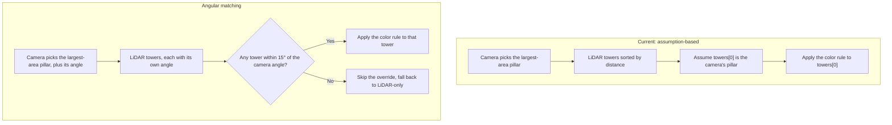
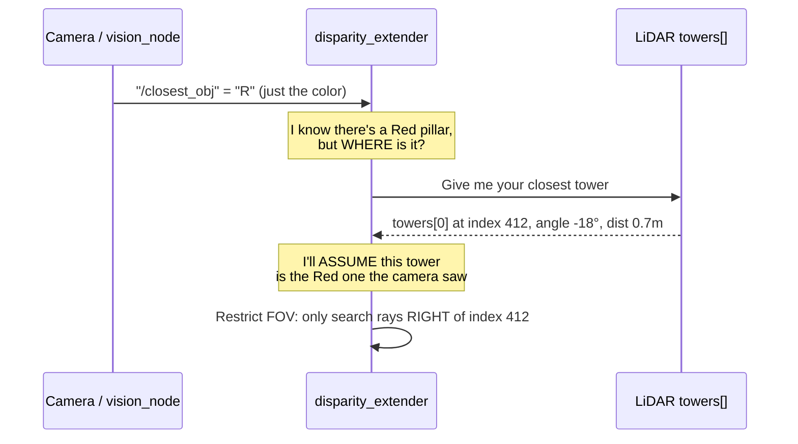
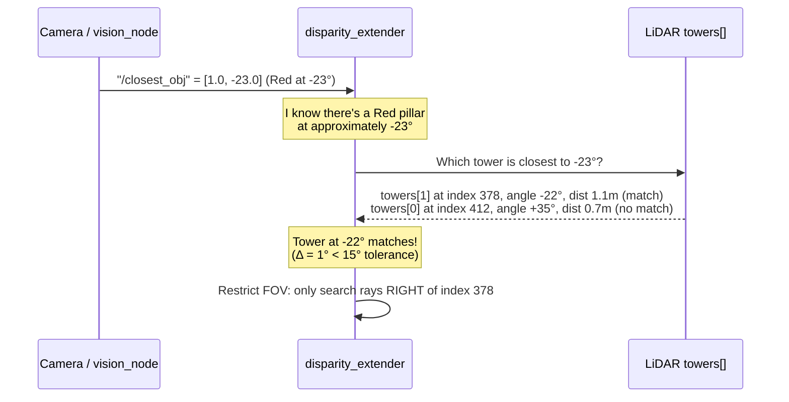

# Current Approach vs Angular Matching: Detailed Comparison

## The Core Difference in One Sentence

| | Current | Angular Matching |
|---|---|---|
| **What the camera tells the brain** | *"I see a Red pillar somewhere"* | *"I see a Red pillar at 23° to the right"* |

Everything else flows from this single difference.

---

## 1. Data Flow Comparison

The two approaches differ in one structural way: whether the camera tells the disparity extender *where* the pillar is, or just *what color* it is.



The current approach guesses. Angular matching checks.

### Current: Loose Color Broadcast



**The assumption:** the camera's "closest" (largest bbox) is the same object as the LiDAR's "closest" (shortest range). This is the source of the mismatch bug.

### Angular Matching



**No assumption needed.** The camera explicitly tells the brain where the pillar is, and the brain matches it to the correct LiDAR signature.

---

## 2. The Exact Failure Scenario

Consider this WRO track situation: the bot approaches a section with two pillars visible at once.

```
            ┌─────────────────────────────────┐
            │             TRACK               │
            │                                 │
            │      Green pillar               │
            │      dist: 1.5m                 │
            │      angle: +25° (left)         │
            │      bbox area: 4800 px²        │ <- Camera says: THIS is closest (bigger)
            │                                 │
            │              Bot                │
            │                                 │
            │      Red pillar                 │
            │      dist: 0.8m                 │ <- LiDAR says: THIS is closest (nearer)
            │      angle: -15° (right)        │
            │      bbox area: 2400 px²        │
            │                                 │
            └─────────────────────────────────┘
```

### What happens with the current approach

| Step | Camera | LiDAR | Disparity Extender |
|------|--------|-------|--------------------|
| 1 | Detects both pillars | Detects both as towers | - |
| 2 | Picks Green (area 4800 > 2400) | Sorts by distance: Red (0.8m) first | - |
| 3 | Publishes `"G"` | `towers[0]` = Red pillar at -15° | - |
| 4 | - | - | Color = "G", so restrict to LEFT of `towers[0]` |
| 5 | - | - | `chk[0] = towers[0]["index"]` (the Red pillar's index) |
| 6 | - | - | **Bot passes the Red pillar on the left (rule violation)** |

**Result:** rule violation. The bot should pass the Red pillar on the right, but it was told "Green" (from the far pillar) and applied that rule to the Red pillar (the close one). The wrong color was applied to the wrong tower.

### What happens with angular matching

| Step | Camera | LiDAR | Disparity Extender |
|------|--------|-------|--------------------|
| 1 | Detects both pillars | Detects both as towers | - |
| 2 | Picks Green (area 4800 > 2400) | Sorts by distance: Red (0.8m) first | - |
| 3 | Publishes `[2.0, +25.0]` (Green at +25°) | `towers[0]` = Red at -15°, `towers[1]` = Green at +25° | - |
| 4 | - | - | Color = Green, camera says +25° |
| 5 | - | - | Find tower closest to +25°: `towers[1]` at +25° (Δ = 0°, exact match) |
| 6 | - | - | Restrict to LEFT of `towers[1]` (the actual Green pillar) |
| 7 | - | - | **Bot passes the Green pillar on the left (correct)** |

**Result:** correct behavior. The angular match ensures the color override targets the correct physical object.

---

## 3. Detailed Technical Comparison

### 3.1 Proximity Heuristic

| Aspect | Current | Angular Matching |
|--------|---------|-----------------|
| **Camera "closest" metric** | Largest bounding box area (px²) | Same, largest area |
| **LiDAR "closest" metric** | Shortest range (meters) | **Angle proximity** to camera detection |
| **Match quality** | Implicit assumption they agree | Explicit geometric matching |
| **Failure mode** | Silent wrong-side pass | Graceful fallback to LiDAR-only if no angular match within tolerance |

### 3.2 Message Format

| Aspect | Current | Angular Matching |
|--------|---------|-----------------|
| **Topic** | `/closest_obj` | `/closest_obj` (same topic, different type) |
| **Message type** | `std_msgs/String` | `std_msgs/Float32MultiArray` |
| **Payload** | `"R"`, `"G"`, or `"N"` | `[color_code, angle_deg]` |
| **Payload size** | 1 byte | 8 bytes (2 floats) |
| **Bandwidth impact** | Negligible | Negligible |

### 3.3 Robustness

| Scenario | Current | Angular Matching |
|----------|---------|-----------------|
| Single pillar, straight ahead | Works | Works |
| Single pillar, off to the side | Works (only 1 tower to match) | Works |
| Two pillars, same side | Risk of mismatch | Matches by angle |
| Two pillars, opposite sides | **Mismatch likely** (see scenario above) | Matches by angle |
| Pillar behind a wall (LiDAR occluded) | Camera sees it, LiDAR doesn't: color override with no tower is a no-op | Same, but explicitly detected as "no angular match" |
| Camera false positive (colored wall) | Applies override to wrong tower | Better: likely no LiDAR tower within 15° of the wall, so the override is skipped |
| Camera completely fails | Falls back to "N" (LiDAR-only) | Same |
| LiDAR detects non-pillar tower (e.g., corner post) | May apply color to it | Only applies if camera angle matches within 15° |

### 3.4 Latency

| Metric | Current | Angular Matching |
|--------|---------|-----------------|
| Camera processing time | ~8ms (320×240, HSV + contours) | ~8ms (same pipeline + 1 division for angle) |
| Message publish latency | <1ms | <1ms |
| Disparity extender overhead | 0 (just reads a string) | ~0.05ms (iterate towers[], compute angle deltas) |
| **Total added latency** | n/a | **< 0.1ms** |

### 3.5 Calibration Requirements

| | Current | Angular Matching |
|---|---------|-----------------|
| Camera HSV thresholds | Required | Required (same) |
| Camera horizontal FOV | Not needed | **Required** (one-time measurement) |
| Camera-LiDAR angular offset | Not needed | **Nice to have** (compensate if camera is not centered) |
| Match tolerance threshold | N/A | **Need to tune** (15° default, adjustable) |

> [!NOTE]
> The camera FOV can be measured once: hold a pillar at the left edge and right edge of the camera view, note the angles from the LiDAR, and divide by 2. Most USB cameras are ~60° horizontal. This takes 5 minutes.

---

## 4. What the Code Diff Would Look Like

### vision_node.py: publishing angle alongside color

```diff
- from std_msgs.msg import String
+ from std_msgs.msg import Float32MultiArray

  # In __init__:
  self.obstacle_pub = self.create_publisher(
-     String,
+     Float32MultiArray,
      obstacles_topic,
      qos_profile=10
  )
+ self.camera_hfov_deg = 60.0  # Horizontal FOV, measure once for your camera

  # In _image_callback, after finding closest_color:
+ closest_angle = 0.0
+ color_code = 0.0  # N
  for det in detections:
      x, y, w, h = det['bbox']
      area = w * h
      if area > max_area:
          max_area = area
-         closest_color = "R" if det['color'] == 'red' else "G"
+         color_code = 1.0 if det['color'] == 'red' else 2.0
+         # Map centroid_x from pixel space to degrees
+         frame_w = cv_image.shape[1]
+         closest_angle = ((det['centroid_x'] - frame_w / 2)
+                          / (frame_w / 2)) * (self.camera_hfov_deg / 2)

- msg_out = String()
- msg_out.data = closest_color
+ msg_out = Float32MultiArray()
+ msg_out.data = [color_code, closest_angle]
  self.obstacle_pub.publish(msg_out)
```

### disparity_extender.py: matching by angle

```diff
  # In color_callback:
- def color_callback(self, msg: String):
-     self.closest_color = msg.data.strip().upper()
+ def color_callback(self, msg: Float32MultiArray):
+     if len(msg.data) >= 2:
+         code = int(msg.data[0])
+         self.closest_color = {0: "N", 1: "R", 2: "G"}.get(code, "N")
+         self.camera_pillar_angle = math.radians(msg.data[1])
      self.last_color_time = time.time()

  # In get_max_d:
  if towers and self.closest_color == "G":
-     chk[0] = towers[0]["index"]
+     matched = min(towers, key=lambda t: abs(t["ang"] - self.camera_pillar_angle))
+     if abs(matched["ang"] - self.camera_pillar_angle) < math.radians(15.0):
+         chk[0] = matched["index"]
  elif towers and self.closest_color == "R":
-     chk[1] = towers[0]["index"]
+     matched = min(towers, key=lambda t: abs(t["ang"] - self.camera_pillar_angle))
+     if abs(matched["ang"] - self.camera_pillar_angle) < math.radians(15.0):
+         chk[1] = matched["index"]
```

---

## 5. Decision Matrix

| Criteria | Weight | Current | Angular Matching |
|----------|--------|---------|-----------------|
| Correctness (multi-pillar) | 5/5 | 3/10 | 9/10 |
| Simplicity | 4/5 | 10/10 | 8/10 |
| Latency overhead | 3/5 | 10/10 | 10/10 |
| Calibration effort | 2/5 | 10/10 | 8/10 |
| Failure-mode safety | 4/5 | 5/10 | 9/10 |
| **Weighted Score** | | **6.5** | **9.0** |

> [!IMPORTANT]
> The current approach scores low on correctness and failure-mode safety because a wrong-side pass is a **silent failure**: there's no log, no warning, no fallback. The bot confidently drives past the wrong side. Angular matching adds a 15° tolerance check that explicitly catches mismatches and falls back to LiDAR-only navigation instead.
