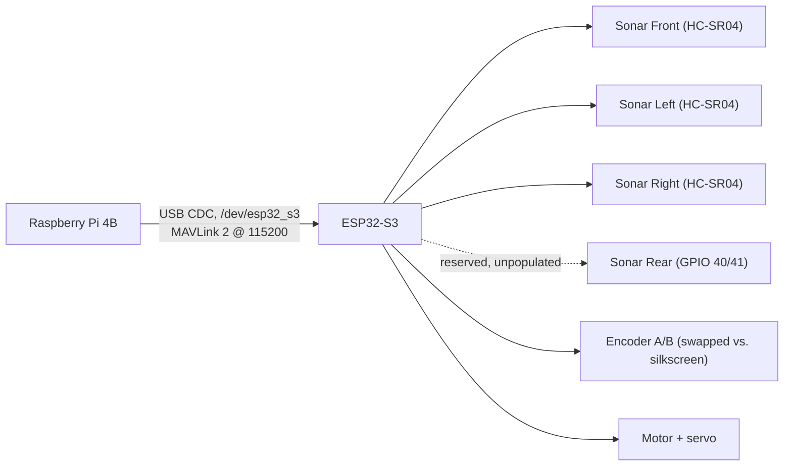

# Circuit diagrams

This folder holds block diagrams of the gorur_gari_2026 electronics, generated from the wiring the firmware actually uses.

| File | Contents |
| --- | --- |
| `circuit_block_diagram.png` / `.svg` | Full system block diagram: Pi 4B, ESP32-S3, sensors, actuators, and signal buses with GPIO labels |
| `esp32_pin_map.png` | ESP32-S3 pin assignment table (used and reserved pins) |
| `generate_diagrams.py` | Generator script (matplotlib) |

## How the boards are wired



The Pi and the ESP32-S3 only talk over native USB CDC, there's no GPIO-level link between them. All sonars are wired but currently disabled in `config.h`: only the FRONT/LEFT/RIGHT HC-SR04s are actually fitted, and the REAR slot (GPIO 40/41) is reserved but unpopulated. Encoder A/B are intentionally swapped relative to the silkscreen so forward motion counts as positive, see `pins.h`.

## Regenerating the diagrams

The diagrams are generated, not hand-drawn, so re-run the script whenever the wiring changes:

```sh
python3 generate_diagrams.py   # needs matplotlib
```

## Sources of truth

These are the files the generator actually reads. If wiring changes, it starts in one of these:

| File | What it defines |
| --- | --- |
| `firmware/include/pins.h` | GPIO assignments |
| `firmware/include/config.h` | PWM frequencies, I²C addresses, sonar enables |
| `firmware/pin-map.md` | Full pin table, including reserved slots |
| `ros2_ws/controls/controls/mcu_bridge.py` | The Pi-to-MCU serial link |
