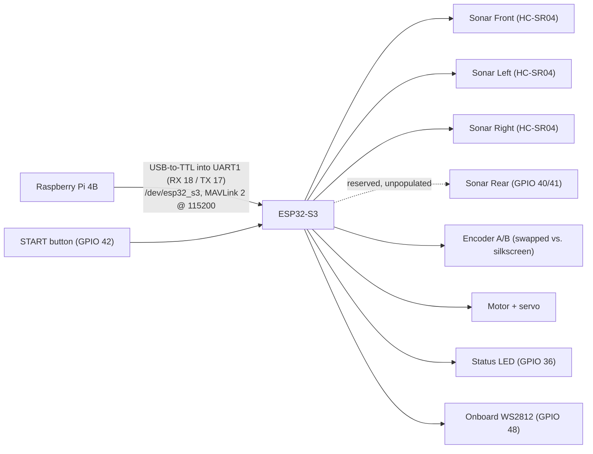

# Circuit diagrams

This folder holds block diagrams of the gorur_gari_2026 electronics, generated from the wiring the firmware actually uses.

| File | Contents |
| --- | --- |
| `circuit_block_diagram.png` / `.svg` | Full system block diagram: Pi 4B, ESP32-S3, sensors, actuators, and signal buses with GPIO labels, plus a key for the WS2812 status colours |
| `esp32_pin_map.png` | ESP32-S3 pin assignment table (used and reserved pins) |
| `generate_diagrams.py` | Generator script (matplotlib) |

## How the boards are wired



The Pi and the ESP32-S3 talk over a USB-to-TTL adapter into the MCU's UART1: adapter TX to GPIO 18, adapter RX to GPIO 17, grounds tied, VCC left disconnected. Firmware logs stay on UART0 (GPIO 43/44) out of the devkit's own CH343 socket, so nothing but binary MAVLink is ever on the link.

That link takes two pins the sonar block also uses, so **the front and left HC-SR04s have to come off the board**, not just be disabled in `config.h`: front ECHO drives GPIO 17 against the UART's transmit pin, which clamps the link and shorts a 5 V sonar output into a 3V3 one. See `firmware/pin-map.md` for the full story. Otherwise all sonars are wired but currently disabled in `config.h`: only the FRONT/LEFT/RIGHT HC-SR04s are actually fitted, and the REAR slot (GPIO 40/41) is reserved but unpopulated. Encoder A/B are intentionally swapped relative to the silkscreen so forward motion counts as positive, see `pins.h`.

## Status lights

Two of the blocks need no wiring decisions but do need explaining, since they are the only output the car has once it is on the mat.

The **status LED on GPIO 36** is a plain single-colour LED (GPIO → 220–470 Ω → anode, cathode to GND). It is off from boot, lights when the ROS 2 bridge announces itself, and blinks the 3-second start countdown after a button press.

The **WS2812 on GPIO 48** is soldered to the devkit, so it costs no wiring and no extra pin. It repeats the link state in colour and adds what the drivetrain is doing:

| Colour | Meaning |
| --- | --- |
| Red | No ROS 2 bridge has announced itself since boot |
| Green | Bridge connected, drivetrain idle |
| Flashing blue | Motor driving, steering within a couple of degrees of centre |
| Flashing purple | Motor driving with the wheels turned |

Driving outranks the link colour, so a car that is moving never shows a resting colour. Driven by `firmware/lib/rgb_status_led` through the Arduino core's `neopixelWrite()` (RMT bit banging, no pixel library); brightness, flash period and the "centred" tolerance are in `firmware/include/config.h`.

## Regenerating the diagrams

The diagrams are generated, not hand-drawn, so re-run the script whenever the wiring changes:

```sh
python3 generate_diagrams.py   # needs matplotlib
```

## Sources of truth

These are the files the generator actually reads. If wiring changes, it starts in one of these:

| File | What it defines |
| --- | --- |
| `firmware/include/pins.h` | GPIO assignments |
| `firmware/include/config.h` | PWM frequencies, I²C addresses, sonar enables |
| `firmware/pin-map.md` | Full pin table, including reserved slots |
| `firmware/lib/rgb_status_led/` | What each WS2812 colour means |
| `ros2_ws/controls/controls/mcu_bridge.py` | The Pi-to-MCU serial link |
