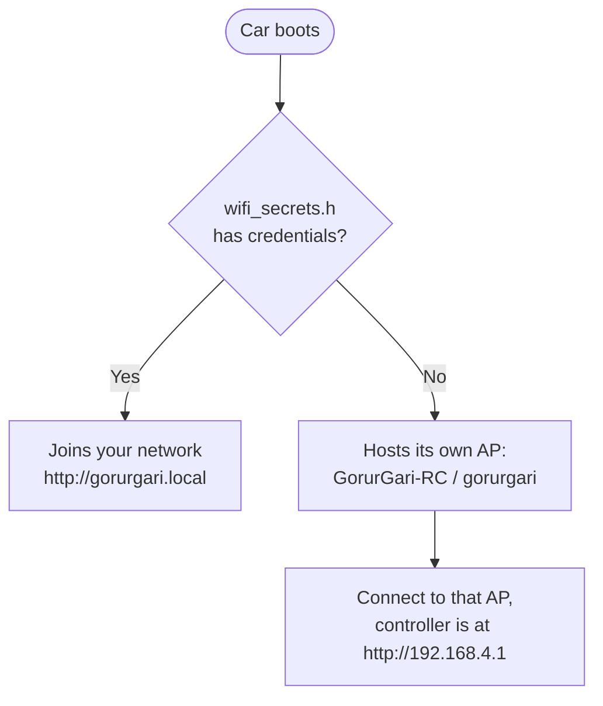
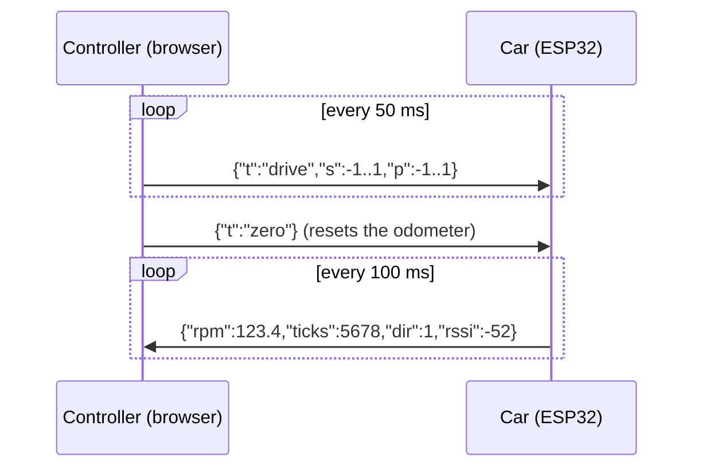

# rc_car: websocket RC test rig

This is test scaffolding, not flight code. It joins wifi, hosts a mobile controller page at `http://gorurgari.local`, and drives the car over a websocket. The whole point is to shake out the motor, encoder, and steering on a bench before the real MAVLink link takes over.

## Using it

```bash
pio run -e esp32doit-devkit-v1-rc -t upload   # rc build
pio run -e esp32doit-devkit-v1 -t upload      # normal build, rc car not compiled in
```

Put your network credentials in `wifi_secrets.h` (gitignored, copy `wifi_secrets.example.h` to start). If you leave it empty, the car brings up its own access point instead:



Hostname, AP name, failsafe timing, and telemetry rate all live in `rc_car_config.h`.

## Protocol

The controller and the car exchange small JSON messages over `/ws`, the controller sending steering and throttle at 20 Hz and the car reporting telemetry back at 10 Hz:



`s` is steer and `p` is throttle, both in the range -1 to 1.

Nothing gets applied straight from the socket callback, that runs on the AsyncTCP task. Instead, commands are recorded and `update()` writes them to the hardware from `loop()`. If commands stop arriving for `RC_FAILSAFE_MS`, the car brakes and centers itself.

## Removing it

Dependencies only point inward: `motor_control`, `encoder_reader`, and `steering_control` have never heard of this library, so it's safe to strip out cleanly:

1. `rm -rf firmware/lib/rc_car`
2. Drop the `[env:esp32doit-devkit-v1-rc]` block from `platformio.ini`
3. Delete the four `#ifdef ENABLE_RC_CAR` blocks in `src/main.cpp`

The default build environment never compiles any of this anyway, so until you do the above, it costs nothing to leave in place.
