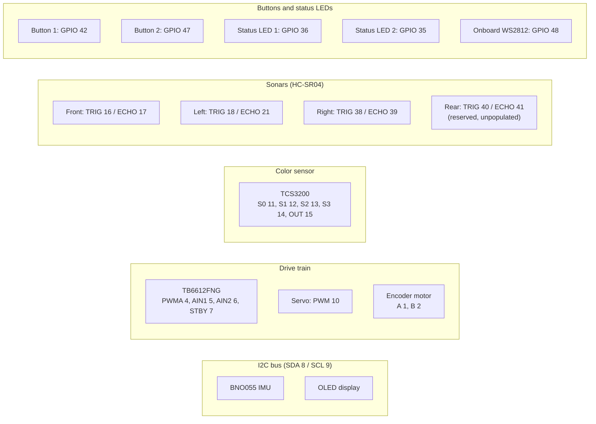

# ESP32-S3 pin map

This is the full GPIO assignment for the ESP32-S3, including reserved slots that aren't populated yet (the rear sonar).

## Overview by subsystem

## Full table

| Device                 | Signal    | GPIO           |
| ---------------------- | --------- | -------------- |
| **BNO055 IMU**         | SDA       | **8**          |
|                        | SCL       | **9**          |
| **OLED Display (I²C)** | SDA       | **8** (shared) |
|                        | SCL       | **9** (shared) |
| **TB6612FNG**          | PWMA      | **4**          |
|                        | AIN1      | **5**          |
|                        | AIN2      | **6**          |
|                        | STBY      | **7**          |
| **Servo**              | PWM       | **10**         |
| **Encoder Motor**      | Encoder A | **1**          |
|                        | Encoder B | **2**          |
| **TCS3200**            | S0        | **11**         |
|                        | S1        | **12**         |
|                        | S2        | **13**         |
|                        | S3        | **14**         |
|                        | OUT       | **15**         |
| **Sonar Front**        | TRIG      | **16**         |
|                        | ECHO      | **17**         |
| **Sonar Left**         | TRIG      | **18**         |
|                        | ECHO      | **21**         |
| **Sonar Right**        | TRIG      | **38**         |
|                        | ECHO      | **39**         |
| **Sonar Rear**         | TRIG      | **40**         |
|                        | ECHO      | **41**         |
| **Push Button 1**      | Input     | **42**         |
| **Push Button 2**      | Input     | **47**         |
| **Status LED 1**       | Output    | **36**         |
| **Status LED 2**       | Output    | **35**         |
| **Onboard WS2812**     | Data      | **48**         |

## Notes

Status LED 1 is a plain LED (GPIO through a 220-470R resistor to the anode, cathode to GND), not the devkit's onboard WS2812 on GPIO 48. It's off from boot and goes high when the ROS2 bridge sends `gorur_gari_ros2_to_mcu_connect_msg` on opening the serial link. So a lit LED means ROS2 is connected to this MCU, a useful thing to glance at during bring-up. It also blinks the start countdown: pressing the start button blinks it once a second for the same three seconds the ROS2 side holds the car still, so the blinks stop at the moment the car moves.

The onboard WS2812 on GPIO 48 is soldered to the devkit, so it costs no wiring. It repeats that link state in colour and adds what the drivetrain is doing, which the single plain LED cannot show:

| Colour              | Meaning                                                    |
| ------------------- | ---------------------------------------------------------- |
| Red                 | No ROS2 bridge has announced itself since boot              |
| Green               | Bridge connected, drivetrain idle                           |
| Flashing blue       | Motor driving, steering within a couple of degrees of centre |
| Flashing purple     | Motor driving with the wheels turned                        |

Driving outranks the link colour, because wheels turning is the thing worth spotting from across the table and the link state is on the plain LED anyway. Reverse counts as driving. Brightness, flash period and the "centred" tolerance are in `firmware/include/config.h`; the driver is `firmware/lib/rgb_status_led`, which uses the Arduino core's `neopixelWrite()` (RMT bit banging) rather than a pixel library.

Both lights follow the same one-shot connect message, so read red as "never connected since boot" rather than "not connected right now": `mcu_bridge` announces itself once when it opens the port and never sends a disconnect, so a bridge that dies mid-session leaves the pixel green. A car that keeps flashing blue or purple with nobody driving it is the more useful tell — that is the drivetrain still holding the last throttle it was given.

No GPIO 48 on the board? Some ESP32-S3-DevKitC-1 units have too little drive voltage on that pin and expect the pixel to be rewired; `RGB_STATUS_LED_PIN` in `firmware/include/pins.h` follows the board variant's `RGB_BUILTIN` and is the one place to change.
