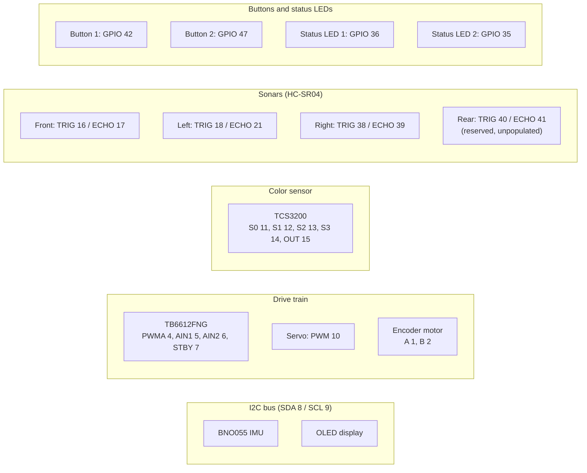

# ESP32-S3 pin map

This is the full GPIO assignment for the ESP32-S3, including reserved slots that aren't populated yet (the rear sonar).

## Overview by subsystem

## Full table

| Device                 | Signal    | GPIO           |
| ---------------------- | --------- | -------------- |
| **BNO055 IMU**         | SDA       | **8**          |
|                        | SCL       | **9**          |
| **OLED Display (I²C)** | SDA       | **8** (shared) |
|                        | SCL       | **9** (shared) |
| **TB6612FNG**          | PWMA      | **4**          |
|                        | AIN1      | **5**          |
|                        | AIN2      | **6**          |
|                        | STBY      | **7**          |
| **Servo**              | PWM       | **10**         |
| **Encoder Motor**      | Encoder A | **1**          |
|                        | Encoder B | **2**          |
| **TCS3200**            | S0        | **11**         |
|                        | S1        | **12**         |
|                        | S2        | **13**         |
|                        | S3        | **14**         |
|                        | OUT       | **15**         |
| **Sonar Front**        | TRIG      | **16**         |
|                        | ECHO      | **17**         |
| **Sonar Left**         | TRIG      | **18**         |
|                        | ECHO      | **21**         |
| **Sonar Right**        | TRIG      | **38**         |
|                        | ECHO      | **39**         |
| **Sonar Rear**         | TRIG      | **40**         |
|                        | ECHO      | **41**         |
| **Push Button 1**      | Input     | **42**         |
| **Push Button 2**      | Input     | **47**         |
| **Status LED 1**       | Output    | **36**         |
| **Status LED 2**       | Output    | **35**         |

## Notes

Status LED 1 is a plain LED (GPIO through a 220-470R resistor to the anode, cathode to GND), not the devkit's onboard WS2812 on GPIO 48. It's off from boot and goes high when the ROS2 bridge sends `gorur_gari_ros2_to_mcu_connect_msg` on opening the serial link. So a lit LED means ROS2 is connected to this MCU, a useful thing to glance at during bring-up.
