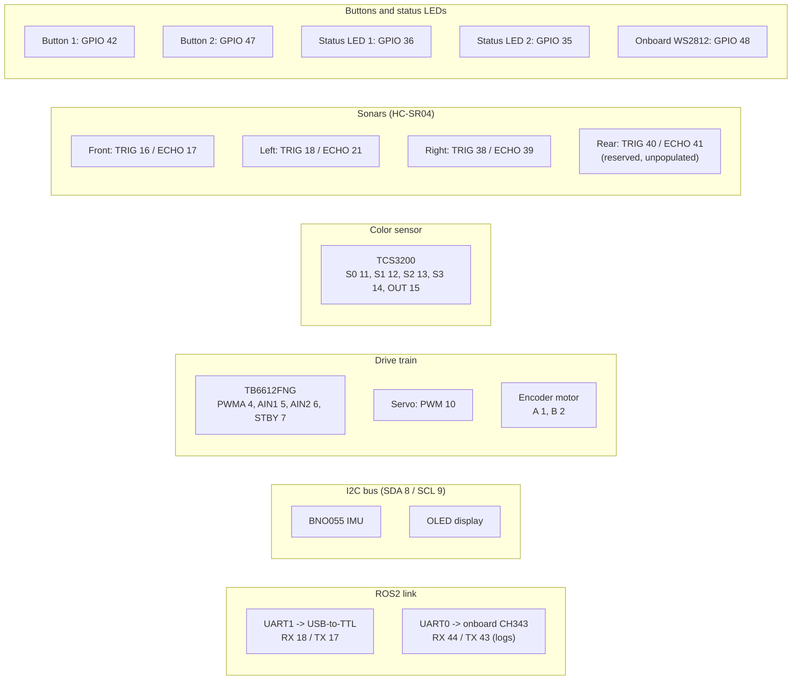

# ESP32-S3 pin map

This is the full GPIO assignment for the ESP32-S3, including reserved slots that aren't populated yet (the rear sonar).

## Overview by subsystem

## Full table

| Device                 | Signal    | GPIO           |
| ---------------------- | --------- | -------------- |
| **MAVLink link (UART1)** | RX (← adapter TX) | **18**  |
|                        | TX (→ adapter RX) | **17**  |
| **Debug logs (UART0)** | RX        | **44** (onboard CH343) |
|                        | TX        | **43** (onboard CH343) |
| **BNO055 IMU**         | SDA       | **8**          |
|                        | SCL       | **9**          |
| **OLED Display (I²C)** | SDA       | **8** (shared) |
|                        | SCL       | **9** (shared) |
| **TB6612FNG**          | PWMA      | **4**          |
|                        | AIN1      | **5**          |
|                        | AIN2      | **6**          |
|                        | STBY      | **7**          |
| **Servo**              | PWM       | **10**         |
| **Encoder Motor**      | Encoder A | **1**          |
|                        | Encoder B | **2**          |
| **TCS3200**            | S0        | **11**         |
|                        | S1        | **12**         |
|                        | S2        | **13**         |
|                        | S3        | **14**         |
|                        | OUT       | **15**         |
| **Sonar Front**        | TRIG      | **16**         |
|                        | ECHO      | **17**         |
| **Sonar Left**         | TRIG      | **18**         |
|                        | ECHO      | **21**         |
| **Sonar Right**        | TRIG      | **38**         |
|                        | ECHO      | **39**         |
| **Sonar Rear**         | TRIG      | **40**         |
|                        | ECHO      | **41**         |
| **Push Button 1**      | Input     | **42**         |
| **Push Button 2**      | Input     | **47**         |
| **Status LED 1**       | Output    | **36**         |
| **Status LED 2**       | Output    | **35**         |
| **Onboard WS2812**     | Data      | **48**         |

## The ROS2 link (UART1, GPIO 18/17)

The Pi and the ESP32-S3 talk MAVLink 2 over a **USB-to-TTL adapter on UART1**, not over the devkit's native USB socket. Three wires, crossed:

| Adapter | ESP32-S3 |
| --- | --- |
| TX | **GPIO 18** (RX) |
| RX | **GPIO 17** (TX) |
| GND | GND |

Leave the adapter's VCC disconnected. The devkit has its own supply, and feeding 5 V from an adapter into a 3V3 pin is how a board dies. If your adapter has a 3V3/5V jumper, it only affects its own logic levels — set it to 3V3 anyway, since a 5 V TX driving GPIO 18 is out of spec even when it appears to work.

Nothing but binary MAVLink frames go out on this port. Human-readable logs go to `DEBUG_SERIAL` (UART0, GPIO 43/44), which reaches the devkit's *other* (CH343) USB socket — one stray line of text in the middle of a packet is enough to desync the ROS2 parser. UART0 is also where the ROM bootloader prints its banner, so the MAVLink link now comes up clean instead of with a page of boot text ahead of the first frame.

**GPIO 17 and 18 are shared with the sonar block — unplug the front and left HC-SR04s.** Front ECHO is 17 and left TRIG is 18. Disabling them in `config.h` is not enough, because the clash is electrical, not just logical:

- **GPIO 17 / front ECHO is the dangerous one.** ECHO is an *output* on the sonar, and 17 is now the UART's *transmit* pin. Two push-pull drivers on one wire: the sonar holds ECHO low between pings while the ESP32 tries to idle its TX high, which both clamps the link (the Pi receives nothing or garbage) and shorts one driver into the other. The HC-SR04 drives ECHO at 5 V, so this is a 5 V output fighting a 3V3 one — it can take the pin with it.
- **GPIO 18 / left TRIG is only noisy.** TRIG is an *input* on the sonar and 18 is the UART's receive pin, so nothing fights; the sonar just sees every byte the Pi sends as a trigger pulse and chirps continuously. No damage, but it draws current and puts ultrasound in the air for no reason.

The firmware cannot see any of this — it fails the build if either sonar is *enabled*, which catches the software half, but a wire left in a header is invisible to it. Fitting a front or left sonar for real means moving one side or the other; free pins on this board are 33, 34, 37 and 45 (the first three belong to the PSRAM die on N8R8/N16R8 modules, which this build does not enable).

On the Pi, `mcu_bridge` opens `/dev/esp32_s3`, which is a udev alias. That alias currently matches the ESP32-S3's native USB (`303a:1001`) and **has to be re-pointed at the adapter** — see `tools/99-esp32-uart.rules.example`. Do not rely on `/dev/ttyUSB0`: the RPLIDAR C1 is on the same bus and whichever device enumerates first takes that number.

## Notes

Status LED 1 is a plain LED (GPIO through a 220-470R resistor to the anode, cathode to GND), not the devkit's onboard WS2812 on GPIO 48. It's off from boot and goes high when the ROS2 bridge sends `gorur_gari_ros2_to_mcu_connect_msg` on opening the serial link. So a lit LED means ROS2 is connected to this MCU, a useful thing to glance at during bring-up. It also blinks the start countdown: pressing the start button blinks it once a second for the same three seconds the ROS2 side holds the car still, so the blinks stop at the moment the car moves.

The onboard WS2812 on GPIO 48 is soldered to the devkit, so it costs no wiring. It repeats that link state in colour and adds what the drivetrain is doing, which the single plain LED cannot show:

| Colour              | Meaning                                                    |
| ------------------- | ---------------------------------------------------------- |
| Red                 | No ROS2 bridge has announced itself since boot              |
| Green               | Bridge connected, drivetrain idle                           |
| Flashing blue       | Motor driving, steering within a couple of degrees of centre |
| Flashing purple     | Motor driving with the wheels turned                        |

Driving outranks the link colour, because wheels turning is the thing worth spotting from across the table and the link state is on the plain LED anyway. Reverse counts as driving. Brightness, flash period and the "centred" tolerance are in `firmware/include/config.h`; the driver is `firmware/lib/rgb_status_led`, which uses the Arduino core's `neopixelWrite()` (RMT bit banging) rather than a pixel library.

Both lights follow the same one-shot connect message, so read red as "never connected since boot" rather than "not connected right now": `mcu_bridge` announces itself once when it opens the port and never sends a disconnect, so a bridge that dies mid-session leaves the pixel green. A car that keeps flashing blue or purple with nobody driving it is the more useful tell — that is the drivetrain still holding the last throttle it was given.

No GPIO 48 on the board? Some ESP32-S3-DevKitC-1 units have too little drive voltage on that pin and expect the pixel to be rewired; `RGB_STATUS_LED_PIN` in `firmware/include/pins.h` follows the board variant's `RGB_BUILTIN` and is the one place to change.
