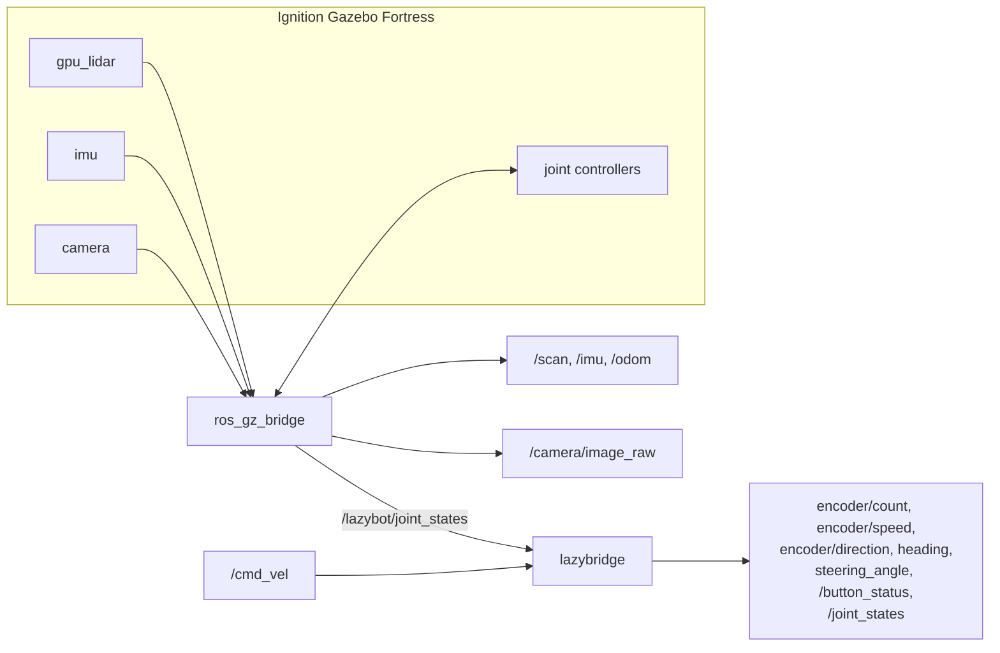

# lazysim

This is the simulation of the Gorur Gari 2026 car, built on Ignition Gazebo Fortress.

The whole point of this package is that nothing downstream of it knows it's a simulation. `lazybridge` presents the exact same ROS interface that `controls/mcu_bridge` does on the real robot, and the simulated `/scan` looks like the RPLIDAR C1's. That means `vector_odom`, `lap_counter`, `open_round_run`, `vision_node`, and `disparity_extender` all run their real, unmodified code, with no sim-specific branches anywhere.

## Data flow



The sensors (LiDAR, IMU, camera) and the joint controllers all sit inside Gazebo and talk to the rest of the stack through `ros_gz_bridge`. `lazybridge` is the piece that stands in for the real MCU: it takes `/cmd_vel` and Gazebo's joint states as input, and produces the same telemetry topics the real robot would.

## Running it

```bash
cd <repo>
colcon build --base-paths lazysim ros2_ws \
             --build-base ros2_ws/build --install-base ros2_ws/install \
             --symlink-install
source ros2_ws/install/setup.bash

ros2 launch lazysim open_round_sim.launch.py        # three laps, then home
ros2 launch lazysim obstacle_round_sim.launch.py    # with traffic pillars
ros2 launch lazysim sim.launch.py                   # simulator only, drive it yourself
```

All three launch files accept the same arguments:

| Argument | Default | What it does |
| :-- | :-- | :-- |
| `gui` | `true` | `false` runs the server headless, which is much faster |
| `rviz` | `true` | Opens RViz |
| `enable_auto_steering` | `true` | `false` plans without moving the car |
| `require_button_start` | `false` | `true` waits for the start button |
| `track_config` | `config/track.yaml` | Pillar, parking, and start layout |
| `bot_config` | `config/bot_config_sim.yaml` | Tuning for the whole stack |
| `build_track` | `true` | `false` leaves a bare mat |

To drive it by hand:

```bash
ros2 topic pub -r 10 /cmd_vel geometry_msgs/msg/Twist \
    '{linear: {x: 0.3}, angular: {z: 0.4}}'      # angular.z > 0 steers LEFT
```

There's no physical start button in sim, so press it over a service call instead:

```bash
ros2 service call /lazybot/press_start std_srvs/srv/Trigger
```

## What's modeled, and where the numbers come from

Everything shared with the real car lives in `ros2_ws/config/bot_config.yaml`. `config/bot_config_sim.yaml` mirrors it and marks its four deltas `SIM:`.

| | Value | Source |
| :-- | :-- | :-- |
| Length | 210 mm | `bot.length_m`, README chassis table |
| Width over tyres | 120 mm | `bot.width_m` |
| Wheel diameter | 50 mm | `bot.wheel_diameter_m` |
| **Wheelbase** | **140 mm** | **Not recorded anywhere, see the note below** |
| Steering lock | ±60° | `bot.max_steer_deg` |
| Encoder | 363 ticks / wheel rev | `bot.encoder_counts_per_rev` |
| LiDAR | RPLIDAR C1: 720 rays, 10 Hz, 0.05-12 m | `rplidar_ros` launch args |
| IMU | BNO055 at 50 Hz | MCU telemetry poll rate |
| Camera | 60° HFOV, 640x480 | `vision_params.yaml camera_hfov_deg` |
| Mat | 3 m field, 1 m centre block, 1 m corridor | WRO Future Engineers |

### Things worth knowing

**The wheelbase is a guess.** 140 mm is not measured. It's not in `bot_config.yaml`, not in the README chassis table, and `cad_files/` is empty. It sets the turning circle, so measure the real axle-to-axle distance and correct `wheelbase` in `description/lazyBot.xacro` and `lazybridge.wheelbase_m` in `config/bot_config_sim.yaml` before trusting any tight-gap result.

**Wheel diameter disagrees across the repo.** `bot_config.yaml` says 50 mm, but both `ros2_ws/launch/*.launch.py` still pass `0.065` to `vector_odom`, and `vector_odom` itself defaults to `0.065`. The sim uses 50 mm throughout. On the real car, that 30% gap goes straight into every distance odometry reports, so the launch defaults are worth revisiting.

**Steering commands are inner-wheel angles.** `angular.z = ±1.0` puts the *inner* front wheel at the 60° stop, and `lazybridge` derives the outer wheel angle (40.7° at full lock) from the Ackermann geometry. Reading 60° as a centreline angle instead would demand 74° from the inner wheel, which no linkage on the car can actually reach.

**Pillar colours are not decorative.** `vision_params.yaml` thresholds red at `S = 255` exactly, so the pillars render with zero green and zero blue in both ambient and diffuse light, plus a black specular term. Any white highlight drops saturation below 255 and makes them invisible to `vision_node`.

**Surfaces need `laser_retro`.** `open_round_run.ray_valid()` discards any ray with intensity at or below 0.05. Ignition returns zero intensity for a surface with no `laser_retro` set, so a new obstacle without one is invisible to the navigation code, even though its range still comes back correctly.

**Don't set `use_velocity_commands` on the steering.** Fortress's `JointPositionController` feeds the position error back with the wrong sign in that mode. The kingpins run away to their limits and sit there while the command topic still reads 0.0.

## Known environment issue

`vision_node` currently can't start on this machine:

```
from cv_bridge import CvBridge  ->  AttributeError: _ARRAY_API not found
```

ROS Humble's `cv_bridge` is built against NumPy 1.x, and this machine has NumPy 2.2.6. This is unrelated to the simulator itself: a bare `python3 -c "from cv_bridge import CvBridge"` fails the same way, and it breaks `vision_node` on the real robot too. Fix it with:

```bash
pip3 install "numpy<2"
```

The sim camera itself has been verified correct: a red pillar at 0.5 m reads `HSV(0, 255, 170)` over 8227 px with an aspect ratio of 1.97, and a green one reads `HSV(60, 255, 162)`. Both are inside the real thresholds, with no cross-talk between colors. `vision_node` will work unchanged once NumPy is sorted out.

## Layout

```
config/
  bot_config_sim.yaml   tuning for lazybridge + the whole autonomy stack
  track.yaml            pillar / parking / start layout
  object_template.sdf   traffic pillar, spawned at runtime
  wall_template.sdf     parking barrier, spawned at runtime
  lazySim.rviz
description/
  lazyBot.xacro         every dimension, in one place
  lazyBotCore.xacro     chassis, wheels, Ackermann linkage
  lidar.xacro           RPLIDAR C1
  IMU.xacro             BNO055
  camera.xacro          USB camera on its pan servo
  control.xacro         Ignition joint controllers, odometry, joint states
  gazebo.xacro          friction
launch/
  sim.launch.py                 simulator only
  open_round_sim.launch.py      + vector_odom, lap_counter, open_round_run
  obstacle_round_sim.launch.py  + vision_node, disparity_extender
lazysim/
  lazybridge.py         stands in for mcu_bridge
  track_maker.py        builds the track over Ignition transport
worlds/
  lazyWorld.sdf         the mat
```
