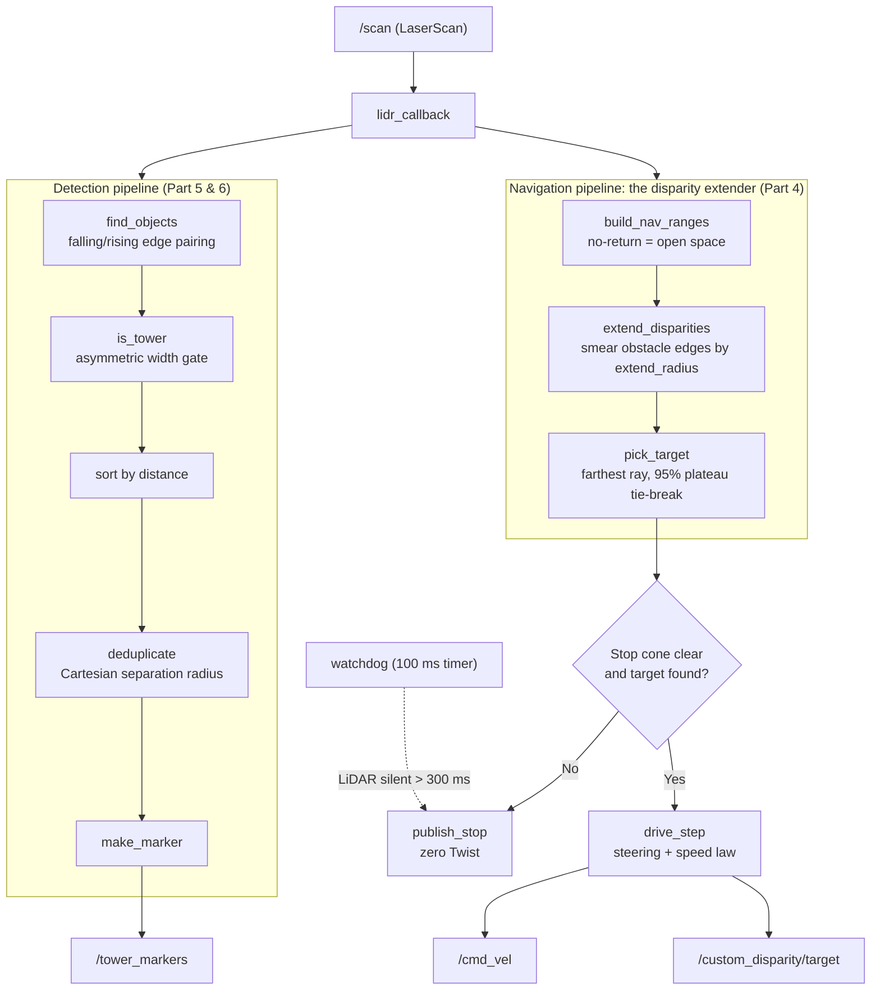
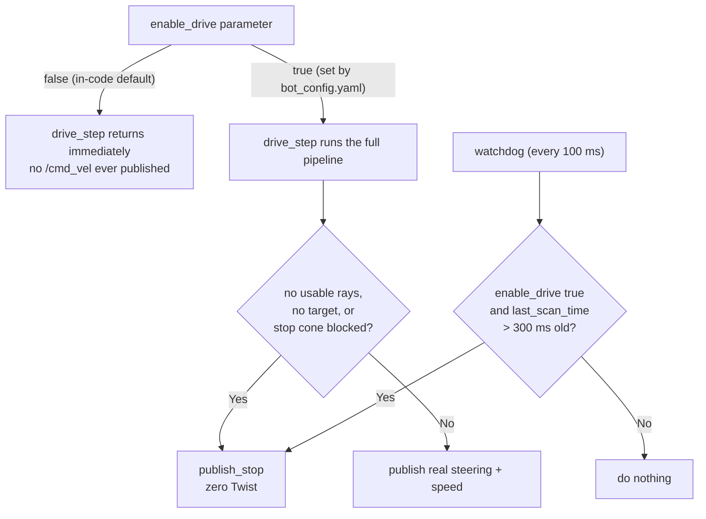
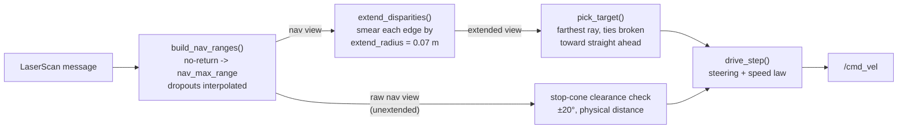
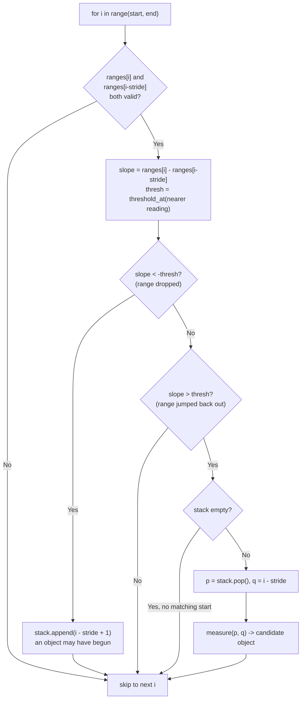
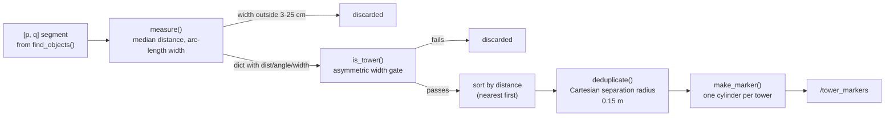

# The Custom Disparity Extender, Explained

*A part-by-part walkthrough of [`autonomy/custom_disparity_extender.py`](../autonomy/custom_disparity_extender.py) for anyone with basic Python knowledge and beginner-level ROS 2 knowledge. Every code block is covered, what it does, and more importantly, **why** it is written that way.*

This node does two jobs on every LiDAR scan, roughly ten times a second:

1. **Detect the towers**: find the 5 cm pillars on the mat, filter out everything that is not a pillar, and draw the survivors in RViz (`/tower_markers`).
2. **Drive the car**: run the classic *disparity extender* racing algorithm over the scan and publish steering + speed on `/cmd_vel`, with several independent safety gates that stop the car when anything looks wrong.

Everything physical about the robot (width, steering lock, speed band, tower size) comes from [`config/bot_config.yaml`](../../config/bot_config.yaml), which the node locates and loads automatically at startup.

## How to run it

```bash
# From anywhere — bot_config.yaml is found and loaded automatically:
ros2 run autonomy custom_disparity_extender

# Or with an explicit params file (takes precedence over the automatic one):
ros2 run autonomy custom_disparity_extender --ros-args \
    --params-file config/bot_config.yaml
```

Check the two startup log lines: they tell you the bot dimensions actually in effect and exactly which config file was loaded (or warn you that none was found, in which case drive stays disabled).

## Topics at a glance

| Topic | Direction | Message type | What flows over it |
|---|---|---|---|
| `/scan` | subscribes | `sensor_msgs/LaserScan` | the LiDAR's fan of distance readings |
| `/cmd_vel` | publishes | `geometry_msgs/Twist` | speed (`linear.x`, m/s) + steering (`angular.z`, normalized −1..+1 of the physical lock) |
| `/tower_markers` | publishes | `visualization_msgs/MarkerArray` | one red disk per detected tower, for RViz |
| `/custom_disparity/target` | publishes | `visualization_msgs/MarkerArray` | green arrow + sphere showing where the car is steering |

## The two pipelines, at a glance

Every scan feeds two independent pipelines that read the same raw data very differently: detection treats an unreliable ray as invalid, navigation treats it as open space (Part 3 explains why they have to disagree).



## Reading guide

The six parts follow the file top to bottom, but each is self-contained enough to read alone:

- **Part 1: Startup and configuration plumbing.** What a ROS 2 parameter is, how `bot_config.yaml` is structured (`/**` wildcard vs. node section), how the node auto-locates the file, and what `main()` wires together.
- **Part 2: `__init__`: every knob explained.** All twenty-five parameters, the derived quantities (`extend_radius`, the tower width gate), the publishers/subscribers, and the index↔angle helpers `a2i()`/`i2a()`.
- **Part 3: Scan intake and safety gates.** How a raw `LaserScan` becomes clean arrays, the single-sentinel trick for invalid rays, and the three independent safety layers (`enable_drive`, the watchdog, `publish_stop`).
- **Part 4: Navigation core.** The disparity extender itself: the nav view of the scan, the smear math, target picking, the stop cone, and the steering/speed laws.
- **Part 5: Tower detection.** Falling/rising edge pairing with a stack, the stride trick for smeared edges, and the width gate that separates pillars from walls.
- **Part 6: Measuring, deduplicating and drawing.** Median-based measurement, Cartesian deduplication, and how the RViz markers are built.

---

## Part 1: Startup and configuration plumbing

This part covers everything that happens *before* the robot logic runs: the module docstring that summarizes the whole node, the imports, the tiny `clamp()` helper, the `find_bot_config()` function that hunts down the YAML configuration file, and `main()`, which wires the configuration into ROS 2 and starts the node. Along the way we will define what a ROS 2 *parameter* is and how `bot_config.yaml` is structured, because the whole point of this file's startup code is getting those parameters into the node safely.

First, three terms you will see constantly:

- A **node** is one running program that participates in a ROS 2 system. This file defines one node, named `custom_disparity_extender`. Nodes talk to each other by publishing and subscribing to **topics**: named message channels like `/scan` or `/cmd_vel`. In this codebase a node never calls another node directly; it just posts messages to a topic and anyone listening receives them.
- A **LiDAR** is a spinning laser rangefinder. Once per revolution it produces a **scan**: an array of distances, one per angle. Each individual distance-at-an-angle is called a **ray**. In ROS 2 a scan arrives as a `LaserScan` message on the `/scan` topic.
- A **parameter** is a named configuration value attached to a node, a number, string, or boolean like `bot.width_m` or `enable_drive`. Parameters are how you tune a node *without editing its code*. We will unpack this fully below.

### The module docstring: what this node does, in miniature

The file opens with a long docstring. It is worth reading closely because it is an accurate table of contents for the entire node.

```python
"""
Custom disparity extender: tower detection + gap navigation between pillars.

Detection pipeline (per scan):
  falling/rising edge pairs -> asymmetric width gate -> dedup -> /tower_markers
```

The node does two independent jobs on every incoming scan. The first is **detection**: find the small pillars ("towers") on the course by looking for places where the measured range suddenly drops (a *falling edge*, the laser starts hitting a pillar in front of the background) and then jumps back up (a *rising edge*, the laser slides off the pillar). Detected objects are filtered by width, deduplicated, and drawn on the `/tower_markers` topic so a human can see them in RViz. (RViz is ROS's 3D visualization tool; a *marker* is a shape (cylinder, arrow, sphere) that a node asks RViz to draw.) Parts 5 and 6 cover this pipeline.

```python
Navigation pipeline (classic disparity extender, per scan):
  1. Build a nav view of the scan: no-return rays count as OPEN space at
     nav.max_range_m, dropouts are interpolated from valid neighbours, ...
```

The second job is **driving**, using the classic "disparity extender" racing algorithm. A **disparity** is a large jump between two neighbouring rays: it means one ray hit something close and the next ray shot past its edge into open space. The algorithm's key trick, described in step 2 of the docstring, is to *smear* the closer distance sideways over the angle that the bot's half-width plus safety margin subtends at that distance: the clearance the robot's body needs to squeeze past that edge. After smearing, any gap too narrow for the robot has literally vanished from the data, so step 3 ("steer at the farthest surviving ray inside the FOV, ties broken toward straight ahead") can never pick an impossible gap. (**FOV** = field of view, the angular window the algorithm considers.) Part 4 explains this algorithm in detail.

```python
All physical geometry (bot width/length, margins, steering lock, speed
band, tower spec) comes from config/bot_config.yaml. The bot.* section is
shared by every node via the /** wildcard, so re-dimensioning the bot is a
config edit, not a code edit.
```

This paragraph states the design philosophy of the startup code: *nothing physical is hardcoded*. If the chassis gets wider, you edit one YAML file and every node on the robot picks it up. The docstring ends with the two ways to run the node, a bare `ros2 run autonomy custom_disparity_extender` (the config is found automatically, as we will see in `find_bot_config()`) or with an explicit `--params-file` argument, which takes precedence over the automatic one.

### The imports

```python
import math
import sys
import time
from pathlib import Path
```

Four pieces of the standard library. `math` supplies `radians`/`degrees`/`atan2` for the constant angle work a LiDAR node does. `sys` gives access to `sys.argv`, the command-line arguments, `main()` needs to inspect and extend them. `time` provides wall-clock timestamps used by the scan watchdog (Part 3). `Path` from `pathlib` is the modern object-oriented way to walk the filesystem, which `find_bot_config()` uses to climb parent directories.

```python
import numpy as np
import rclpy
from geometry_msgs.msg import Twist
from rclpy.node import Node
from sensor_msgs.msg import LaserScan
from visualization_msgs.msg import Marker, MarkerArray
```

`numpy` is used because a scan is an array of ~500 floats (360° at the 0.72° increment of the RPLIDAR C1) arriving 10 times a second; NumPy lets the node filter and transform whole scans in one vectorized operation instead of Python loops. `rclpy` is the ROS 2 Python client library: it provides `rclpy.init()`, `rclpy.spin()`, and the `Node` base class this node inherits from. The remaining imports are **message types**, the typed data structures that travel over topics: `LaserScan` (the incoming scan: an array of ranges plus the angular geometry describing them), `Twist` (the outgoing velocity command: a linear velocity plus an angular velocity, published on `/cmd_vel` to actually move the car), and `Marker`/`MarkerArray` (the RViz drawing instructions mentioned above; a `MarkerArray` is just a list of `Marker`s published together).

### clamp(): keeping a number inside a range

```python
def clamp(val, lo, hi):
    return max(lo, min(hi, val))
```

A one-line utility that limits `val` to the interval `[lo, hi]`. Read it inside-out: `min(hi, val)` caps the value from above, then `max(lo, ...)` caps it from below. Worked example: the steering command must live in `[-1.0, 1.0]` (a fraction of the physical steering lock). If the target angle works out to a raw ratio of `1.7`, then `min(1.0, 1.7) = 1.0` and `max(-1.0, 1.0) = 1.0`, full **left** lock, not an impossible 170%. (Per REP-103, the ROS convention this node follows, a positive angle and positive `angular.z` mean counterclockwise, i.e. left.) With `-2.3` the same two steps give `min(1.0, -2.3) = -2.3` then `max(-1.0, -2.3) = -1.0`, full right lock. It is defined as a free function rather than a method because it has nothing to do with the node's state; `drive_step()` uses it twice, on the steering ratio and on the open-space fraction that sets the speed (see Part 4).

### Interlude: parameters, bot_config.yaml, and the `/**` wildcard

Before `find_bot_config()` makes sense, you need to know what it is finding.

**What a ROS 2 parameter is.** Every node owns a small key–value store of configuration values. The node *declares* each parameter with a name, a type, and a default (this node does it via the `_param()` helper, see Part 2), and at startup ROS 2 can *override* those defaults from an external YAML file passed with `--params-file`. The crucial property: the values live outside the code. The same program can drive a 12 cm bot today and a 21 cm bot tomorrow with zero code changes.

**What bot_config.yaml is.** It is that external YAML file, the single source of truth for this robot's physical reality and tuning. It has two top-level sections, and the distinction between them matters:

```yaml
/**:
  ros__parameters:
    bot:
      width_m: 0.12              # chassis width including wheels
      safety_margin_m: 0.01      # clearance kept on EACH side of the bot
```

The section header `/**:` is a **wildcard**: it means "these parameters apply to *every* node that loads this file", whatever the node's name or namespace. That is exactly right for physical facts: the chassis is 0.12 m wide no matter which node is asking. Any node on the robot that declares a parameter called `bot.width_m` and loads this file gets 0.12. Note two YAML-to-ROS conventions here: the key `ros__parameters` (two underscores) is mandatory boilerplate marking where the parameters start, and nested YAML keys are flattened into dotted names, so the `width_m` under `bot:` becomes the single parameter name `bot.width_m` in code.

```yaml
custom_disparity_extender:
  ros__parameters:
    enable_drive: true
    nav:
      max_range_m: 3.0           # scan cap; no-return rays count as this
```

The second section is headed by a specific node name, so it applies *only* to the node named `custom_disparity_extender`. This is where node-private tuning lives: the drive switch, edge-detection thresholds, the navigation FOV, and so on. Another node loading the same file never sees these.

**Why the code keeps its own defaults, with drive disabled.** Every parameter in the code carries an in-code default (`p('bot.width_m', 0.21)`, Part 2 walks through all of them), so the node still *starts* even if the YAML is missing. But look at what those defaults describe: a 0.21 x 0.31 m bot with a 0.06 m margin (a bigger, older chassis, not the current one). Run the numbers for the smear radius the navigation depends on: from the YAML, `extend_radius = 0.12 / 2 + 0.01 = 0.07 m`; from the code defaults, `0.21 / 2 + 0.06 = 0.165 m`: more than double. Driving with the wrong geometry would be somewhere between overly timid and dangerous. The defense is the parameter `enable_drive`, whose in-code default is `False` while the YAML sets it to `true`:

```yaml
    # Master switch: the node never publishes /cmd_vel unless this is
    # true. The in-code default is false, so a bare `ros2 run` without
    # this file can never move the car.
    enable_drive: true
```

So the failure mode of "config file not found" degrades to "node runs, detects towers, logs a warning, and refuses to move": annoying, never harmful. Defaults are a safety net, not a second copy of the tuning.

### find_bot_config(): auto-locating the YAML

```python
def find_bot_config():
    """Locate config/bot_config.yaml by walking up from this file.
    ...
    """
    for parent in Path(__file__).resolve().parents:
        candidate = parent / 'config' / 'bot_config.yaml'
        if candidate.is_file():
            return str(candidate)
```

Why is this function needed at all? Because the *same* Python file can execute from more than one location. When you build a ROS 2 workspace with `colcon build`, your source code gets copied (or symlinked) into `build/` and `install/` directories, and `ros2 run` launches the *installed* entry point: in this workspace, a generated launcher script under `install/autonomy/lib/autonomy/` that imports the module from the `build/` copy. The one thing all these locations have in common is that they live somewhere *under the workspace root*, and the workspace root is recognizable because it is the directory that contains `config/bot_config.yaml`:

```
ros2_ws/                                   <- workspace root
├── config/
│   └── bot_config.yaml                    <- what we are looking for
├── autonomy/autonomy/
│   └── custom_disparity_extender.py       <- the source you edit
├── build/autonomy/autonomy/
│   └── custom_disparity_extender.py       <- colcon's copy: the module that
│                                             actually gets imported here
└── install/autonomy/lib/autonomy/
    └── custom_disparity_extender          <- launcher script ros2 run starts
```

The mechanism: `Path(__file__).resolve()` gives the absolute path of the running file, resolving any symlinks along the way, so the walk always starts from the file's real location (in a `--symlink-install` workspace that is the source tree, still under the workspace root, which is all that matters). `.parents` then iterates its ancestor directories from nearest to farthest. Walking up from the executed copy at `build/autonomy/autonomy/custom_disparity_extender.py` visits `autonomy/` (the inner package directory), `autonomy/` (the package's build directory), `build/`, and finally `ros2_ws/`, where `ros2_ws/config/bot_config.yaml` exists, so the loop returns it. Running the source copy directly works the same way, two levels up. The docstring highlights the payoff: this always finds the **live** file you edit at the workspace root, never a stale copy colcon may have made somewhere under `build/` or `install/`. Edit the YAML, restart the node, done. No rebuild needed for config changes.

```python
    # Last resort: the documented way to run is from the workspace root.
    candidate = Path.cwd() / 'config' / 'bot_config.yaml'
    return str(candidate) if candidate.is_file() else None
```

If the walk finds nothing (say the package was installed somewhere entirely outside the workspace), there is one more guess: the module docstring documents running the node *from the workspace root*, so try `config/bot_config.yaml` relative to the current working directory. If that also fails, the function returns `None`. Importantly, that is not an error. `main()` turns `None` into a loud warning and the node runs on its safe defaults.

### main(): injecting the config and running the node

```python
def main(args=None):
    argv = list(sys.argv if args is None else args)
```

`main()` accepts an optional `args` list (useful for tests and for launch systems that call `main` directly) and otherwise takes the real command line from `sys.argv`. It copies it to a fresh list because it is about to append to it.

```python
    config_path = None
    if '--params-file' not in argv:
        config_path = find_bot_config()
        if config_path:
            argv += ['--ros-args', '--params-file', config_path]
```

This is the auto-wiring. First it checks whether the caller *already* supplied a params file, either a human typing `--ros-args --params-file ...` or a launch file, which passes node parameters through the command line the same way. If so, the code respects it and does nothing: an explicit choice always beats the automatic one. Otherwise it calls `find_bot_config()` and, on success, appends `--ros-args --params-file <path>` to the argument list, exactly as if the user had typed it. The result: a bare `ros2 run autonomy custom_disparity_extender` behaves identically to the fully spelled-out command in the docstring, and every way of starting the node ends up with the same tuning.

```python
    rclpy.init(args=argv)
    node = CustomDisparityExtender()
```

`rclpy.init()` boots the ROS 2 client library, and (this is the trick that makes the injection work) it *parses* the argument list it is given. The `--params-file` argument (whether typed or injected) is consumed here and stored as pending parameter overrides. Then the node object is constructed; inside `__init__`, every `declare_parameter` call (via `_param()`, see Part 2) checks those pending overrides and returns the YAML value instead of the in-code default whenever the file provides one. That is the entire mechanism by which `bot.width_m: 0.12` in a YAML file becomes `self.bot_width == 0.12` in Python.

```python
    if config_path:
        node.get_logger().info(f'Parameters auto-loaded from {config_path}')
    elif '--params-file' in argv:
        node.get_logger().info('Parameters from caller-supplied --params-file.')
    else:
        node.get_logger().warn(
            'bot_config.yaml NOT found — running on in-code defaults '
            '(drive stays disabled).')
```

Three mutually exclusive startup messages, one per possible configuration source, so the very first lines of the log tell you which world you are in:

1. **Auto-loaded** (`config_path` is set): `find_bot_config()` succeeded and the file was injected, the normal case, and the log prints the exact path so you can confirm it found the file you think it found.
2. **Caller-supplied** (`config_path` is `None` but `--params-file` is in `argv`): someone passed a file explicitly, so the auto-finder was skipped entirely.
3. **Not found** (neither): a *warning*, not an info, spelling out the consequence: the node is alive but on in-code defaults, and per the safety-net design above, `enable_drive` defaults to `False`, so the car will not move. If your robot mysteriously refuses to drive, this is the first log line to look for.

```python
    try:
        rclpy.spin(node)
    except KeyboardInterrupt:
        pass
    finally:
        node.destroy_node()
        if rclpy.ok():
            rclpy.shutdown()
```

`rclpy.spin(node)` is the node's event loop: it blocks forever, waking the node's callbacks as work arrives, `lidr_callback` for each `/scan` message and `watchdog` on its 100 ms timer (Parts 3 and 4). The `try/except/finally` shape is the standard clean-shutdown pattern. Ctrl-C raises `KeyboardInterrupt` out of `spin`; catching it with `pass` turns a scary traceback into a quiet exit. The `finally` block runs no matter how `spin` ended: `destroy_node()` releases the node's publishers, subscriptions, and timers, and `rclpy.shutdown()` tears down the client library, but only after checking `rclpy.ok()`, because on Ctrl-C recent rclpy versions may have *already* shut the context down internally, and calling `shutdown()` on an already-shut-down context raises an exception of its own. The guard makes the cleanup idempotent.

```python
if __name__ == '__main__':
    main()
```

The standard Python entry-point guard: run `main()` when the file is executed directly (e.g. `python3 custom_disparity_extender.py`), but not when it is merely imported. `ros2 run` reaches `main()` through the package's registered console-script entry point instead, so both paths converge on the same function.

### Gotchas

- **Missing YAML is silent-ish but safe.** If `find_bot_config()` returns `None`, the node starts normally and even detects towers; it just never drives, because the in-code `enable_drive` default is `False`. The only evidence is the startup warning and the word `disabled` in the greeting log from `__init__`. Always check the first few log lines after startup.
- **`ros__parameters` has two underscores.** Typing `ros_parameters` in the YAML does not silently fall back to defaults, ROS 2's parameter parser *requires* that key, so the misspelled file fails to parse and `rclpy.init()` dies at startup with an error like `Cannot have a value before ros__parameters at line ...`. The error is loud but cryptic: it points at a line number in the YAML, not at the misspelled key, so know to look for the double underscore.
- **The node-name section must match exactly.** The `custom_disparity_extender:` header must equal the name passed to `super().__init__()` (Part 2). Rename the node in code without renaming the YAML section and all node-specific tuning (including `enable_drive: true`) silently stops applying. The `/**` section, being a wildcard, keeps working regardless.
- **Config edits are live; code edits are not.** Because `find_bot_config()` returns the workspace-root file, editing `bot_config.yaml` needs only a node restart. Editing the *Python* file, however, changes the source copy, while `ros2 run` executes the copy colcon made under `build/`, without a fresh `colcon build` (or a `--symlink-install` workspace) your code change does nothing, which can look exactly like a config problem.
- **An explicit `--params-file` wins completely.** The membership test `'--params-file' not in argv` means that if you pass any params file yourself, the workspace one is not loaded at all, you must supply *all* the tuning yourself, including the `/**` geometry section, or the code defaults fill the gaps.

## Part 2: `__init__`: every knob explained

`__init__` is the constructor: the method Python runs once when the node object is created, before any laser data arrives. Everything this node will ever need (the robot's physical dimensions, all the tuning numbers, the connections to other programs) is set up here. By the end of `__init__` the node is fully wired and simply waits for scans.

A quick vocabulary check before we dive in, because these words appear constantly below:

- A **node** is one running program in a ROS 2 system. Nodes talk to each other over **topics**: named channels such as `/scan` or `/cmd_vel`. A node **publishes** messages onto a topic or **subscribes** to receive them.
- A **parameter** is a named configuration value attached to a node (a number, string, or boolean). Parameters can be set from a YAML file at launch, which is exactly what `bot_config.yaml` does (Part 1 explains how that file is found and loaded).
- A **LaserScan** is the standard ROS 2 message a spinning LiDAR publishes: one revolution's worth of distance measurements. Each individual measurement is a **ray**: "at angle θ, the nearest surface is r metres away".
- **FOV** (field of view) is the wedge of angles we actually care about, e.g. "±90° around straight ahead".
- A **disparity** is a sudden jump in distance between two neighbouring rays, the signature of an object's edge.

We will now walk through `__init__` block by block, in the order the code runs.

### The constructor preamble and the `_param()` helper

```python
def __init__(self):
    super().__init__('custom_disparity_extender')

    p = self._param
```

`super().__init__('custom_disparity_extender')` calls the constructor of the ROS 2 `Node` base class and registers this program on the network under the name `custom_disparity_extender`. That name matters: in `bot_config.yaml`, the section headed `custom_disparity_extender:` applies its parameters only to a node with exactly this name, while the `/**:` section applies to every node.

`p = self._param` just gives the helper method a one-letter alias so that the twenty-five parameter reads below fit on single readable lines. The helper itself is defined right after `__init__`:

```python
def _param(self, name, default):
    """Declare with a default and read back the (possibly overridden) value."""
    self.declare_parameter(name, default)
    return self.get_parameter(name).value
```

In ROS 2, a node must **declare** a parameter (name plus default value) before it can read it. If a YAML file loaded at startup contains that name, the file's value **overrides** the default; otherwise the default stands. `_param()` bundles the declare-and-read dance into one call, so every line like `p('bot.width_m', 0.21)` means: "use `bot.width_m` from the YAML if present, else fall back to 0.21". Keep this precedence in mind for the whole section, several code comments describe the *in-code defaults*, while the numbers actually in effect on this robot come from `bot_config.yaml`.

One more subtlety: the YAML contains keys this node never declares (`bot.wheel_diameter_m`, `bot.encoder_counts_per_rev`, `bot.lidar.forward_offset_m`). That is fine, the `/**:` section is shared by every node, and each node only picks up the parameters it declares. Undeclared keys are silently ignored.

### Global bot geometry

```python
self.bot_width = float(p('bot.width_m', 0.21))
self.bot_length = float(p('bot.length_m', 0.31))
self.safety_margin = float(p('bot.safety_margin_m', 0.06))
self.max_steer_rad = math.radians(float(p('bot.max_steer_deg', 60.0)))
self.max_speed = float(p('bot.max_speed_mps', 0.6))
self.min_speed = float(p('bot.min_speed_mps', 0.25))
```

With the values in `bot_config.yaml`, the robot is **0.12 m wide** (including wheels) and **0.21 m long** (bumper to bumper), and keeps a **0.01 m safety margin** of extra clearance on each side. Notice the code defaults (0.21 × 0.31 m) describe a bigger chassis than the YAML. The config file is the source of truth here, and it carries one stale trace of the old dimensions itself: the YAML comment on `nav.stop_distance_m` still reads "(bot is 31 cm long)", matching the 0.31 m code default rather than the configured 0.21 m. Both are good illustrations of why the module docstring says "re-dimensioning the bot is a config edit, not a code edit", and why you trust values, not comments.

`max_steer_deg` is the physical steering lock, how far the steering can turn to one side, here 60°. `math.radians()` converts it because everything downstream works in radians (the natural angle unit for ROS and for `math` functions: 180° = π radians). The `float()` wrappers on every line are cheap insurance: they guarantee the attribute is a Python float regardless of how the YAML author typed the number (`60` vs `60.0`), and they document the expected type.

`max_speed_mps` (0.6 m/s) and `min_speed_mps` (0.25 m/s) define the **speed band**: the node never commands faster than the ceiling on open track, and never slower than the creep floor while it is moving at all (below that, it stops outright). How speed is interpolated inside this band is Part 4's business.

### `frame_id`: which coordinate frame the drawings live in

```python
# Verify against: ros2 topic echo /scan --field header.frame_id
# C1 drivers publish either 'laser' or 'laser_frame'; a mismatch
# makes markers vanish silently.
self.frame_id = str(p('bot.lidar.frame_id', 'laser'))
```

A **coordinate frame** is a named origin-plus-axes that positions are measured in; every positioned ROS message carries a `frame_id` saying which frame its coordinates belong to. This node later publishes **markers**: drawing instructions (cylinders, arrows, spheres) that **RViz**, the standard ROS 2 visualization GUI, renders in 3D. Those markers describe positions like "tower at x = 0.8, y = 0.3", and those numbers only mean something *relative to the LiDAR*, so the markers must be stamped with the LiDAR's own frame.

The gotcha the comment warns about is real and painful: different RPLIDAR driver packages name the sensor frame differently (`laser` vs `laser_frame`). If this parameter does not exactly match what the driver puts in the scan's header, RViz cannot place the markers and quietly draws nothing, no error, no warning, just an empty screen. The comment even gives you the diagnostic command: echo the scan topic's `header.frame_id` field and compare. The YAML sets `laser`.

### The tower spec

```python
tower_w = float(p('bot.tower.width_m', 0.05))

# Pillars sit min_separation apart centre-to-centre at the tightest.
# Anything closer than this is the same pillar detected twice.
self.min_tower_separation = float(p('bot.tower.min_separation_m', 0.10))
```

The competition "towers" are square pillars with a **0.05 m (5 cm) face**. Note that `tower_w` is a local variable, not `self.tower_w`: it is only needed to compute the two derived widths in the next block.

`min_tower_separation` (0.15 m from the YAML, overriding the 0.10 m default) encodes a fact about the *world*: two distinct physical pillars are never closer than 15 cm centre-to-centre. Therefore, if two detections land closer together than that, they must be the same pillar seen twice, and the deduplication step (Part 6) merges them. Encoding world knowledge as a parameter keeps the merging rule honest and adjustable.

### Derived quantities: `extend_radius` and the tower width gate

```python
self.extend_radius = self.bot_width / 2.0 + self.safety_margin
self.tower_w_min_face = tower_w * 100.0
self.tower_w_max_diag = tower_w * 100.0 * math.sqrt(2.0)
```

These three numbers are *computed* from the parameters rather than configured directly, so they can never drift out of sync with the geometry.

**`extend_radius`** is the single most important number in the whole node. It answers: "how much lateral clearance does the bot need to slide past an obstacle edge?" That is half the body width (the centreline to the outer edge) plus the safety margin. With our numbers:

```
extend_radius = 0.12 / 2 + 0.01 = 0.06 + 0.01 = 0.07 m
```

Part 4 shows how every detected edge in the scan gets "smeared" sideways by exactly the angle this 0.07 m subtends, which is what makes "steer at the farthest ray" collision-safe.

**The tower width band** answers: "how wide can a 5 cm square pillar *appear* to the LiDAR?" The `* 100.0` simply converts metres to centimetres, because the measurement code (Part 6) reports widths in cm. The interesting factor is `sqrt(2)`. A square pillar seen **face-on** presents its 5 cm face. Seen **corner-on** (rotated 45°), its silhouette spans the diagonal, which for a square of side *w* is *w*·√2:

```
   face-on:                 corner-on (rotated 45°):

   +-------+                        /\
   |       |                       /  \
   +-------+                       \  /
                                    \/
   silhouette = w = 5.0 cm     silhouette = w·√2 ≈ 7.07 cm
```

So any honest measurement of a real tower must land between `tower_w_min_face = 5.0` cm and `tower_w_max_diag ≈ 7.07` cm (before measurement slack is added, see `tower_width_gate()` in Part 5). Anything far outside that band is a wall, a robot, or noise.

### Edge-detection tuning

```python
self.spike_threshold = float(p('spike_threshold_m', 0.06))
self.spike_ref_dist = float(p('spike_ref_dist_m', 0.8))
self.edge_stride = int(p('edge_stride', 6))
self.fov_half_deg = float(p('detect_fov_half_deg', 90.0))
```

These four knobs tune the tower *detector* (the falling/rising-edge machinery of Part 5).

- `spike_threshold` is the minimum jump in distance between compared rays that counts as an edge. The in-code comment explains the default choice of 0.06 m: a pillar seated only 400 mm off the inner wall produces just a small disparity at grazing incidence, and a stricter 0.10 m threshold started missing those past 1.5 m. The YAML, however, overrides this to **0.02 m**: a reminder that comments describe defaults while the config holds the live values.
- `spike_ref_dist` (0.05 m in the YAML, overriding the 0.8 m default) is the reference distance at which `spike_threshold` applies as-is; beyond it, the effective threshold grows linearly with range via `threshold_at()` (Part 5 explains why flat walls viewed obliquely would otherwise trigger false edges). Worked example with the YAML numbers: at 0.5 m the effective threshold is 0.02 × (0.5 / 0.05) = 0.20 m.
- `edge_stride` (3 in the YAML, overriding the default 6) means edges are found by comparing `ranges[i]` against `ranges[i - stride]` rather than the immediate neighbour. Skipping a few rays makes a gradual-but-real edge register as one clean jump instead of several sub-threshold steps (the mechanics and the index bookkeeping it forces live in Part 5).
- `fov_half_deg` (90°) restricts the tower search to ±90° around straight ahead, there is no point detecting pillars behind the bot.

```python
self.width_min_cm = float(p('width_min_cm', 3.0))
self.width_max_cm = float(p('width_max_cm', 25.0))
```

These are *coarse* sanity bounds applied in `measure()` (Part 6), before the precise tower gate. The comments give the reasoning: below **3.0 cm**, a "detection" is about the size of a single noisy ray at working range, so it cannot be trusted; above **25.0 cm**, the object is wider than the widest legitimate obstacle on the course (the 200 mm parking-lot limitation) and is therefore a wall segment, not a tower.

```python
self.max_useful_range = float(p('max_useful_range_m', 2.0))
```

Detection simply ignores anything beyond **2.0 m**. The comment explains why with course geometry (the corridor is 1000 mm wide, the whole mat 3200 mm): a resolution argument. The LiDAR's rays fan out, so at distance *d* neighbouring rays are about *d* × angular-step apart. At 2 m with a 0.72° step, that is 2.0 × 0.01257 ≈ **2.5 cm between rays**, so a 5 cm pillar is hit by at most about two rays, far too few to measure a width meaningfully. Rather than produce garbage widths, the detector declares those rays invalid (Part 3 shows where this cap is applied).

### Navigation tuning

```python
self.nav_fov_half = math.radians(float(p('nav.fov_half_deg', 80.0)))
self.nav_max_range = float(p('nav.max_range_m', 3.0))
self.disparity_thresh = float(p('nav.disparity_threshold_m', 0.25))
self.stop_distance = float(p('nav.stop_distance_m', 0.35))
self.stop_cone_half = math.radians(float(p('nav.stop_cone_half_deg', 20.0)))
self.steer_speed_drop = float(p('nav.steer_speed_drop', 0.4))
```

This is the second, independent set of knobs, for *driving*, not detecting. The two pipelines deliberately read the scan differently (Part 4 explains the biggest difference: navigation treats "no return" as open space, detection treats it as invalid).

- `nav_fov_half` (80°): the steering target is only ever chosen within ±80° of straight ahead.
- `nav_max_range` (**3.0 m**): every distance is capped here, and rays with no return are counted as open space *at* this distance. It is the "far enough to not matter" horizon.
- `disparity_thresh` (0.25 m): the minimum jump between *adjacent* rays that navigation treats as an obstacle edge worth smearing. Note it is much larger than the detector's spike threshold, navigation only cares about edges big enough to clip a car on.
- `stop_distance` (0.35 m) and `stop_cone_half` (20°) together define the **stop cone**: a forward wedge of ±20° in which any obstacle closer than 0.35 m parks the car. The clearance is measured on the *unextended* nav-view distances (the code comment in `drive_step` calls them "raw nav distances, not extended ones": the smearing is a steering fiction, physical clearance is physical). The YAML comment justifies 0.35 m against "(bot is 31 cm long)": the stale 0.31 m figure again; with the configured 0.21 m body the stopping margin is simply more generous:

```
            \    ±20°    /
             \    |     /      any nav-view distance inside this
              \   |    /       wedge closer than 0.35 m
               \  |   /        => publish zero velocity
                \ |  /
                [bot]
```

- `steer_speed_drop` (0.4): the fraction of speed surrendered at full steering lock. At full lock the commanded speed is multiplied by 1 − 0.4 = 0.6, so hard cornering is automatically slower. The full speed formula is walked through in Part 4.

### The drive gate: `enable_drive`

```python
# Drive gate. Default OFF in code so a bare `ros2 run` without the
# config file can never move the car; bot_config.yaml enables it.
self.enable_drive = bool(p('enable_drive', False))
```

This is a deliberate safety design, worth internalizing. The *code* defaults to `False`; only the *config file* flips it to `true`. Consequence: if the YAML fails to load (wrong directory, typo in the filename, missing file) the node still runs, still detects towers, still publishes markers, but **cannot** publish motion commands. A configuration failure degrades to "car sits still", never to "car drives off with default tuning". `drive_step()`, the only method that can command motion, returns immediately when this flag is false, and even the watchdog's emergency stop is gated on it (Part 3).

### Topic names

```python
scan_topic = str(p('scan_topic', '/scan'))
cmd_topic = str(p('cmd_vel_topic', '/cmd_vel'))
```

Even the topic names are parameters (locals, like `tower_w`, because they are only needed a few lines below). `/scan` is the conventional name for LaserScan data and `/cmd_vel` ("command velocity") the conventional name for motion commands, but making them configurable means you can retarget the node (say, at a recorded or simulated scan topic) without touching code. The YAML sets both to the conventional names anyway.

### LiDAR state fallbacks

```python
# ── LiDAR state (fallbacks until the first scan arrives) ──
# 0.72 deg matches an RPLIDAR C1 at 10 Hz.
self.min_ang = -math.pi
self.max_ang = math.pi
self.ang_inc = math.radians(0.72)
self.ranges = np.empty(0, dtype=np.float32)
self.valid = np.empty(0, dtype=bool)
self.last_scan_time = 0.0
```

These attributes describe the *current scan*, but at construction time no scan exists yet, so they are seeded with safe placeholders. `min_ang`/`max_ang` are the angles of the first and last ray, and `ang_inc` is the angular step between neighbouring rays. The placeholders are **not trusted**: `lidr_callback()` overwrites all three from every incoming LaserScan message, precisely because hardcoding them breaks on LiDARs with a different angle convention (Part 3 covers that failure mode). Their job here is simply to guarantee the attributes exist with sane values, so nothing crashes or divides by zero if any method runs before the first scan.

The specific values are still chosen to match the actual hardware. The comment "0.72 deg matches an RPLIDAR C1 at 10 Hz" is worth unpacking: the RPLIDAR C1 takes about 5000 distance samples per second; spinning at 10 revolutions per second, that is 500 samples per revolution, and 360° / 500 = **0.72° per ray**. So a typical scan from this sensor is an array of about 500 ranges, and the fallback geometry is a faithful stand-in.

`ranges` (the distances) and `valid` (a parallel array of booleans marking which rays are trustworthy) start as empty NumPy arrays, an empty scan, which every consumer already handles (for example, `find_objects()` returns an empty list when there are no rays). `last_scan_time = 0.0` means "never received a scan", a sentinel the watchdog checks so it does not scream about silence before the LiDAR has even started.

### Subscriptions, publishers, and the watchdog timer

```python
self.sub = self.create_subscription(
    LaserScan, scan_topic, self.lidr_callback, 10)
self.marker_pub = self.create_publisher(MarkerArray, '/tower_markers', 10)
self.target_pub = self.create_publisher(MarkerArray, '/custom_disparity/target', 10)
self.cmd_pub = self.create_publisher(Twist, cmd_topic, 10)
```

This is the node's entire interface with the outside world:

- **One subscription**: every LaserScan message arriving on `/scan` triggers `self.lidr_callback` (yes, "lidr" is a typo in the method name, harmless, since it is used consistently). The trailing `10` is the queue depth: if messages arrive faster than they are processed, up to 10 are buffered before the oldest are dropped. Dropping old scans is *correct* here, a stale scan is worse than no scan.
- **Three publishers**: `/tower_markers` carries a `MarkerArray` (a batch of RViz drawing instructions) showing detected pillars as cylinders; `/custom_disparity/target` carries the arrow-plus-sphere pair showing where the bot intends to drive (Part 6 covers both); and `cmd_pub` publishes `Twist` messages (the standard ROS velocity command) on `/cmd_vel`, where the microcontroller bridge picks them up and moves the motors. In this codebase `linear.x` is the speed in m/s as usual, but `angular.z` carries a *normalized steering value* in [−1, 1] of the physical lock rather than the standard rad/s, the convention the MCU bridge expects, spelled out where the command is built in `drive_step()` (Part 4).

```python
# A silent /scan must never leave the MCU on a stale throttle.
self.create_timer(0.1, self.watchdog)
```

`create_timer(0.1, ...)` asks ROS to call `self.watchdog` every 0.1 seconds, forever, independently of whether scans arrive. That independence is the whole point: the scan callback obviously cannot detect that scans have *stopped* coming. If the LiDAR cable is yanked mid-run, the last published `Twist` would otherwise stay in force and the MCU (microcontroller unit, the board driving the motors) would hold its last throttle blindly. The watchdog body, which stops the car after 300 ms of LiDAR silence, is covered in Part 3.

### The startup log line

```python
self.get_logger().info(
    f'Custom disparity extender up | bot {self.bot_width:.2f}x'
    f'{self.bot_length:.2f} m | extend radius {self.extend_radius:.3f} m | '
    f'drive {"ENABLED" if self.enable_drive else "disabled"}'
)
```

One line, printed once, and it doubles as a configuration self-test. With the YAML loaded you should see `bot 0.12x0.21 m | extend radius 0.070 m | drive ENABLED`. If you instead see `bot 0.21x0.31 m`, `extend radius 0.165 m` and `drive disabled`, the node is running on in-code defaults (the config file was not found) and you know it *before* wondering why the car will not move.

### The index–angle helpers: `a2i()` and `i2a()`

```python
def a2i(self, angle: float) -> int:
    """Angle (radians) -> array index. round(), not int(): int() truncates
    toward zero, which is asymmetric either side of 0."""
    return int(round((angle - self.min_ang) / self.ang_inc))

def i2a(self, index: int) -> float:
    """Array index -> angle (radians)."""
    return self.min_ang + index * self.ang_inc
```

A LaserScan is just a flat array, but each slot corresponds to a direction. Ray `i` points at angle `min_ang + i × ang_inc`, that is `i2a()`, and `a2i()` is its inverse. With the fallback geometry (−π to +π in 0.72° steps, ~500 rays):

```
        +90° (left)          0° (ahead)          −90° (right)
           i = 375             i = 250              i = 125
               \                  |                  /
                \                 |                 /
                 \                |                /
                  `------------[LiDAR]-----------'
   i = 0 at −180° ... index grows counter-clockwise ... i = 499 at ≈ +179°
```

(Angles follow the ROS convention **REP-103**: positive is counter-clockwise, i.e. to the robot's left.) Worked example: straight ahead is `a2i(0.0)` = round((0 − (−π)) / 0.012566) = round(250.0) = **250**: exactly, because 180° / 0.72° = 250.

Why `round()` and not `int()`? Because `int()` on a positive float always truncates *downward*, which biases every conversion toward lower indices, and (as the docstring notes) does so asymmetrically about the forward direction. Concretely: the angle +0.35° lands at exact array position 250.486, and −0.35° at 249.514. With `round()` both map to index 250, symmetric as they should be for two nearly-forward angles. With `int()` they map to 250 and **249**: two mirrored angles land on non-mirrored rays. Every FOV window built from `a2i()` (the ±80° nav window, the ±20° stop cone) would be systematically lopsided by up to one ray, which for a steering algorithm means a permanent, tiny, maddening pull to one side. `round()` snaps to the *nearest* ray and the bias disappears.

`i2a()` is used in the opposite direction: once the navigation core picks a winning ray index, `i2a()` converts it back into the steering angle to command (Part 4). The two functions are inverses only up to quantization, `i2a(a2i(θ))` returns the angle of the nearest ray, not θ itself, which is exactly the precision the hardware offers anyway.

### Gotchas for this section

- **`frame_id` mismatch = invisible markers.** If `bot.lidar.frame_id` does not exactly match the scan's `header.frame_id` (check with `ros2 topic echo /scan --field header.frame_id`), RViz drops every marker without any error message. This is the single most common "my markers disappeared" cause.
- **Parameter names must match exactly.** A misspelled key in the YAML (say `safety_margin` instead of `safety_margin_m`) does not fail loudly, the node silently uses the in-code default. The startup log line is your quick check that the real geometry loaded.
- **Comments describe defaults; the YAML holds the truth, and even YAML comments can lie.** The 0.06 m spike-threshold rationale in the code explains the *default* while the live value is 0.02 m; conversely the YAML's own `stop_distance_m` comment still quotes the old 31 cm body length. When debugging, read the *values* in `bot_config.yaml`, not any comment.
- **The fallback scan geometry is a placeholder, not a promise.** The code comment in `lidr_callback()` spells out the failure mode: hardcoding `min_ang = −π` breaks `a2i()` on any LiDAR that publishes its scan as 0…2π, indices come out wrong, and a negative index is silently wrapped by Python to the *end* of the array instead of raising an error. This is exactly why the callback re-reads `angle_min`, `angle_max` and `angle_increment` from every message (Part 3).
- **`enable_drive` is off by design.** If the car refuses to move, check the startup log for `drive disabled` before suspecting the algorithm, the config file probably was not found.

## Part 3: Scan intake and safety gates

This part walks through `lidr_callback()`, the code that runs every time a new LiDAR scan arrives, from reading the message's geometry all the way to handing off to navigation, plus the three pieces of safety machinery that keep the car from doing anything dangerous: `publish_stop()`, the `watchdog()` timer, and the `enable_drive` master gate. (The inside of `drive_step()` is Part 4; here we stop at its front door.) Before reading any of that code, it helps to know exactly what the message being handed to the callback contains.

### What a `sensor_msgs/LaserScan` message actually contains

A 2D LiDAR is a spinning laser rangefinder. As it rotates, it fires a laser pulse at regular angular steps and measures how long the reflection takes to come back, which gives one distance per direction. Each of those individual distance measurements is called a **ray**. One full sweep of rays is packaged into a single **LaserScan message** (a message is just a typed bundle of data sent over a ROS 2 topic) and published, here on the `/scan` topic.

The fields that matter for this node are:

- `header.stamp`, when the scan was taken.
- `header.frame_id`, the name of the **coordinate frame** the measurements are expressed in (a frame is a named origin-plus-axes; everything in ROS is positioned relative to some frame). For an RPLIDAR C1 this is usually `laser` or `laser_frame`.
- `angle_min`, `angle_max`, the angles (in radians) of the first and last ray in the sweep.
- `angle_increment`, the angular step between neighbouring rays.
- `range_min`, `range_max`, the sensor's own trustworthy distance limits; readings outside them are garbage.
- `ranges[]`, the actual data: one distance in metres per ray. This is the array everything in this node works on.
- `intensities[]`, reflection strength per ray (unused here).

The key relationship is that `ranges[i]` is the distance measured at angle `angle_min + i * angle_increment`. The scan is a fan of rays:

```
                     angle 0 (straight ahead)
                             |
       +45 deg   \     .     |     .     /   -45 deg
                  \     .    |    .     /
                   \     .   |   .     /
       +90 deg .....\    .   |   .    /..... -90 deg
                     \    .  |  .    /
                       [ LiDAR ]

   one ray  =  one entry of msg.ranges
   ray i points at:  angle_min + i * angle_increment
```

(Positive angles are to the *left*, that is REP-103, ROS's standard convention: x forward, counter-clockwise positive when viewed from above.)

Concretely, the RPLIDAR C1 used here steps about 0.72 degrees per ray at 10 Hz, so one revolution is roughly `360 / 0.72 = 500` rays, and the node receives about ten of these 500-element arrays per second. The **FOV** (field of view) is simply the slice of this fan a given algorithm chooses to look at, for example, tower detection searches ±90 degrees around straight ahead (`detect_fov_half_deg: 90.0` in `bot_config.yaml`).

### Reading the scan geometry from every message

```python
def lidr_callback(self, msg: LaserScan):
    # Read geometry from the message every frame. Hardcoding min_ang = -pi
    # breaks a2i() on any LiDAR publishing 0..2pi: the index goes negative
    # and Python silently wraps to the end of the array.
    self.min_ang = msg.angle_min
    self.max_ang = msg.angle_max
    self.ang_inc = msg.angle_increment
    self.last_scan_time = time.time()
```

`lidr_callback()` is the **callback** registered on the `/scan` subscription in `__init__` (see Part 2): ROS 2 calls it automatically for every incoming scan. Its first act is to copy the scan geometry (`angle_min`, `angle_max`, `angle_increment`) out of the message into the node's own attributes, overwriting the fallback values that `__init__` set. It also records `time.time()` into `self.last_scan_time`; that timestamp is the heartbeat the `watchdog()` timer checks later.

Why re-read the geometry on *every* frame instead of assuming it? Because these three numbers are the foundation of the angle-to-index conversion used everywhere else in the node:

```python
def a2i(self, angle: float) -> int:
    return int(round((angle - self.min_ang) / self.ang_inc))
```

`a2i()` converts "an angle in radians" into "which slot of the `ranges` array", and `i2a()` does the reverse. Both are only correct if `self.min_ang` matches what the sensor actually published, and different LiDAR drivers genuinely disagree on this. Some publish angles from −π to +π (straight ahead near the middle of the array); others publish 0 to 2π (straight ahead at index 0). Assume the wrong convention and every conversion lands on the wrong physical ray. Two concrete failures with the C1's 0.012566 rad (0.72 degree) increment:

- The device publishes 0..2π, but the code hardcodes `min_ang = -π`. Asking for the forward ray gives `a2i(0) = (0 − (−π)) / 0.012566 ≈ 250`, but index 250 on this device points at `250 × 0.72 ≈ 180` degrees, directly *behind* the car. The node would steer using the view out the back window.
- The device publishes −π..+π, but the code assumes angles start at 0. Asking for the right-hand edge of the nav FOV gives `a2i(-80°) = −1.396 / 0.012566 ≈ −111`. Python and NumPy do not treat a negative index as an error, `ranges[-111]` silently means "111 rays from the *end* of the array", which on this device is a ray pointing roughly +100 degrees, behind-left. No exception, no warning; the bug only shows up as the car flinching at obstacles that are actually behind it.

Copying the values from every message keeps `a2i()` consistent with whichever convention the driver uses, an index always maps back to the angle the driver actually reported, even if you hot-swap the LiDAR driver mid-session. One honest caveat: consistency is not full immunity. Parts of the node still assume that straight ahead (angle 0) lies *inside* the array, true for a −π..+π driver, but on a 0..2π driver the forward wedge sits split across *both ends* of the array and the FOV windows silently degrade. Part 4's angle-wraparound gotcha walks through exactly what goes wrong.

### Rejecting a broken scan early

```python
if self.ang_inc <= 0.0:
    self.get_logger().warn('angle_increment is non-positive; dropping scan.')
    return
```

`a2i()` divides by `self.ang_inc`. A zero increment would crash the node with a `ZeroDivisionError`, and a negative one would flip every index calculation. A malformed message (a misconfigured driver, or a half-initialised simulator) is not worth crashing over, so the callback logs a warning and simply drops the frame. The next good scan restores normal operation.

One subtlety: the heartbeat was already refreshed *before* this check, so a driver streaming malformed scans still counts as "alive" to the watchdog even though every frame is dropped. That is a deliberate division of labour (the watchdog detects *silence*, not garbage) but it is worth knowing (see the gotchas below).

### One sentinel for every kind of invalid reading

```python
r = np.array(msg.ranges, dtype=np.float32)

# ONE sentinel for every kind of invalid reading. Mapping nan -> inf and
# inf -> 0 would turn "nothing in range" into "obstacle at 0 m" and
# manufacture a disparity against the neighbouring ray.
r = np.nan_to_num(r, nan=0.0, posinf=0.0, neginf=0.0)
```

The raw `ranges` field arrives as a plain Python sequence; converting it to a NumPy `float32` array makes all the later element-wise maths fast, and 32-bit floats carry far more precision than the sensor itself delivers.

Real scans are messy. By convention a driver reports `inf` when the pulse never came back (nothing within `range_max`), `NaN` for a measurement error, and some drivers report `0.0` for either. `np.nan_to_num()` collapses every one of these special values to a single **sentinel**: a reserved marker value, here `0.0`, chosen because the very next lines' validity mask requires every trusted ray to exceed at least 1 cm (`max(range_min, 0.01)`), so a `0.0` can never sneak through as data no matter what the sensor's own `range_min` says.

The comment warns about the tempting-but-wrong alternative. Suppose a no-return ray's value ever got *treated as data* rather than masked out. Three neighbouring rays would become:

```
ray:        i-1     i     i+1
raw (m):    1.52   inf    1.50        reality: dropout / nothing in range
naive:      1.52   0.00   1.50        "solid obstacle at 0 m!"
```

The step from 1.52 m down to 0.00 m looks exactly like a **disparity**: a large jump between neighbouring rays, which is precisely the signal the detection and navigation algorithms hunt for (Parts 4 and 5). One flaky ray would manufacture a phantom obstacle glued to the bumper. Mapping the other direction (`nan → inf`) is subtler but still wrong: it relabels "measurement error" as "nothing within range", a claim the sensor never made. (In this particular pipeline the mask's upper bound would still catch the `inf`, but only because sentinel and mask are designed as a matched pair; the single-sentinel rule is what keeps that pairing simple enough to stay correct.) The design means invalid rays never participate in any comparison at all, `find_objects()` explicitly skips ray pairs where either sample fails the mask.

One subtlety worth noting: this cleaned array feeds the *tower detection* pipeline. Navigation deliberately re-reads the raw `msg.ranges` in `build_nav_ranges()` and applies a different policy, where a no-return ray counts as open space, see Part 4 for why the two pipelines must disagree about `inf`.

### The valid mask: which rays are trustworthy

```python
upper = min(float(msg.range_max), self.max_useful_range)
valid = (r > max(float(msg.range_min), 0.01)) & (r < upper)

self.ranges = r
self.valid = valid
```

`valid` is a boolean mask: an array of `True`/`False` the same length as `ranges`, marking which rays detection is allowed to trust. A ray must clear two gates:

- **Lower bound:** it must exceed the larger of the sensor's own `range_min` and 1 cm. This single comparison throws out the `0.0` sentinel from the previous step, any driver that reports `0.0` natively, and readings inside the sensor's blind zone.
- **Upper bound:** it must be below the smaller of the sensor's `range_max` and `max_useful_range`, which `bot_config.yaml` sets to 2.0 m.

Why cap detection at 2.0 m when the sensor can see much farther? Angular resolution. Each 0.72 degree ray sweeps an arc of `distance × 0.012566` metres. At 2.0 m that arc is `2.0 × 0.012566 ≈ 2.5 cm`, so the 5 cm tower face (`bot.tower.width_m: 0.05`) is hit by only `5 / 2.5 = 2` rays. You cannot measure the width of something from two samples: the estimate would be dominated by quantisation noise, and the width gate in Part 5 would be classifying noise. At 1.0 m the same tower spans about 4 rays, which is workable. The 2.0 m cap simply refuses to guess. (It also matches the arena: the corridor is 1 m wide and the mat 3.2 m, so nothing detection *needs* is farther than that.) Navigation is not bound by this cap; it uses its own `nav.max_range_m: 3.0` (Part 4).

Finally, the cleaned array and its mask are stored on `self` so that `find_objects()` and `measure()` (Parts 5 and 6) can use them without re-parsing the message.

### Detect, gate, sort, deduplicate: in exactly that order

```python
# Gate to tower-sized objects BEFORE deduplication, so a wall fragment
# cannot occupy the separation radius and suppress a real pillar.
objects = [o for o in self.find_objects() if self.is_tower(o)]
objects.sort(key=lambda o: o["dist"])
towers = self.deduplicate(objects)
```

This is the detection pipeline's assembly line. `find_objects()` walks the scan for candidate objects (Part 5), `is_tower()` keeps only candidates whose measured width fits a 5 cm pillar (Part 5), the survivors are sorted nearest-first, and `deduplicate()` merges multiple detections of the same physical pillar (Part 6).

The *ordering* is the load-bearing decision, and the comment explains why. `deduplicate()` works by walking the sorted list and keeping each detection only if it sits at least `bot.tower.min_separation_m` (0.15 m in `bot_config.yaml`) from every detection already kept. Imagine a wall fragment mis-detected at 0.90 m sitting 10 cm from a real pillar at 0.95 m. If deduplication ran first, the wall fragment (being closer, hence sorted first) would claim the spot and the genuine pillar would be discarded as its "duplicate". The width gate would then reject the wall fragment, and the scan would report *zero* towers despite one being plainly visible. Gating first removes impostors before they can occupy anyone's separation radius. Sorting nearest-first matters too: closer detections span more rays and are better measured, so when true duplicates collide, the best measurement wins.

### Publishing the markers: even an empty set

```python
marker_array = MarkerArray()
for i, o in enumerate(towers):
    marker_array.markers.append(self.make_marker(o, i))

# Publish unconditionally: an empty array is meaningful information.
self.marker_pub.publish(marker_array)
```

A **marker** is a `visualization_msgs/Marker` message, a drawing instruction (a cylinder, arrow, sphere, and so on, with a pose, size and colour) consumed by **RViz**, ROS's 3D visualisation tool. A `MarkerArray` is simply a list of them published as one message. Each detected tower becomes one cylinder marker via `make_marker()` (covered in Part 6), numbered by its list index.

The publish happens even when `towers` is empty, and the comment says why: "no towers this frame" is real information. A subscriber (or a human watching `ros2 topic echo /tower_markers`) can distinguish "the node is alive and sees nothing" from "the node is dead", and downstream tooling always gets one marker message per scan instead of a gap-filled stream it has to interpret.

### The throttled status log

```python
if towers:
    target = towers[0]
    self.get_logger().info(
        f"{len(towers)} tower(s); closest at {target['dist']:.2f} m, "
        f"width {target['width_cm']:.1f} cm, "
        f"angle {target['angle_deg']:.1f} deg.",
        throttle_duration_sec=0.5,
    )
```

Because the list was sorted by distance, `towers[0]` is the closest pillar, and the node logs a one-line summary of it. The important detail is `throttle_duration_sec=0.5`: scans arrive ten times per second, and printing ten near-identical lines per second would bury anything useful in the terminal. Throttling tells the ROS logger to emit this message at most once every 0.5 seconds, silently swallowing the repeats in between.

### Handing off to navigation

```python
self.drive_step(msg)
```

The last line of the callback passes the *original message* (not the cleaned `self.ranges`) to `drive_step()`, because navigation builds its own differently-filtered view of the scan (`build_nav_ranges()` treats no-return rays as open space rather than invalid). Everything inside `drive_step()` is Part 4's territory; the only piece that belongs here is its very first gate, covered below.

The rest of this part covers three independent safety mechanisms. They overlap on purpose: any one of them alone can stop the car, so a gap in one is covered by another.



### `publish_stop()`: what "stop" actually is

```python
def publish_stop(self, reason: str):
    self.cmd_pub.publish(Twist())
    self.get_logger().warn(f'STOP — {reason}.', throttle_duration_sec=1.0)
```

A `Twist` is the standard `geometry_msgs` velocity command: `linear.x/y/z` and `angular.x/y/z`. A freshly constructed `Twist()` has every field zeroed, so publishing it on `/cmd_vel` literally commands "zero forward speed, zero turn", a full stop.

Why must the stop be *published* rather than the node just going quiet? Because the MCU bridge (the microcontroller that drives the motors) holds the last command it received. Silence on `/cmd_vel` does not mean "stop"; it means "keep doing whatever you were last told". An active zero command is the only way to actually halt the car. The accompanying warning is throttled to once per second so a persistently blocked car does not flood the log, while the `reason` string tells you *which* of its two callers tripped: `'no usable rays in scan'` (the scan had nothing navigation could use) or `'blocked, clearance 0.21 m'`-style (the forward stop-cone found an obstacle too close, Part 4).

### `watchdog()`: the 300 ms LiDAR-silence emergency stop

The timer is wired up in `__init__` (Part 2):

```python
# A silent /scan must never leave the MCU on a stale throttle.
self.create_timer(0.1, self.watchdog)
```

and the handler itself is:

```python
def watchdog(self):
    """Emergency stop if /scan goes quiet while we are allowed to drive."""
    if not self.enable_drive or self.last_scan_time == 0.0:
        return
    if time.time() - self.last_scan_time > 0.3:
        self.cmd_pub.publish(Twist())
        self.get_logger().error(
            'LiDAR silent > 300 ms — emergency stop.',
            throttle_duration_sec=1.0)
```

`create_timer(0.1, ...)` makes ROS call `watchdog()` every 100 ms, independently of whether scans are arriving, which is the whole point, since its job is to notice when they *stop*. It compares the current time against the `self.last_scan_time` heartbeat that `lidr_callback()` refreshes on every frame. The failure it protects against is nasty precisely because of the stale-throttle behaviour described above: if the LiDAR cable pops out mid-corner, `lidr_callback()` simply stops firing, no stop command is ever computed, and the MCU happily keeps driving the last speed and steering it was given, straight into a wall. The watchdog is the independent safety net for exactly that case.

The numbers line up with the sensor: at 10 Hz a healthy scan arrives every 100 ms, so 0.3 s of silence means **three consecutive missed frames**: long enough to rule out ordinary jitter, short enough that the car barely moves. The check is strictly "more than 0.3 s", and the timer ticks are not synchronised with the scans, so the stop lands on the first tick after the threshold, between 0.3 and 0.4 s of silence. At the 0.25 m/s creep floor that is at most about 10 cm of travel; even at the 0.6 m/s ceiling, about 24 cm.

```
scans:   |----|----|----|    x    x    x
time(s): 0.0  0.1  0.2  0.3  0.4  0.5  0.6  0.7
                        ^                   ^
                 last scan seen      first tick MORE than 0.3 s
                                     after it -> STOP
```

(A tick landing at exactly 0.6 s sees exactly 0.3 s of silence (not yet *more* than) so the trip comes on the next tick.)

The two early-return guards are deliberate. `not self.enable_drive`: if driving is disabled the node has never commanded motion, so there is nothing to stop (and no reason to spam `/cmd_vel`). `self.last_scan_time == 0.0`: before the *first* scan ever arrives the heartbeat still holds its initial value, and screaming "LiDAR silent!" while you are still waiting for the driver to launch would be noise, not safety. Once tripped, the timer keeps firing every 100 ms, so the zero command is re-sent continuously until scans resume, and the error log is throttled to once per second so the console stays readable.

### `enable_drive`: the master gate

```python
def drive_step(self, msg: LaserScan):
    if not self.enable_drive:
        return
```

with the switch living in `bot_config.yaml`:

```yaml
custom_disparity_extender:
  ros__parameters:
    # Master switch: the node never publishes /cmd_vel unless this is
    # true. The in-code default is false, so a bare `ros2 run` without
    # this file can never move the car.
    enable_drive: true
```

`enable_drive` is the single flag that decides whether this node is a passive perception tool or an actual autopilot. With it false, `lidr_callback()` still runs the full detection pipeline (markers still appear in RViz, logs still flow) but `drive_step()` returns before computing anything, so not one byte ever reaches `/cmd_vel`.

The design detail is *where the default lives*. In code, the parameter defaults to `False` (see `_param()` in Part 2); only the config file flips it to `true`. That is a fail-safe default: `main()` auto-locates `bot_config.yaml` by walking up from the source file, but if it genuinely cannot be found, a bare `ros2 run autonomy custom_disparity_extender` gets a node that observes but physically cannot move the car (and logs a warning saying exactly that). Making motion require an explicit, findable line in a config file (rather than the absence of one) is the same philosophy as a hardware arming switch. Note that `watchdog()` checks the same flag, so the entire drive-and-stop machinery switches on and off as one unit.

### Gotchas

- **`frame_id` mismatch makes markers vanish silently.** Every marker this node publishes is stamped with `bot.lidar.frame_id` (default `laser`). If the LiDAR driver actually publishes `laser_frame` (C1 drivers ship with either) RViz cannot place the markers in space and simply draws nothing, with no error anywhere. Verify with `ros2 topic echo /scan --field header.frame_id` and make the config match.
- **Never hardcode scan angles.** As shown above, assuming `-π..π` on a `0..2π` device (or vice versa) shifts every angle-to-index conversion by half a revolution, and negative indices wrap silently to the far end of the array instead of raising an error. The symptom is a car reacting to obstacles behind it; the cure is exactly what `lidr_callback()` does: trust the message, every frame.
- **Driver conventions for "no return" vary.** `inf`, `NaN`, and `0.0` all occur in the wild. The single-sentinel-plus-mask combination handles all three, but if you ever port this node to a new sensor, check what its driver emits before trusting the detection output.
- **`max_useful_range` caps detection, not navigation.** Towers are ignored beyond 2.0 m by design; the car still steers using ranges up to `nav.max_range_m` (3.0 m). Do not "fix" a far-away missing marker by raising the detection cap, beyond 2 m the width measurement is genuinely meaningless for a 5 cm pillar.
- **The watchdog detects silence, not garbage.** `last_scan_time` is refreshed before the `angle_increment` sanity check, so a driver streaming *malformed* scans keeps the heartbeat alive even though every frame is dropped and `drive_step()` never runs, leaving the MCU on its last command, exactly the stale-throttle hazard, without the watchdog firing. Catching that failure is the MCU's job (its own command timeout), which leads to the next point.
- **The watchdog guards against a silent LiDAR, not a dead node.** It runs inside this process; if the whole node crashes, nothing here can publish the stop. The last line of defence against that failure has to live on the MCU side (its own command timeout), which is exactly why safety layers are stacked rather than centralised.

## Part 4: Navigation core: the disparity extender itself

This part covers the four methods that actually drive the car: `build_nav_ranges()`, `extend_disparities()`, `pick_target()`, and `drive_step()`. Together they implement a classic algorithm from F1TENTH-style racing called the **disparity extender**. (F1TENTH is a university league for 1/10th-scale autonomous race cars; the disparity extender became a standard baseline racer there.) Before diving into the code, here is the idea in one paragraph.

A LiDAR **scan** (delivered as a ROS 2 `LaserScan` message, see Part 3) is an array of distances. Each entry is one **ray**: "at angle θ, the nearest surface is d metres away." A tempting navigation rule is "steer toward the ray with the largest distance," but that rule is deadly near obstacle edges: the ray *just past* a pillar's edge reads far, so the car aims right next to the pillar and clips it with its shoulder, because the car is not a zero-width point. The disparity extender fixes this by *pre-fattening* every obstacle edge in the scan by the car's half-width plus a safety margin, and only then steering at the farthest ray. After the fattening, "farthest ray" is collision-safe *by construction*.

The numbers below come from `config/bot_config.yaml` (see Part 2 for how they are loaded):

| Quantity | Value | Where it comes from |
|---|---|---|
| Bot width | 0.12 m | `bot.width_m` |
| Bot length | 0.21 m | `bot.length_m` |
| Safety margin (per side) | 0.01 m | `bot.safety_margin_m` |
| **extend_radius** | **0.07 m** | derived: `0.12 / 2 + 0.01` |
| Nav max range | 3.0 m | `nav.max_range_m` |
| Nav FOV half-angle | 80° | `nav.fov_half_deg` |
| Disparity threshold | 0.25 m | `nav.disparity_threshold_m` |
| Stop distance | 0.35 m | `nav.stop_distance_m` |
| Stop cone half-angle | 20° | `nav.stop_cone_half_deg` |
| Steering speed drop | 0.4 | `nav.steer_speed_drop` |
| Max steering lock | 60° | `bot.max_steer_deg` |
| Speed band | 0.25 – 0.6 m/s | `bot.min_speed_mps` / `bot.max_speed_mps` |

Here is how the four methods chain together on every scan:



`extend_disparities()` reads from the un-smeared `nav` array to find edges, but writes into a fresh copy, and `drive_step()` still keeps the original `nav` around afterward for the stop cone. That is why the diagram shows two arrows coming out of `build_nav_ranges()`: the smeared view drives steering, the raw view drives the emergency stop, and they are never allowed to mix.

One more picture to hold in your head: the scan is a *fan* of rays, stored in a flat array. Index 0 is the most negative angle, the middle of the fan is straight ahead (angle 0), and the last index is the most positive angle. The helpers `a2i()` (angle to index) and `i2a()` (index to angle) convert between the two views (Part 2 explains them). The angular step between rays, `ang_inc`, is about 0.72° for an RPLIDAR C1 at 10 Hz, but it is always read from the live message, never hardcoded.

```
  +80° (left edge of nav FOV)              -80° (right edge)
      \     \      |      |      /     /
       \     \     |      |     /     /        one ray = one array
        \     \    |      |    /     /         entry = one distance
         ─────────[ LiDAR ]─────────
                      |
              forward = angle 0
        (middle of the array for a ±π scan)
```

### `build_nav_ranges()`: a driving-friendly copy of the scan

Part 3 showed that the *detection* pipeline maps every unusable reading (`nan`, `inf`, out-of-range) to `0.0` and flags it invalid, because a fabricated distance could conjure a phantom tower. Driving needs the opposite philosophy, so this method builds a *second, separate* view of the same scan. The docstring states the two rules, and the code implements them in order.

```python
raw = np.array(msg.ranges, dtype=np.float32)
if raw.size == 0:
    return None
```

First, copy the message's `ranges` list into a NumPy array so the rest of the method can use fast vectorised operations, and bail out with `None` if the scan is empty. Returning `None` (rather than an empty array) gives `drive_step()` an unambiguous "there is nothing to drive on" signal, which it converts into a stop command.

```python
open_mask = np.isposinf(raw) | (raw >= self.nav_max_range)
bad = ~open_mask & (np.isnan(raw) | (raw < max(float(msg.range_min), 0.01)))
```

These two lines sort every ray into one of three buckets using boolean masks (arrays of `True`/`False`, one flag per ray):

- **Open** (`open_mask`): the ray returned `+inf` (LiDAR saw nothing within its range) or a distance at or beyond `nav_max_range` (3.0 m). For *driving*, "no return" almost always means "nothing there", an open corridor. This is the key difference from detection: if you zeroed these rays the way detection does, every open corridor would look like a wall at 0 m and the car would refuse to enter free space. So instead of being invalid, these rays are treated as *maximally open*.
- **Bad** (`bad`): the ray is `nan` or reads closer than the sensor's minimum range (`msg.range_min`, floored at 1 cm to be safe against drivers that report `range_min = 0`). These are genuine sensor dropouts: the LiDAR failed to measure, and the reading tells you nothing either way. The `~open_mask &` prefix guarantees a ray cannot land in both buckets. Note that a driver reporting "no return" as `0.0` instead of `+inf` (some RPLIDAR drivers do) lands in *this* bucket, not the open one: those rays get interpolated from their neighbours rather than counted as 3.0 m of free space.
- Everything else is a normal, trustworthy distance.

```python
nav = raw.copy()
nav[open_mask] = self.nav_max_range
```

Work on a copy (never mutate the message data another part of the callback still uses), then stamp every open ray to exactly 3.0 m. Capping at a finite value, rather than leaving `inf` in the array, matters later: `extend_disparities()` computes differences between neighbours, and arithmetic with `inf` produces `inf` and `nan` results that would poison the disparity search.

```python
if bad.any():
    good = ~bad
    if not good.any():
        return None
    idx = np.arange(nav.size, dtype=np.float32)
    nav[bad] = np.interp(idx[bad], idx[good], nav[good])
```

Dropouts get *interpolated* from their nearest valid neighbours. `np.interp(x, xp, fp)` performs linear interpolation: for each query position in `x` (here, the array indices of the bad rays), it finds the surrounding known points (`xp` = indices of good rays, `fp` = their distances) and draws a straight line between them. If ray 41 reads 0.80 m, ray 42 is `nan`, and ray 43 reads 0.84 m, the dropout is filled with 0.82 m, the midpoint. A dropout next to an open ray interpolates toward 3.0 m, which is the right bias for driving: "probably open."

Why interpolate at all? Because of what a single dead ray does to the disparity extender downstream. Imagine a genuinely open 0.30 m gap between two pillars, wide enough for the 0.12 m bot. If one ray in the middle of that gap dropped out and were carried through as a bogus near-zero distance, it would sit in the data as a phantom obstacle in the middle of the gap. A *tiny nonzero* value is the worst case: `extend_disparities()` would smear an enormous angle around it (`atan2(0.07, small)` approaches 90°) and erase the whole gap. An *exact* zero produces no smear at all (the `closer <= 0.0` guard in `extend_disparities()` skips it) but the phantom "surface at 0 m" still sits in the array, and the moment the gap comes ahead of the bumper it lands inside the stop cone and parks the car in front of a perfectly passable route. Either way, one flaky ray must not delete a real gap.

The `if not good.any(): return None` guard covers the pathological case where *every* ray is a dropout, there is nothing to interpolate from, so the method refuses to produce a nav view and the car stops.

```python
return np.minimum(nav, self.nav_max_range)
```

A final element-wise cap at 3.0 m. The `open_mask` assignment already handled rays at or beyond the cap, and interpolation can never exceed the values it interpolates between, so this line is a belt-and-braces guarantee: whatever happened above, no value in the returned array exceeds `nav_max_range`. The cap also serves an algorithmic purpose you will see in `pick_target()`: it deliberately flattens all far readings into equal-valued *plateaus*.

**Gotchas.**
- The "no return means open" assumption is a heuristic, not a law of physics. Matte-black or strongly angled surfaces can absorb or deflect the laser and produce no return even though something *is* there. The forward stop cone in `drive_step()` (which uses close-range readings that are much more reliable) is the safety net for exactly this failure mode.
- Interpolation only fills rays classified as *dropouts*. If a real obstacle consistently reads `nan`, it gets interpolated away into apparent free space. Keep reflective tape on competition obstacles if you can.

### `extend_disparities()`: smearing obstacles to bot width

This is the heart of the algorithm. A **disparity** is a large jump in distance between two *neighbouring* rays, larger than `disparity_threshold_m` (0.25 m). Physically, a disparity is an exposed obstacle *edge*: one ray hits a pillar at 1 m, the very next ray misses it and hits the far wall at 3 m. The car's centre could aim through the far ray, but its near-side shoulder would still clip the pillar. The fix: overwrite the far side of every disparity with the *closer* distance, across exactly the angle that the bot's half-width-plus-margin (`extend_radius` = 0.07 m) subtends at that distance.

```python
d = nav.copy()
n = d.size
```

All modifications go into a copy `d`. This is essential, not just tidy: the disparity *positions* must be found in the original `nav` array. If you smeared into the same array you are scanning, the first smear would create new artificial steps that later iterations would misread as fresh disparities.

```python
diffs = np.diff(nav)
for i in np.flatnonzero(np.abs(diffs) > self.disparity_thresh):
    closer = float(min(nav[i], nav[i + 1]))
    if closer <= 0.0:
        continue
```

`np.diff(nav)` produces `nav[i+1] - nav[i]` for every adjacent pair, and `np.flatnonzero` returns the indices where the absolute jump exceeds 0.25 m, the list of disparities, found in one vectorised pass instead of a slow Python scan. For each disparity, `closer` is the near side of the edge: that is the surface the bot could actually hit, so it is the distance that will be smeared. The `closer <= 0.0` guard skips degenerate zero-distance readings, which would otherwise produce a nonsense extension angle (`atan2(0.07, 0)` is a full 90°, which would wipe out a quarter of a 360° scan). After `build_nav_ranges()` every value should already be positive, so this is a defensive guard, but a cheap one.

```python
n_ext = int(math.ceil(
    math.atan2(self.extend_radius, closer) / self.ang_inc))
```

This is the ray-count math. Stand at the LiDAR and look at the obstacle edge, `closer` metres away. For the bot's centre-line to pass the edge safely, the centre must stay at least `extend_radius` = 0.07 m to the side of it. Sideways offset `0.07 m` at distance `closer` subtends an angle of `atan(0.07 / closer)` at the sensor, basic right-triangle trigonometry (`atan2(y, x)` is the two-argument arctangent; it is used here instead of `atan(y/x)` because it is numerically safe even when `closer` is tiny). Dividing that angle by `ang_inc` (the angle per ray) converts it into a number of rays, and `math.ceil` rounds *up*, because rounding down would leave a sliver of the danger zone uncovered, always round toward safety.

Worked example with the config numbers and a C1's 0.72° (0.01257 rad) increment:

- Edge at `closer` = 1.0 m: `atan2(0.07, 1.0)` = 0.0699 rad ≈ 4.0°. Divided by 0.01257 rad gives 5.56, so `n_ext` = **6 rays**.
- Edge at `closer` = 0.5 m: `atan2(0.07, 0.5)` = 0.1391 rad ≈ 8.0°, giving 11.07, so `n_ext` = **12 rays**.

Notice the inverse relationship: the closer the edge, the wider the angular smear, because the same 0.07 m of physical clearance looks angularly bigger up close. That is exactly right, near obstacles need more angular respect.

```python
if nav[i] < nav[i + 1]:
    # Obstacle is on the low-index side: smear forward.
    j0, j1 = i + 1, min(n, i + 1 + n_ext)
else:
    # Obstacle is on the high-index side: smear backward.
    j0, j1 = max(0, i + 1 - n_ext), i + 1
```

Direction matters. The smear must always go from the obstacle *into the open side*: it is the open-looking rays next to an edge that lie about being safe. If `nav[i] < nav[i + 1]`, the near surface sits on the low-index side and the far (open) side is at higher indices, so the overwrite runs *forward* from `i + 1`. Otherwise the near surface is on the high-index side and the overwrite runs *backward*, ending at `i + 1` (Python slices exclude their end, so `d[j0:j1]` with `j1 = i + 1` covers up to and including index `i`, which is the far-side ray in this orientation). The `min(n, ...)` and `max(0, ...)` clamps stop the smear from running off either end of the array. Smearing the wrong way would fatten the *obstacle side* (pointless) while leaving the dangerous open side untouched.

Here is a falling edge over a pillar at 1 m with the wall at 3 m behind it, before and after (six rays overwritten because `closer` = 1.0 m):

```
index:    46   47   48 |  49   50   51   52   53   54   55   56
nav:     1.00 1.00 1.00 | 3.0  3.0  3.0  3.0  3.0  3.0  3.0  3.0
                        ^ disparity here (jump of 2.0 m > 0.25 m)
                        └──── smear 6 rays forward with closer=1.0 ────┐
d:       1.00 1.00 1.00 | 1.0  1.0  1.0  1.0  1.0  1.0  3.0  3.0      │
                          └──────── now "occupied" ────────┘
```

The rays just past the pillar's edge now *look* as close as the pillar itself, so the target picker can never aim the car's centre-line through them.

```python
seg = d[j0:j1]
np.minimum(seg, closer, out=seg)
```

Two subtleties packed into two lines. First, why `minimum` and not plain assignment (`d[j0:j1] = closer`)? Because smears overlap. If a ray is being smeared by a far edge at 1.0 m but was already smeared by a nearer edge at 0.4 m (or genuinely reads 0.4 m), overwriting it with 1.0 would *erase* the more dangerous, more restrictive value. Taking the element-wise minimum means every ray always keeps the closest threat claimed by any edge, the conservative choice always wins.

Second, why `out=seg` (the in-place form)? `d[j0:j1]` is a NumPy *view*, a window onto `d`'s own memory, not a copy. Writing the result back through that view with `out=seg` modifies `d` directly. The natural-looking alternative `seg = np.minimum(seg, closer)` would allocate a brand-new array, rebind the local name `seg` to it, and leave `d` completely unchanged, a silent no-op bug. (It also avoids an allocation per disparity, but the correctness point is the one that bites.)

```python
return d
```

The method returns the smeared copy; the untouched `nav` remains available to `drive_step()`, which still needs *un-smeared* distances for the stop cone.

Finally, the emergent behaviour promised in the module docstring: **a too-narrow gap physically disappears from the scan.** The bot needs a corridor of 2 × `extend_radius` = 0.14 m to fit. Consider two pillars 1 m away with a 0.10 m gap between them. The gap subtends `2·atan(0.05 / 1.0)` ≈ 5.7°, which is about 8 rays. Each pillar's inner edge is a disparity, and each smears `n_ext` = 6 rays into the gap, 12 rays of smear over an 8-ray gap, so the two smears overlap and every gap ray is overwritten down to ~1.0 m:

```
          pillar A         0.10 m gap          pillar B
nav:   ... 1.0  1.0 | 3.0 3.0 3.0 3.0 3.0 3.0 3.0 3.0 | 1.0  1.0 ...
smear from A's edge:  →→→→→→→→→→→ (6 rays)
smear from B's edge:            (6 rays) ←←←←←←←←←←←
d:     ... 1.0  1.0 | 1.0 1.0 1.0 1.0 1.0 1.0 1.0 1.0 | 1.0  1.0 ...
                      the gap no longer exists in the data
```

A 0.30 m gap at the same distance subtends about 24 rays; 6 rays of smear from each side still leaves roughly 12 far rays alive in the middle, so a passable gap survives and remains steerable. No explicit "is this gap wide enough?" test exists anywhere in the code: the geometry does it automatically, which is the elegance of the algorithm.

**Gotchas.**
- The safety guarantee only holds against edges the scan actually *contains*. An obstacle entirely below the LiDAR's scan plane, or one that produced no return (see the `build_nav_ranges()` gotcha), was never a disparity and never gets smeared.
- `extend_radius` uses the bot's *width* only. The math models the bot as a point with a 0.07 m side clearance; the 0.21 m body *length* is instead protected by the stop-distance choice in `drive_step()`.

### `pick_target()`: choosing where to steer

With obstacles fattened, target selection becomes almost trivial: steer at the farthest surviving ray. Two refinements make it robust.

```python
lo = max(0, self.a2i(-self.nav_fov_half))
hi = min(d.size - 1, self.a2i(self.nav_fov_half))
if hi <= lo:
    return None
```

**FOV** (field of view) is the angular window the algorithm is allowed to look at. Even though the LiDAR sees 360°, steering targets are restricted to ±80° (`nav.fov_half_deg`) around straight ahead, a car cannot drive sideways or backwards, so a "great gap" at 120° is useless and choosing it would command a physically impossible heading. `a2i()` converts the two boundary angles into array indices; the `max(0, ...)` / `min(d.size - 1, ...)` clamps keep the indices legal for LiDARs whose scan covers less than ±80°. If clamping collapses the window to nothing, return `None` and let `drive_step()` stop the car.

```python
window = d[lo:hi + 1]
best = float(window.max())
if best <= 0.0:
    return None
```

Slice out the FOV window and find the single largest extended distance in it. If even the best ray is 0 (a fully blocked or fully degenerate scan), there is nowhere to go, again `None`, again a stop.

```python
cand = np.flatnonzero(window >= 0.95 * best) + lo
centre = self.a2i(0.0)
idx = int(cand[np.argmin(np.abs(cand - centre))])
return idx, float(d[idx])
```

This is the 95%-plateau trick, and it deserves a careful explanation because it is what makes the car drive *smoothly* instead of twitching.

Remember that `build_nav_ranges()` capped everything at 3.0 m. In any open area, dozens of adjacent rays will read *exactly* 3.0, a plateau of equally "best" rays. If the code naively took `argmax`, NumPy would return the plateau's *first* index, the edge of the open region, never its middle. That is bad twice over. Aiming at the edge of every opening is a systematic pull toward one side of the corridor (the smear keeps it collision-safe, but only just, and it wastes clearance). Worse, the plateau's boundary shifts by a few rays every frame as noisy readings cross the 3.0 m cap, and whole new plateaus tie at exactly 3.0 as gaps open and close, so the `argmax` winner jumps around from scan to scan and the steering command twitches even on a dead-straight corridor.

Instead, the code collects *every* ray within 95% of the best value (with `best` = 3.0 m, that is every ray ≥ 2.85 m) into a candidate set. The `+ lo` converts the window-relative indices from `np.flatnonzero` back into full-array indices, forgetting that offset is a classic bug that would silently shift every target toward the start of the array (the negative-angle side of the scan). Then the tie-break: among the candidates, take the one whose index is nearest `centre` (the index of angle 0, straight ahead), via `argmin(|cand - centre|)`.

The result reads as a sensible driving policy: *of all the directions that are essentially as open as the best one, pick the one requiring the least steering.* It maximises clearance and minimises steering effort simultaneously, and because "closest to centre within a broad plateau" is stable from frame to frame, the target (and therefore the steering) stops oscillating. The 5% tolerance also absorbs ordinary range noise, so two rays reading 2.98 m and 3.00 m count as equals rather than fighting each other.

Worked example: the corridor ahead is open, so rays from −12° to +25° all sit at 3.0 m (the cap), and one stray ray at +55° reads 2.9 m. Candidates are every ray ≥ 2.85 m, the whole plateau plus the stray. The tie-break picks the candidate nearest 0°, so the car aims essentially straight, with a tiny correction toward the plateau if it is off-centre. The method returns `(idx, d[idx])`: the winning ray's index and its extended distance, which `drive_step()` uses as the free distance ahead.

### `drive_step()`: turning the pick into a `/cmd_vel` command

This method runs at the end of every scan callback (Part 3) and converts the algorithm's decision into an actual motion command on the `/cmd_vel` **topic** (the standard velocity-command channel, carrying `geometry_msgs/Twist` messages, a pair of linear and angular velocity vectors).

```python
if not self.enable_drive:
    return
```

The master gate. `enable_drive` defaults to `False` in code and is switched on only by `bot_config.yaml` (Part 2 explains the reasoning: a bare `ros2 run` without the config must never move the car). When disabled, detection and markers still run; only motion is suppressed.

```python
nav = self.build_nav_ranges(msg)
if nav is None:
    self.publish_stop('no usable rays in scan')
    return

extended = self.extend_disparities(nav)
pick = self.pick_target(extended)
```

The three-stage pipeline in order: build the nav view, smear the disparities, pick a target. If the nav view could not be built at all, publish an immediate stop (`publish_stop()` sends an all-zeros `Twist`; it is covered with the other safety machinery in Part 3). Note that both `nav` and `extended` are kept, the next block is precisely why.

```python
# Forward stop-cone: raw nav distances, not extended ones — the
# extension is for steering choice, physical clearance is physical.
c0 = max(0, self.a2i(-self.stop_cone_half))
c1 = min(nav.size - 1, self.a2i(self.stop_cone_half))
clearance = float(nav[c0:c1 + 1].min()) if c1 > c0 else 0.0
```

The stop cone is a ±20° wedge (`stop_cone_half_deg`) straight ahead of the bumper, at 0.72° per ray, roughly 28 rays each side of centre, about 57 rays in total. `clearance` is the *minimum* distance anywhere inside that wedge.

```
            +20°    0°    -20°
               \    |    /
                \   |   /
                 \  |  /          clearance = the SMALLEST un-extended
              ____\ | /____       nav reading inside this wedge
                  [ BOT ]
```

The comment in the code marks the crucial design decision: the cone is evaluated on the **un-extended `nav` distances, not the extended ones**. The disparity extension writes deliberate fiction into the array (rays are marked "close" that are physically open) and that fiction exists purely to keep the *steering choice* honest. Physical clearance is a physical question: is there actually an object within 0.35 m of the front of the car? Answering it from the extended array would make the car brake for its own safety smear (for example, driving parallel to a wall would constantly look "blocked"). The `if c1 > c0 else 0.0` fallback is fail-safe: if the cone window is degenerate (a tiny scan, or a LiDAR whose array does not contain the forward direction) `clearance` becomes 0.0, which is below any sane stop distance, and the car stops rather than guessing.

```python
if pick is None or clearance < self.stop_distance:
    self.publish_stop(f'blocked, clearance {clearance:.2f} m')
    return
```

Two ways to stop: no viable target anywhere in the FOV, or something inside the stop cone closer than `stop_distance_m` = 0.35 m. The configured `bot.length_m` is 0.21 m, so 0.35 m leaves braking room beyond the bumper. (Careful readers of the YAML will spot that the comment beside `stop_distance_m` says "bot is 31 cm long": that matches the *in-code default* length of 0.31 m, not the configured 0.21 m; trust the parameter, not the comment.) This is the length-wise protection that complements the width-wise `extend_radius`.

```python
idx, free_dist = pick
target_ang = self.i2a(idx)

# REP-103: +angle = left = +angular.z. ...
steer = clamp(target_ang / self.max_steer_rad, -1.0, 1.0)
```

Unpack the winning ray and convert its index back to an angle with `i2a()`. Then the steering command. **REP-103** is the ROS Enhancement Proposal that standardises coordinate conventions: x forward, y left, z up, and positive rotation about z is counter-clockwise. Concretely: a target to the *left* of the car has a *positive* angle, and REP-103 says that must map to a *positive* `angular.z`. Getting this sign wrong is one of the most common robot bugs in existence, the car steers *away* from every gap and *into* every wall, which looks spookily deliberate.

The division by `max_steer_rad` (60° = 1.047 rad, from `bot.max_steer_deg`) normalises the angle so that a target at full physical lock maps to exactly ±1.0, and `clamp` (Part 1) pins anything beyond the lock to the limit, necessary because the FOV allows targets out to ±80°, beyond the ±60° lock. So `angular.z` here is *not* an angular velocity in rad/s: it is a normalised steering fraction in [−1, 1], the convention the MCU bridge on the other end of `/cmd_vel` expects. Example: target at +30° gives `steer = 0.5236 / 1.0472 = 0.5`, half lock to the left.

```python
open_frac = clamp(
    (free_dist - self.stop_distance)
    / max(self.nav_max_range - self.stop_distance, 1e-6),
    0.0, 1.0)
speed = self.min_speed + (self.max_speed - self.min_speed) * open_frac
speed *= 1.0 - self.steer_speed_drop * abs(steer)
```

The speed law, in two stages.

Stage one maps free distance onto the configured speed band. `open_frac` is a linear ramp: it is 0.0 when `free_dist` equals the stop distance (0.35 m, you are about to have to stop, creep) and 1.0 when `free_dist` reaches `nav_max_range` (3.0 m, fully open, cruise), clamped to [0, 1] outside that. The `max(..., 1e-6)` in the denominator is a guard against a config where `stop_distance ≥ nav_max_range`, which would otherwise divide by zero or flip the ramp's sign. The speed then interpolates the band: `0.25 + (0.6 − 0.25) · open_frac`.

Stage two multiplies in a steering penalty. At full lock (`|steer| = 1`) the speed is scaled by `1 − 0.4 = 0.6`, i.e. `steer_speed_drop` is the *fraction of speed surrendered at maximum steering*. Cars that corner at full commanded speed understeer, slide wide, and clip the very pillar the algorithm just steered around; slowing in proportion to steering effort is the cheap, effective cure.

Worked example, fully numeric: suppose `pick_target()` chose a ray at +30° with `free_dist` = 1.5 m. Then `open_frac = (1.5 − 0.35) / (3.0 − 0.35) = 1.15 / 2.65 ≈ 0.434`, so `speed = 0.25 + 0.35 × 0.434 ≈ 0.40 m/s`. The steering fraction is 0.5, so the penalty factor is `1 − 0.4 × 0.5 = 0.8`, giving a final `speed ≈ 0.32 m/s`. On a fully open straight (`free_dist` = 3.0 m, `steer ≈ 0`) the same formulas give the full 0.6 m/s.

```python
cmd = Twist()
cmd.linear.x = float(speed)
cmd.angular.z = float(steer)
self.cmd_pub.publish(cmd)
```

Pack the two numbers into a `Twist` message, `linear.x` is forward speed in m/s, `angular.z` is the normalised steering fraction discussed above, and publish it on `/cmd_vel`. The explicit `float()` casts matter: ROS 2 message fields are strictly typed, and assigning a NumPy `np.float32` scalar to a float field raises an `AssertionError` the moment the field is assigned. (An `np.float64` happens to slip through because it subclasses Python's `float`, which makes the bug intermittent if you rely on luck instead of the cast.)

```python
self.publish_target_marker(target_ang, free_dist)
self.get_logger().info(
    f'[NAV] {math.degrees(target_ang):+6.1f} deg | free {free_dist:.2f} m | ...',
    throttle_duration_sec=0.5,
)
```

Finally, publish an RViz visualisation of the chosen heading (an arrow plus a sphere on the target point, `publish_target_marker()` itself is covered in Part 6) and log a one-line status. `throttle_duration_sec=0.5` rate-limits the log to twice a second; at 10 scans per second an unthrottled log would drown the console.

**Gotchas.**
- **Angle wraparound.** All the index math in this part (`pick_target()`'s window, the stop cone) assumes the forward direction (angle 0) lies *inside* the array, which is true for a LiDAR publishing −π..π. A driver publishing 0..2π puts "forward" at *both ends* of the array: `a2i(−20°)` goes negative and the `max(0, ...)` clamp pins it to index 0, so the stop cone silently covers only 0° to +20° and the FOV window only 0° to +80°, the entire right (negative-angle) half of both wedges lives at the far end of the array and is never examined. Part 3 explains why `angle_min` is read from every message; if you swap LiDAR drivers, check `angle_min`/`angle_max` before trusting the nav behaviour.
- **frame_id mismatch.** The target marker is stamped with `bot.lidar.frame_id` (`laser` in the config). If the driver actually publishes `laser_frame`, RViz cannot place the marker in space and it vanishes *silently*, the nav pipeline still drives fine, which makes this maddening to debug. Verify with `ros2 topic echo /scan --field header.frame_id` (the hint lives as a comment in `__init__`, see Part 2).
- **Units on `/cmd_vel`.** `angular.z` here is a normalised steering fraction, not rad/s. Pointing this topic at a stock differential-drive simulator (which interprets `angular.z` as a true angular velocity) produces sluggish, wrong turning; the value is only meaningful to the matching MCU bridge.
- **The stop cone is the last line of defence, not the first.** It only reacts inside 0.35 m at ±20°. An obstacle approached at an angle just outside the cone, or one invisible to the scan plane, defeats it (which is why the E-Stop node (`e_stop.py` in this same `autonomy` package) an independent emergency-stop watchdog that can cut motion regardless of what this node decides) exists as a separate layer.

## Part 5: Tower detection: finding pillars in the scan

This part covers the detection half of the node: the code that looks at a single LiDAR scan and answers the question *"which of these readings are the 5 cm pillars (towers) we care about?"*. A quick vocabulary refresher before we start: a **LaserScan** message is an array of distance readings called **rays**: the sensor spins and fires one distance measurement per small angular step, so the array is like a fan of rays around the robot. On the RPLIDAR C1 used here that step is 0.72° (the node reads the real step from every message; 0.72° is the C1's value and the in-code fallback, and it is what the worked examples below assume). The **FOV** (field of view) is the angular slice of that fan we actually search. Detection works on `self.ranges` and `self.valid`, which Part 3 prepared: NaN and infinite readings are replaced with 0.0, and `self.valid` records which rays are trustworthy (a ray is valid only if its reading is above `max(range_min, 0.01)`) the 1 cm floor that guarantees the 0.0 sentinel can never count as valid (Part 3), and below `min(range_max, max_useful_range_m)`, with `max_useful_range_m: 2.0` from the YAML. (Note the asymmetry: NaN/inf readings are *zeroed*; an ordinary reading beyond 2 m keeps its value and is merely flagged invalid.) This is deliberately a *different* view of the scan than the navigation view in Part 4, where "no return" counts as open space.

The core idea is simple. A pillar standing in front of a wall shows up in the range array as a *dip*: the readings are far (the wall), suddenly drop (the pillar's near face), stay low for a few rays, then jump back up (the wall again). Detection means finding the drop, finding the jump, and pairing them up.

```
range (m)
 1.0 |----------------.             .----------------   wall behind
     |                |             |
     |        falling |             | rising
     |          edge  |             |   edge
 0.5 |                '-------------'                   pillar (rays 250..257)
     +------------------------------------------------> ray index i
        ... 247 248 249 250 251  ...  256 257 258 259
```

The functions involved, in the order we will visit them: `threshold_at()` decides *how big* a drop has to be before we call it an edge, the `edge_stride` idea decides *which two rays* we compare, `find_objects()` walks the scan and pairs edges into candidate objects, and `tower_width_gate()` / `is_tower()` throw away every candidate that is not pillar-shaped.

One note on numbers before we begin: the in-code defaults (for example `spike_threshold_m` defaulting to 0.06 and `edge_stride` to 6) are only fallbacks. The values actually used come from `bot_config.yaml`, because a ROS 2 **parameter** file overrides the defaults declared in code (Parts 1 and 2 explain that plumbing). So all worked examples below use the live YAML values: `spike_threshold_m: 0.02`, `spike_ref_dist_m: 0.05`, `edge_stride: 3`, `detect_fov_half_deg: 90.0`, tower face width `0.05` m, `max_useful_range_m: 2.0`, and an angular step of 0.72° ≈ 0.01257 rad.

### threshold_at(): a spike threshold that grows with range

```python
def threshold_at(self, dist: float) -> float:
    return self.spike_threshold * max(1.0, dist / self.spike_ref_dist)
```

**What it does.** Given a distance `dist` in metres, it returns the minimum range difference (in metres) between two compared rays that counts as an edge. At or below `spike_ref_dist` (0.05 m in the YAML) it returns exactly `spike_threshold` (0.02 m); beyond that it grows linearly with distance. With the config values: 0.02 m at 0.05 m, 0.2 m at 0.5 m, 0.4 m at 1.0 m.

**Why it scales with distance.** Imagine the LiDAR looking at a flat wall at an oblique angle, not straight-on, but slanted. Two adjacent rays hit the wall at slightly different spots, and because of the slant, those spots are at slightly different distances. Geometrically, the range difference between neighbouring rays on a slanted flat surface is approximately `r × Δθ × tan(α)`, where `r` is the distance, `Δθ` is the angular step, and `α` is how slanted the surface is. The important part: it is *proportional to r*. Double the distance and the natural, boring, "this is just a wall" step between neighbouring rays doubles too. A fixed threshold tuned tight enough to catch pillars up close would therefore fire constantly on ordinary walls at long range, flooding the detector with false edges. Scaling the threshold linearly with distance matches the physics exactly: the detector stays sensitive up close and stays quiet on distant flat surfaces. The docstring in the file says exactly this in compressed form, "the natural range difference between adjacent rays on an obliquely-viewed wall approaches a fixed threshold", and this is the expanded version.

**Why the `max(1.0, ...)`.** Without it, a distance below `spike_ref_dist` would *shrink* the threshold below 0.02 m, which is comparable to the sensor's own range noise. The `max` puts a hard floor under the threshold so noise at point-blank range cannot fake edges.

### The edge_stride idea: compare across a small window, not adjacent rays

The obvious way to find edges is to compare each ray with its immediate neighbour: `ranges[i] - ranges[i-1]`. The node deliberately does not do that. It compares each ray with the ray `stride` steps back:

```python
near = float(self.ranges[i])
far = float(self.ranges[i - stride])
slope = near - far
```

(`edge_stride: 3` in the YAML, the config comment reads "compare ranges[i] vs ranges[i-stride]".)

**Why.** Real LiDAR edges are not perfectly sharp. When a ray grazes the very edge of a pillar, the laser spot is partly on the pillar and partly on the wall behind it, and the sensor returns some in-between distance (a so-called *mixed pixel*). A physical edge can therefore be smeared over two or three rays, each individual step being too small to clear the threshold. Comparing `ranges[i]` against `ranges[i-3]` straddles the whole smeared region, so the *full* depth of the step shows up in one comparison:

```
index:    247   248   249   250
range:    1.0   0.85  0.65  0.5      per-neighbour steps: 0.15, 0.20, 0.15
           ^------ stride = 3 -----^  strided step: ranges[250]-ranges[247] = -0.5
```

Remember the threshold is evaluated per comparison, at the *nearer* of the two readings (that detail comes up again in `find_objects()` below). So the three neighbour pairs face thresholds of 0.34 m (at 0.85 m), 0.26 m (at 0.65 m) and 0.20 m (at 0.5 m), and their steps of 0.15, 0.20 and 0.15 m clear none of them (the closest call is the middle step, 0.20 m against its 0.26 m threshold, still well short, and the test is strictly greater-than anyway). The strided comparison at `i = 250`, by contrast, sees the whole 0.5 m drop against the 0.2 m threshold and fires cleanly. The price of the stride is a small ambiguity about *exactly where* inside the 3-ray window the edge sits, `find_objects()` compensates for that, and `tower_width_gate()` budgets slack for what remains. Both are covered below.

### find_objects(): pairing falling and rising edges with a stack

This is the heart of the detector, so we will go through it block by block.

```python
n = len(self.ranges)
if n == 0:
    return []

stride = max(1, self.edge_stride)
```

The first guard handles the startup case: until the first scan arrives, `self.ranges` is empty and there is nothing to search, so return an empty list of objects. The `max(1, ...)` on the stride is defensive configuration handling, if someone sets `edge_stride: 0` (or a negative number) in the YAML, comparing `ranges[i]` with `ranges[i - 0]` would compare every ray with itself and never find any edge, so the code silently clamps the stride to at least 1.

```python
half = math.radians(self.fov_half_deg)
start = max(stride, self.a2i(-half))
end = min(n - 1, self.a2i(half))
if end <= start:
    return []
```

This converts the detection FOV into array indices. `detect_fov_half_deg: 90.0` means we search from −90° to +90°, the front half of the fan (angles follow REP-103: 0 rad points straight ahead and positive angles run counter-clockwise, i.e. to the robot's left); the back half faces where the robot has been, which is not useful for detecting pillars ahead. `a2i()` is the angle-to-index helper from Part 2 (it relies on `angle_min` and `angle_increment` being read fresh from every message, see Part 3 for why hardcoding those breaks on some LiDARs). Two clamps matter here. `min(n - 1, ...)` keeps the end inside the array. `max(stride, ...)` is subtler and important: the loop body reads `self.ranges[i - stride]`, and if `i` were smaller than `stride` that index would go *negative*. Python does not raise an error on a negative index, `ranges[-2]` silently reads from the *far end* of the array, which is a ray pointing behind the robot. Clamping `start` to at least `stride` makes that impossible. Finally, if the clamps leave no room (`end <= start`, e.g. a pathologically short scan), there is nothing to iterate and we bail out.

```python
stack = []
objects = []
```

`objects` collects finished detections. `stack` is a plain Python list used as a **stack**: a last-in-first-out (LIFO) container where `append()` pushes and `pop()` removes the most recently pushed item. It holds the start indices of objects that have *begun* (falling edge seen) but not yet *ended* (rising edge not yet seen). Why a stack and not a single variable will become clear in a moment.

```python
for i in range(start, end):
    # Both samples must be real before their difference means anything.
    if not (self.valid[i] and self.valid[i - stride]):
        continue
```

The loop walks every index in the FOV window (note `range(start, end)` excludes `end` itself, the last compared pair is `ranges[end-1]` vs `ranges[end-1-stride]`, which is fine because edges at the very rim of the FOV are unreliable anyway). The validity check is essential: Part 3 recorded in `self.valid` which rays are trustworthy, NaN/inf readings (zeroed to 0.0), readings below `range_min`, and readings beyond `max_useful_range_m` all fail it. If either of the two compared rays is untrustworthy, their difference is meaningless, a real wall at 1.0 m next to a zeroed dropout ray would look like a 1.0 m "edge" that does not physically exist. So any comparison touching an invalid ray is simply skipped.

```python
near = float(self.ranges[i])
far = float(self.ranges[i - stride])
slope = near - far

thresh = self.threshold_at(min(near, far))
```

`slope` is the strided difference discussed above: negative means the range *dropped* going forward through the array (something near appeared), positive means it *jumped* (the near thing ended). The threshold is evaluated at `min(near, far)`, the closer of the two readings, which at an object's edge is the object itself, not the background. That keeps the threshold tight for a nearby pillar even when the wall behind it is far away: a pillar at 0.5 m gets the 0.2 m threshold appropriate for 0.5 m, not the looser 0.4 m threshold its 1.0 m background would demand.

```python
if slope < -thresh:
    # Range dropped: object starts at the first ray on it.
    stack.append(i - stride + 1)
```

A **falling edge**: the range dropped by more than the threshold, so an object has begun. We push its estimated first ray onto the stack. Note that we do *not* push `i`, we push `i - stride + 1`. The reason is stride compensation, explained in full two blocks below.

```python
elif slope > thresh:
    # Range jumped back out: object ended at the previous ray.
    if not stack:
        continue
```

A **rising edge**: the range jumped back out, so the most recent object has ended. But first, the empty-stack guard. If a rising edge arrives with *no* falling edge on the stack, it means the object was already in view when our FOV window opened (its falling edge is outside ±90°, happened against an invalid background ray and was skipped, or never cleared the threshold). We only ever see it leave, never arrive. The safe move is to skip it. The dangerous alternative would be to pair it with some later, unrelated falling edge, which is exactly the failure mode of the naive algorithm described next.

**Why the SIGN of the slope beats abs() + pairing.** A tempting simpler design is: take `abs(slope) > thresh` to get a flat list of "edge positions", then pair them up as (0,1), (2,3), (4,5), … assuming edges strictly alternate enter-leave-enter-leave. That design is brittle in a way that is catastrophic rather than graceful. The moment one single edge is missed (clipped by the FOV boundary, skipped over an invalid ray, or drowned in noise) every subsequent pair shifts by one position. You then pair one object's *exit* with the next object's *entrance*, which means you measure the empty **gap between two pillars** and report it as an object, for every remaining pair in the scan. Keeping the sign means a falling edge can only ever open an object and a rising edge can only ever close one; a missed edge damages at most the one object it belonged to, and the empty-stack guard turns even that into a clean skip instead of a wrong answer. The stack (rather than a single "current start" variable) additionally handles *nested* falling edges (one real-world way those arise is shown in the worked example below) by pairing each rising edge with the most recent unclosed falling edge, producing properly nested intervals instead of crossing ones.

The per-ray loop, as a decision flow:



A falling edge only ever pushes, a rising edge only ever pops the most recently pushed start. That LIFO discipline is what lets nested falling edges (the worked example below shows exactly how a single physical edge produces three of them) resolve into correctly nested segments instead of crossed ones.

```python
p = stack.pop()
q = i - stride
if q < p:
    continue

obj = self.measure(p, q)
if obj is not None:
    objects.append(obj)
```

On a rising edge with a non-empty stack, we pop the matching start index `p` and compute the end index `q = i - stride`. The `q < p` guard is pure defensiveness: with this pairing discipline the earliest a rising edge can fire is one index after its falling edge, which gives `q == p` (a legitimate one-ray segment) and since a rising edge always pops a `p` pushed at a strictly earlier `i`, `q < p` cannot actually occur. The guard is cheap insurance against future edits to the boundary arithmetic, not a live code path. Valid pairs go to `measure()`, which computes the object's distance, angle and width and applies a coarse size filter. That function belongs to Part 6, so here it is enough to know it returns a dict (or `None` if the segment fails its sanity checks).

**The stride compensation math, why `p = i - stride + 1` and `q = i - stride`.** When the comparison `ranges[i]` vs `ranges[i - stride]` fires, all we truly know is that the transition happened *somewhere strictly after* `i - stride` and *no later than* `i`: the interval `(i - stride, i]`. The code resolves this ambiguity the same way on both edges: it always takes the **earliest possible boundary**:

- Falling edge at `i`: the earliest ray that could be on the object is `i - stride + 1` (the first index inside the ambiguity interval), so `p = i - stride + 1`.
- Rising edge at `i`: the earliest possible transition means `i - stride + 1` is already *off* the object, so the last ray *on* it is `q = i - stride`.

Each boundary individually can be wrong by up to `stride − 1` rays, both shifted *early*. But because both are shifted early *by the same convention*, the two errors point the same way and **cancel in the width** `q − p + 1`. The object's reported *position* may slide by a ray or two (harmless, the dedup radius in Part 6, `bot.tower.min_separation_m: 0.15`, absorbs far more than that), but its *width*, which is the quantity the tower gate lives or dies on, comes out right. As the docstring notes, with `stride == 1` the formulas collapse to the intuitive `p = i` and `q = i - 1`.

**Worked example.** A 5 cm pillar stands 0.5 m ahead, with a wall 1.0 m from the LiDAR behind it. The pillar subtends about `0.05 / 0.5 = 0.1` rad ≈ 5.7°, which at 0.72° per ray is 8 rays, say indices 250 through 257 read 0.5 m, and everything around them reads 1.0 m. Stride is 3; the threshold at `min(0.5, 1.0) = 0.5` m is `0.02 × (0.5 / 0.05) = 0.2` m.

- At `i = 250`: `slope = 0.5 − 1.0 = −0.5`, which is below −0.2 → falling edge, push `p = 250 − 3 + 1 = 248`.
- The same comparison also fires at `i = 251` and `i = 252` (their `i − 3` partners 248 and 249 are still on the wall) → pushes 249 and 250. This is how one clean physical edge produces the *nested* falling edges the stack exists for: `stack = [248, 249, 250]`.
- The wall returns at index 258. At `i = 258`: `slope = 1.0 − 0.5 = +0.5 > 0.2` → rising edge, pop 250, `q = 258 − 3 = 255` → segment [250, 255], 6 rays.
- At `i = 259`: pop 249, `q = 256` → segment [249, 256], 8 rays.
- At `i = 260`: pop 248, `q = 257` → segment [248, 257], 10 rays.

Look at the middle pairing: `p = 249` is one early of the truth (250), `q = 256` is one early of the truth (257), and the width `256 − 249 + 1 = 8` rays is **exact**: the two early-biases cancelled. The three nested detections have widths 6, 8 and 10 rays, i.e. the true width ±(stride − 1) rays. In centimetres (width ≈ distance × ray count × angular step): 3.77 cm, 5.03 cm and 6.28 cm. (The 10-ray segment contains two wall rays at 1.0 m, but `measure()` takes the *median* range of the segment, so its distance is still 0.5 m.) All three describe the same physical pillar; the width gate below is built to accept all of them, and deduplication (Part 6) collapses them to a single tower.

```python
return objects
```

The function returns every measured candidate, pillars, but also anything else that produced a plausible edge pair, like the end of a wall segment. Sorting them out is the next function's job.

### tower_width_gate() and is_tower(): is this candidate actually a pillar?

```python
def tower_width_gate(self, dist: float):
    ray_cm = dist * self.ang_inc * 100.0
    slack = 1.5 * ray_cm + 0.5 * (self.edge_stride - 1) * ray_cm
    return (self.tower_w_min_face - slack,
            self.tower_w_max_diag + slack)
```

**The geometric band: [face, face × √2].** The towers are square pillars with a 5 cm face (`bot.tower.width_m: 0.05` in the YAML; Part 2 shows `tower_w_min_face = 5.0` cm and `tower_w_max_diag = 5√2 ≈ 7.07` cm being derived in `__init__`). How wide such a pillar *looks* to the LiDAR depends on its orientation. Seen face-on, the silhouette is exactly one face: 5 cm. Seen corner-on (rotated 45°), the LiDAR sees across the square's diagonal: `5 × √2 ≈ 7.07` cm. Every other orientation falls between those extremes. So the honest acceptance band for "this measured width could be our pillar" is [5.0, 7.07] cm, asymmetric around the face width, which is why the module docstring calls it an *asymmetric width gate*.

**The slack: paying for ray quantisation and the stride.** The measured width is not a continuous number: it is a count of rays, so it is *quantised* (snapped) to multiples of one ray's footprint. `ray_cm` is that footprint at this distance: the arc length one angular step covers, `dist × ang_inc`, converted to centimetres. At 0.5 m that is `0.5 × 0.01257 × 100 ≈ 0.63` cm per ray. Two effects make the measured width wobble around the geometric truth. First, each of the two edges independently snaps to a ray boundary; the `1.5 * ray_cm` term budgets about a ray-and-a-half of combined jitter for that. Second, as the worked example above showed, a stride of `s` produces nested detections whose widths span the truth by up to ±(s − 1) rays; the `0.5 * (self.edge_stride - 1) * ray_cm` term adds `(s − 1)/2` rays of budget on top. Neither term alone covers the worst case: it is the *combined* slack, `2.5 × ray_cm` at stride 3, that comfortably covers the ±2-ray stride spread plus edge-snap jitter.

**Worked example, continuing from above.** At 0.5 m: `ray_cm ≈ 0.63`, `slack = 1.5 × 0.63 + 0.5 × 2 × 0.63 ≈ 1.57` cm, so the gate accepts widths in `[5.00 − 1.57, 7.07 + 1.57] = [3.43, 8.64]` cm. Our three nested detections measured 3.77, 5.03 and 6.28 cm, all inside the band, exactly as designed, while a 20 cm wall fragment at the same distance is rejected outright. Because `slack` grows linearly with distance, the band widens with range (at 1.5 m it is roughly [0.3, 11.8] cm, nearly useless, which is one reason `max_useful_range_m: 2.0` caps detection range and why the coarse 3–25 cm floor/ceiling inside `measure()` still applies; see Part 6).

```python
def is_tower(self, obj: dict) -> bool:
    lo, hi = self.tower_width_gate(obj["dist"])
    return lo <= obj["width_cm"] <= hi
```

This is the gate applied to one candidate: fetch the band for the candidate's distance and check its measured width with Python's chained comparison (`lo <= x <= hi` is true only when both inequalities hold). The dict fields `dist` (metres) and `width_cm` were filled in by `measure()` (Part 6).

**Why the gate runs BEFORE deduplication.** The call site in `lidr_callback()` makes the ordering explicit:

```python
# Gate to tower-sized objects BEFORE deduplication, so a wall fragment
# cannot occupy the separation radius and suppress a real pillar.
objects = [o for o in self.find_objects() if self.is_tower(o)]
objects.sort(key=lambda o: o["dist"])
towers = self.deduplicate(objects)
```

Deduplication (Part 6) works by a radius rule: any detection within `bot.tower.min_separation_m` (0.15 m) of an already-kept detection is assumed to be the same physical tower and discarded. Now imagine running dedup *first*, on the ungated candidate list. A chunk of wall (not tower-shaped at all) that happens to sit near a real pillar and slightly closer to the robot would be kept first (the list is sorted by distance), claim the separation radius, and cause the *real pillar* to be discarded as its "duplicate". Then the width gate would delete the wall fragment for being the wrong size, and you would be left with nothing, having silently eaten a genuine tower. Gating first means only tower-shaped candidates ever compete for the separation radius, so a non-tower can never shadow a tower. Order of filters matters: always remove the impostors before letting survivors exclude each other.

### Gotchas

- **A pillar with nothing behind it is invisible to the detector.** Both compared rays must be valid, and Part 3 marks everything beyond `max_useful_range_m: 2.0` invalid (and no-return rays become 0.0, which is also invalid). A pillar silhouetted against open space (no wall within 2 m behind it) has its edges land on invalid background rays, so every edge comparison is skipped and the pillar is never detected. On the competition mat this is fine (the corridor walls are always within range) but it will bite you in an open room during bench testing. The navigation side (Part 4) does *not* share this blindness, because it treats no-return rays as open space.
- **Threshold scaling can quietly outgrow your obstacles.** With the YAML's aggressive `spike_ref_dist_m: 0.05`, the threshold at 1.0 m is already 0.4 m and at 1.5 m it is 0.6 m, a pillar standing only 0.4 m off a wall stops clearing the threshold beyond about 1 m. If the detector seems blind at range, `spike_ref_dist_m` (and `spike_threshold_m`) are the knobs to revisit; the width gate and `max_useful_range_m` are usually not the culprits.
- **Negative indices wrap silently.** The `start = max(stride, ...)` clamp exists because `ranges[i - stride]` with a small `i` would go negative, and Python would happily hand back a ray from the *other end of the array* (a reading from behind the robot) with no error. If you ever change the loop bounds, keep that clamp.
- **The detection FOV depends on correct scan geometry.** `a2i(-half)` only lands at −90° because `angle_min` and `angle_increment` are read from every incoming message (Part 3). On a LiDAR that publishes angles as 0..2π instead of −π..π, hardcoded assumptions would aim the "front-facing" detection window at the wrong part of the fan.
- **One physical pillar legitimately yields several detections per scan.** As the worked example showed, a stride of 3 can fire each edge condition up to `stride` times (three times in the example), producing nested segments. That is expected behaviour, not a bug, the width gate's stride slack term admits them and `deduplicate()` (Part 6) merges them. Resist the urge to "fix" the multiple firings inside `find_objects()`; the downstream pipeline is built around them.
- **Markers can vanish for reasons unrelated to detection.** If towers are being detected (the log line reports them) but nothing appears in RViz (ROS's 3-D visualisation tool), the usual cause is a `frame_id` mismatch between `bot.lidar.frame_id` in the YAML and what the LiDAR driver actually publishes, see the note in `__init__` (Part 2) and the marker construction in Part 6.

## Part 6: Measuring, deduplicating and drawing

At this point in the pipeline, Part 5 has walked the scan and produced candidate segments: pairs of ray indices `[p, q]` that mark where an object starts and ends in the laser data. (A *ray* is one distance sample in the `LaserScan` message, the LiDAR spins and fires hundreds of them per revolution, one every `angle_increment` radians, which is nominally 0.72° on this RPLIDAR C1; the node re-reads the true value from every scan message.) This part covers the last four jobs: turning a segment into physical measurements (`measure`), merging repeat detections of the same pillar (`deduplicate`), and drawing everything on screen (`make_marker` and `publish_target_marker`).

A note on ordering: in the source file `deduplicate` sits just above `measure`, but at runtime the flow is `find_objects` (which calls `measure` on each completed segment as it pops it) → `is_tower` gate → sort by distance → `deduplicate` → `make_marker`, so that is the order we will follow here.



### measure(): from a ray segment to a physical object

`measure(p, q)` receives the first and last ray index of a detected segment and must answer three questions: how far away is this thing, how wide is it, and in which direction is it?

```python
seg = self.ranges[p:q + 1]
seg_valid = self.valid[p:q + 1]
seg = seg[seg_valid]

if seg.size == 0:
    return None
```

The first block slices out the rays that belong to the object. Python slices exclude the end index, so `p:q + 1` is how you write "from `p` to `q` *inclusive*". The `self.valid` boolean array was built in `lidr_callback` (see Part 3) and marks which rays are trustworthy readings; `seg[seg_valid]` throws away any invalid rays inside the segment. If nothing valid survives, there is nothing to measure, so the function returns `None` and the caller simply skips this candidate.

```python
dist = float(np.median(seg))
```

This single line fixes two real bugs, and both are worth understanding.

**Bug one: measuring the background instead of the object.** The docstring in `measure` spells it out. At a falling edge (the moment the range suddenly *drops* because a ray has landed on a nearby pillar instead of the wall behind it, see Part 5), the ray just *before* the edge is the background, and the ray just after it is the object. An earlier version of this code took its distance from the edge-adjacent background ray. Picture a 5 cm tower standing 1.0 m away with a wall 3.0 m behind it:

```
   wall  ────────────────────────────────    3.0 m
                     ████                    5 cm pillar at 1.0 m
                   \ | | | /
   rays:     ... ──┼─┼─┼─┼─┼── ...
   reports:  3.0 │ 1.0 1.0 1.0 │ 3.0     <- range each ray returns (m)
        background   p ...  q   background
```

Why does that matter for *width*? Because, as we will see two lines down, the width is computed as `distance × angle`. Use the background distance of 3.0 m instead of the pillar's 1.0 m and a 5 cm pillar "measures" about 15 cm, wrong by exactly the ratio of the two distances (3.0 / 1.0 = 3×). That inflated width then fails the tower gate and the pillar is never reported. The fix is to take the distance only from rays strictly *inside* `[p, q]`, all of which actually landed on the object.

**Bug two: one bad ray dragging the average.** Even inside the segment, a single glitched ray can slip past the validity mask (say it read 2.6 m when the pillar is at 1.0 m). The *median* (the middle value after sorting) of `[1.00, 1.01, 0.99, 2.60, 1.00]` is 1.00; the *mean* would be 1.32. A median ignores one outlier completely, which is exactly the robustness you want from noisy sensor data.

```python
theta = (q - p + 1) * self.ang_inc
```

`theta` is the object's *angular footprint*: the total angle the object occupies in the scan. Each ray covers one angular increment, and the number of rays from index `p` to index `q` inclusive is `q - p + 1`, the classic fence-post count (rays at indices 3, 4, 5 are *three* rays, not `5 − 3 = 2`). The in-code comment quantifies why the `+ 1` matters: on a wide object one increment is negligible, but the config caps detection at `max_useful_range_m: 2.0` precisely because beyond 2 m a 5 cm pillar subtends only about two rays. On a two-ray object, `q - p` gives 1 instead of 2, a 50 % error on the width, easily enough to fail the gate.

```python
width_cm = dist * theta * 100.0
```

This is the *arc length* formula, `s = r × θ`: a piece of a circle of radius `r` spanning an angle `θ` (in radians) has length `r × θ`. Strictly this measures the arc the object covers, not its straight-line width, but for small angles the arc and the chord are almost identical, so `s ≈ width`. The `× 100.0` converts metres to centimetres, because the width gates in the config are written in cm.

**Worked example.** A 5 cm tower at 1.0 m subtends `atan(0.05 / 1.0) ≈ 0.050 rad ≈ 2.86°`. At 0.72° per ray that is about 4 rays, so `[p, q]` covers 4 indices (`q − p + 1 = 4`). Then `theta = 4 × 0.012566 = 0.0503 rad` and `width_cm = 1.0 × 0.0503 × 100 = 5.03 cm`, right on the true 5 cm. Had we used `(q − p) = 3`, we would report 3.77 cm, a 25 % undershoot, and on the fewer rays at longer range the error only gets worse.

```python
if not (self.width_min_cm < width_cm < self.width_max_cm):
    return None
```

A coarse sanity band from the config: anything under `width_min_cm: 3.0` is about one ray of noise at working range, and anything over `width_max_cm: 25.0` is bigger than the widest legitimate object on the course (the 200 mm parking wall, plus slack), so it must be a wall or clutter. Note this is only the *coarse* filter, the precise, distance-aware tower gate is `is_tower` / `tower_width_gate`, covered in Part 5.

```python
mid = (p + q) // 2

return {
    "start": p,
    "end": q,
    "dist": dist,
    "angle_deg": math.degrees(self.i2a(mid)),
    "width_cm": width_cm,
}
```

Finally the function picks the middle ray of the segment (`//` is integer division) and converts its index back to an angle with the `i2a` helper (index → angle, see Part 2), giving the object's bearing. Everything is returned as a plain dictionary: start/end indices, median distance in metres, bearing in degrees, and width in centimetres. Degrees rather than radians mostly because the value is destined for log messages that humans read, `deduplicate` converts it back to radians with `math.radians` before doing any trigonometry.

### deduplicate(): one tower, one detection

One physical tower can appear more than once in a single scan. The docstring lists the two ways it happens: nested falling edges left sitting on the detection stack, or one bad ray splitting a segment into two half-width pieces that each get measured separately. `deduplicate` merges these, keeping exactly one detection per physical pillar.

```python
a = math.radians(o["angle_deg"])
x = o["dist"] * math.cos(a)
y = o["dist"] * math.sin(a)
```

Each detection so far lives in *polar* coordinates: a distance and an angle, which is the LiDAR's native language. This block converts to *Cartesian* coordinates, plain `(x, y)` positions on the floor, with `x` pointing straight ahead of the LiDAR and `y` to its left (REP-103). The conversion is the standard trigonometry: `x = d·cos(a)`, `y = d·sin(a)`. Why bother? Because "close together" is only meaningful in real space. Two detections 3° apart are about 5 cm apart at 1 m range but 10 cm apart at 2 m; and two detections at the *same* angle but different distances are not close at all. Comparing angles alone would get both cases wrong; comparing Cartesian positions gets both right.

```python
if all(math.hypot(x - k["x"], y - k["y"]) >= self.min_tower_separation
       for k in kept):
    o["x"] = x
    o["y"] = y
    kept.append(o)
```

`math.hypot(dx, dy)` computes `sqrt(dx² + dy²)`, the straight-line distance between two points. A detection is kept only if it is at least `min_tower_separation` away from *every* detection already kept. That threshold comes from `bot.tower.min_separation_m: 0.15` in `bot_config.yaml`, the course rules guarantee that two real pillars are never closer than 15 cm centre-to-centre, so anything inside that circle around a kept tower *must* be the same pillar detected twice. Kept detections get their `x` and `y` stashed into the dictionary, which `make_marker` will reuse directly instead of recomputing the trigonometry.

**Why sorting by distance first matters.** `deduplicate` is greedy: whichever detection it sees *first* claims the 15 cm exclusion circle, and everything else inside that circle is discarded. Just before calling it, `lidr_callback` does `objects.sort(key=lambda o: o["dist"])`, so detections arrive nearest-first, meaning the *nearest* detection of each pillar always wins. That is deliberate: a closer view of the same pillar covers more rays (better angular resolution), which means more samples feeding the median distance and a finer-grained width. The best measurement survives; the blurrier duplicates are the ones thrown away.

**Worked example.** A split segment produces detection A at 0.98 m, 20.0° and detection B at 1.02 m, 21.5°. Converting: A = (0.921, 0.335) m, B = (0.949, 0.374) m. Their separation is `hypot(0.028, 0.039) ≈ 0.048 m`, well under 0.15 m, so B is recognised as a duplicate of A and dropped. A, being nearer, was sorted first and therefore won.

> **Gotcha:** the order of operations in `lidr_callback` is load-bearing. Detections are gated down to tower-sized objects with `is_tower` *before* deduplication runs (see Part 3). Done the other way round, a wall fragment could land first, occupy the 15 cm exclusion circle, and silently suppress the real pillar standing next to it.

### make_marker(): drawing a tower in RViz

*RViz* is the 3-D visualization program that ships with ROS 2: it subscribes to topics and renders what it receives. A *Marker* (from the `visualization_msgs` package) is a message that tells RViz "draw this primitive shape (cylinder, arrow, sphere, text) at this pose, in this colour". A `MarkerArray` is simply a list of them. This node publishes one cylinder per confirmed tower on `/tower_markers`; `lidr_callback` loops over the deduplicated list with `enumerate`, calling `make_marker(o, i)` so each tower gets a sequential id.

```python
m = Marker()
m.header.frame_id = self.frame_id
m.header.stamp = self.get_clock().now().to_msg()
m.ns = 'towers'
m.id = marker_id
m.type = Marker.CYLINDER
m.action = Marker.ADD
```

Every position in ROS is expressed relative to a named *coordinate frame*, and `frame_id` in the message header names that frame. The tower positions were computed straight from LiDAR rays (distances measured by the LiDAR, from the LiDAR) so the only honest frame is the LiDAR's own, `'laser'`, loaded from `bot.lidar.frame_id` in the config (see Part 2). The `stamp` records when the marker was made; RViz uses it to look up the right transform when placing the marker. RViz identifies markers by the pair `(ns, id)` (namespace plus integer id) so republishing `('towers', 0)` next scan *replaces* last scan's `('towers', 0)` instead of piling up. `Marker.CYLINDER` picks the shape, and `Marker.ADD` means "create or update".

> **Gotcha:** a `frame_id` mismatch makes markers vanish *silently*. RPLIDAR C1 drivers publish either `laser` or `laser_frame` depending on version; if the config says one and the driver says the other, RViz cannot place the marker in its world and simply draws nothing (at best it prints a quiet transform warning). If your towers are being detected in the logs but nothing shows in RViz, check this first: `ros2 topic echo /scan --field header.frame_id` and make sure `bot.lidar.frame_id` matches exactly.

```python
m.pose.position.x = obj['x']
m.pose.position.y = obj['y']
m.pose.position.z = 0.0
m.pose.orientation.w = 1.0   # identity: no rotation needed for a flat disk
```

The position is the Cartesian point that `deduplicate` computed and stored; `z = 0` puts the disk on the LiDAR's scan plane. The `orientation` field is a *quaternion*, ROS's four-number `(x, y, z, w)` representation of a 3-D rotation (more on how it encodes an angle in `publish_target_marker` below). Here the cylinder needs no rotation at all, and "no rotation" is the *identity quaternion* `(0, 0, 0, 1)`, so setting `w = 1.0` is exactly right.

> **Gotcha:** an all-zero quaternion is not "no rotation": it is an *invalid* rotation, and RViz responds with an "uninitialized quaternion" warning while assuming identity. In ROS 1 the message default really was all zeros, which made this a classic trap; ROS 2's `geometry_msgs/Quaternion` defaults `w` to 1.0, so a freshly constructed message is already the identity and the explicit `w = 1.0` here is belt-and-braces self-documentation. Just never zero out all four components yourself.

```python
diameter = self.tower_w_min_face / 100.0
m.scale.x = diameter
m.scale.y = diameter
m.scale.z = 0.02             # thin: sits like a flat disk on the ground
```

For a cylinder, `scale.x` and `scale.y` are its diameters and `scale.z` its height. `tower_w_min_face` was computed in `__init__` as the configured tower width in centimetres (`bot.tower.width_m: 0.05` × 100 = 5.0), so dividing by 100 gives back 0.05 m. Notice the marker is drawn at the tower's *true* footprint, not at `obj['width_cm']`. The measured contour width of a square 5 cm pillar legitimately varies with viewing angle: 5 cm seen face-on, up to `5 × √2 ≈ 7.07 cm` seen corner-on across the diagonal (this is the `tower_w_min_face` to `tower_w_max_diag` band the gate in Part 5 accepts, widened there by a distance-dependent slack). The physical pillar never changes size, though, so drawing the measured value would make markers visibly "breathe" as the bot drives around, while drawing the known footprint keeps them steady. Two centimetres of height makes it a thin disk: a footprint stamp on the floor rather than a column that blocks your view of the scan.

```python
m.color.r = 1.0
m.color.g = 0.2
m.color.b = 0.2
m.color.a = 0.8
```

Colours in ROS are RGBA with each channel from 0.0 to 1.0; this is a strong red at 80 % opacity. The `a` (alpha) channel is opacity, and it defaults to 0.0, so a marker whose colour you forget to set is fully transparent and invisible. A classic "my marker doesn't show up" trap.

```python
m.lifetime.sec = 0
m.lifetime.nanosec = int(0.3 * 1e9)   # 300 ms
```

This is the anti-ghosting trick. A marker with the default lifetime of zero persists in RViz forever, until something republishes the same `(ns, id)` or explicitly deletes it. Now imagine the scan saw three towers last frame (ids 0, 1, 2) but only two this frame (ids 0, 1): nothing ever overwrites id 2, so a phantom tower would sit on screen indefinitely, a *ghost*. Setting `lifetime` to 300 ms makes every marker self-destruct 0.3 s after RViz receives it, and the countdown restarts each time the same `(ns, id)` arrives again, so a live tower never expires. The number is chosen against the scan rate: the C1 scans at 10 Hz, so a real tower is refreshed every 100 ms, roughly three refreshes per lifetime, which means one dropped frame does not cause flicker, but a tower that genuinely disappears from detection fades out within a third of a second.

### publish_target_marker(): showing where the bot wants to go

`drive_step` (Part 4) calls this with the chosen steering heading and the free distance along it. It publishes two markers (an arrow along the heading and a sphere on the exact target point) as one `MarkerArray` on `/custom_disparity/target`, so the node's driving intent is unambiguous in RViz.

```python
stamp = self.get_clock().now().to_msg()
```

One timestamp, taken once and shared, so both markers carry identical headers; travelling in the same message, they refresh and expire together.

```python
arrow.type = Marker.ARROW
arrow.action = Marker.ADD
arrow.pose.orientation.z = math.sin(angle / 2.0)
arrow.pose.orientation.w = math.cos(angle / 2.0)
arrow.scale.x = float(dist)
```

An `ARROW` marker specified by pose (rather than by a list of points) starts at its pose's position (left at the default `(0, 0, 0)`, i.e. the LiDAR itself) and points along its own +x axis, with `scale.x` as its length. So the arrow is `dist` metres long, but out of the box it would point straight ahead. To aim it we rotate it by `angle` around the vertical z axis. A rotation about z is called *yaw* (the "turning left or right" rotation) and per REP-103 (the ROS convention document that fixes x = forward, y = left, z = up, and positive rotation = counter-clockwise) a positive yaw turns the arrow to the *left*, matching the steering sign convention in `drive_step` (Part 4): `+angle = left = +angular.z`.

Now the quaternion, explained simply. A quaternion packs a 3-D rotation into four numbers: the x, y, z components hold the rotation *axis* scaled by `sin(θ/2)`, and w holds `cos(θ/2)`, where θ is the rotation angle. The halving of the angle is just how the mathematics of quaternions works, accept it and the formula becomes mechanical. For a pure yaw the axis is `(0, 0, 1)`, so only two components survive:

```
x = 0,   y = 0,   z = sin(θ/2),   w = cos(θ/2)
```

which is exactly what the code writes. Sanity checks: θ = 0 gives `(0, 0, 0, 1)`, the identity, arrow straight ahead. For a target 40° to the left, `z = sin(20°) ≈ 0.342` and `w = cos(20°) ≈ 0.940`. And because `sin² + cos² = 1`, the quaternion is automatically unit-length, which is a requirement for it to represent a valid rotation, no manual normalising needed.

```python
arrow.scale.y = 0.04
arrow.scale.z = 0.04
arrow.color.g = 1.0
arrow.color.a = 0.9
arrow.lifetime.nanosec = int(0.3 * 1e9)
```

For a pose-style arrow, `scale.y` is the shaft diameter and `scale.z` the head diameter, 4 cm here, thin but visible. Pure green (`g = 1.0`, with r and b left at their 0.0 defaults) at 90 % opacity, and the same 300 ms lifetime as the tower markers (`lifetime.sec` defaults to 0, so setting only `nanosec` is enough): if driving stops, the arrow evaporates instead of ghosting a stale intent.

```python
point.type = Marker.SPHERE
point.pose.position.x = dist * math.cos(angle)
point.pose.position.y = dist * math.sin(angle)
point.pose.orientation.w = 1.0
point.scale.x = 0.08
```

The sphere sits *on* the target point itself, computed with the same polar-to-Cartesian conversion used in `deduplicate`: `dist` metres out along `angle`. A sphere looks the same from every direction, so its orientation is irrelevant, the explicit identity `w = 1.0` just keeps the intent visible in the code. All three scale components are 0.08, an 8 cm sphere; the colour (`g = 1.0, b = 0.4`) is a slightly blue-tinted green so it reads as part of the same "navigation" family as the arrow while remaining distinguishable; and it carries the same 300 ms lifetime. The arrow alone tells you the *direction*; the sphere pins down *how far* along that direction the chosen free ray actually reaches. Crucially, the sphere shares the arrow's namespace `'nav_target'` but uses `id = 1` where the arrow uses `id = 0`, same id would make each one overwrite the other, since RViz keys markers by `(ns, id)`.

```python
arr = MarkerArray()
arr.markers.append(arrow)
arr.markers.append(point)
self.target_pub.publish(arr)
```

Both markers travel in a single `MarkerArray` message on `target_pub` (the `/custom_disparity/target` publisher created in `__init__`, see Part 2), so RViz updates the arrow and the sphere in the same instant, you never see a new arrow paired with last frame's sphere.

> **Gotchas recap for the drawing code:** (1) `frame_id` must exactly match what the LiDAR driver publishes, or every marker in this file vanishes without an error; (2) never leave a quaternion all-zero: the identity is `(0, 0, 0, 1)`, and although ROS 2's message default already sets `w = 1`, being explicit costs nothing; (3) forgetting `color.a` leaves a marker fully transparent; (4) markers without a `lifetime` live forever and ghost when detections drop out; and (5) two markers sharing both `ns` and `id` silently overwrite each other, so vary the `id`.
