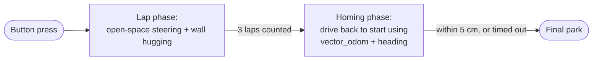
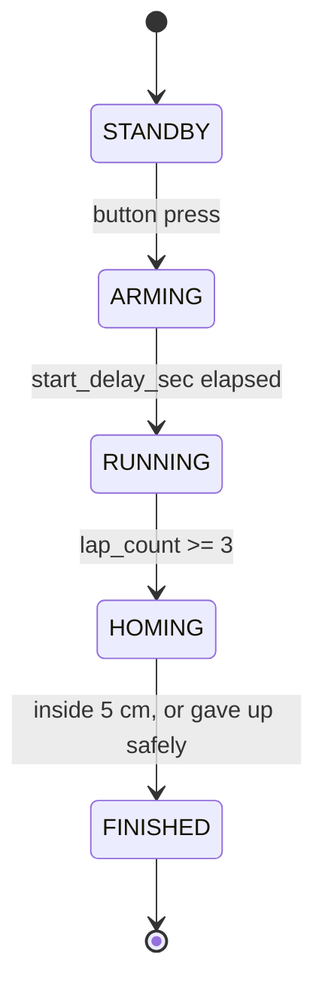
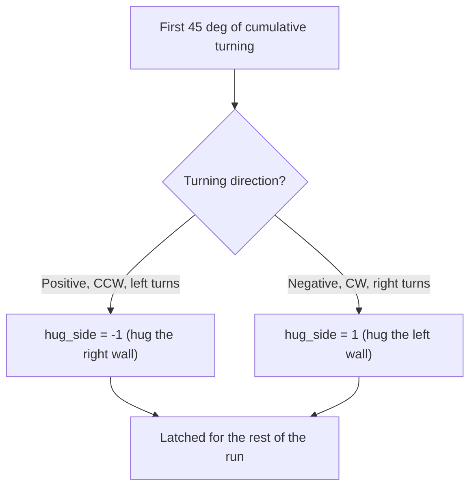
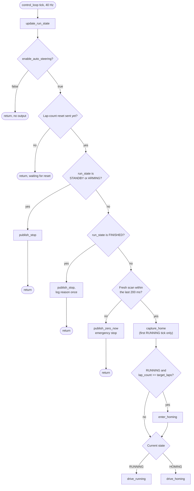
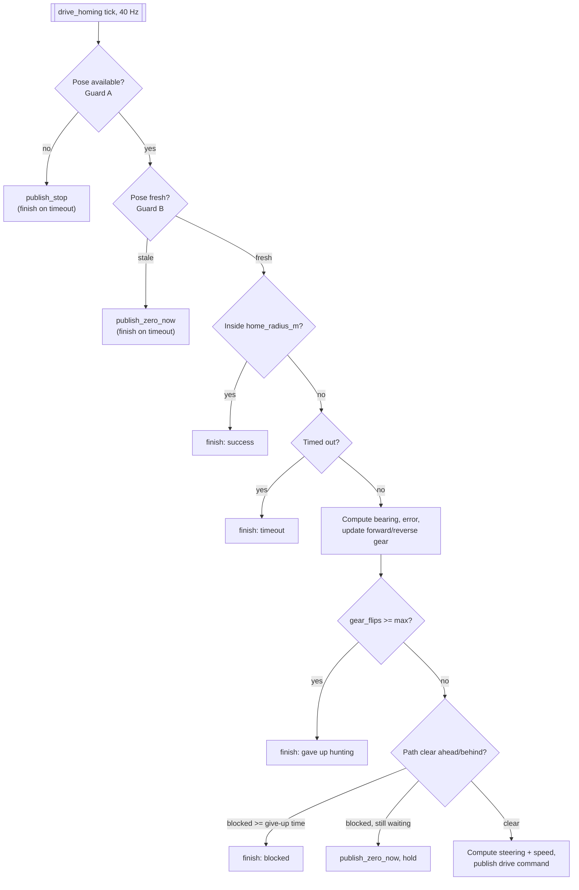
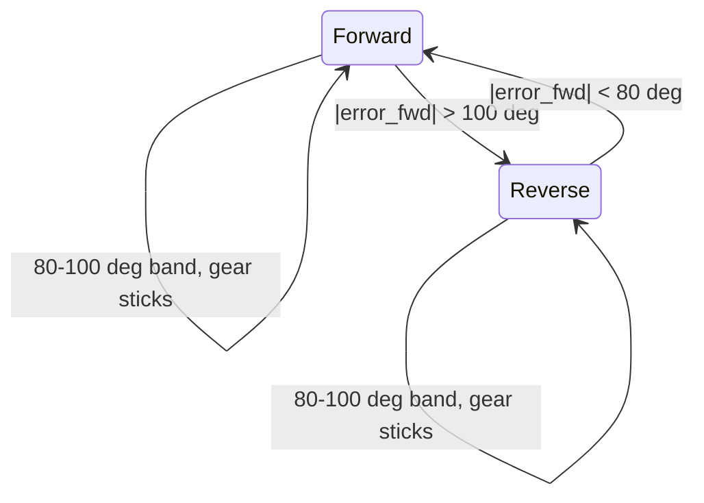
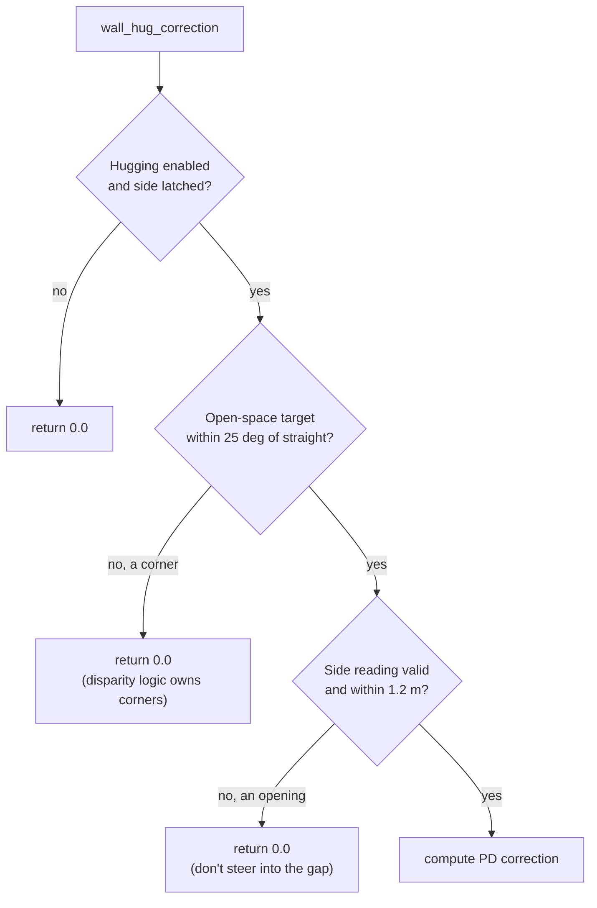
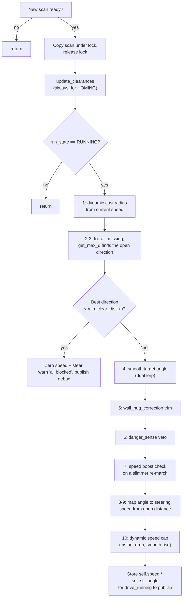

# The Open Round Run Node, Explained

*A part-by-part walkthrough of [`autonomy/open_round_run.py`](../autonomy/open_round_run.py) for anyone with basic Python knowledge and beginner-level ROS 2 knowledge. Every code block is covered: what it does, and more importantly, **why** it is written that way.*

This node drives the WRO **open round** (the mat with walls but *no* pillars) from button press to final park, in three phases:

1. **Lap phase**: find the most open direction in the LiDAR scan using circle-cast ray marching (the same core algorithm as `disparity_extender.py`), and trim that heading with a **wall hugging** controller so the car holds a steady distance from the outer wall on straights.
2. **Lap counting**: listen to `/lap_count` (published by the `lap_counter` node, which counts corners from the compass) until 3 laps are done.
3. **Homing phase**: using the position vector from `vector_odom` (`/odom_vector`) and the compass heading (`/heading`), drive back to the exact spot the run started from and stop within a **5 cm radius** of it, reversing if the start point is behind the car.



On top of that sit the same safety layers the obstacle-round node has (start button gate, LiDAR watchdog, lap-count reset, all-blocked stop), plus a set of homing-specific guards (stale odometry, blocked path, overshoot hunting, timeout).

## How to run it

```bash
# From the workspace root. The config file supplies all tuning and flips
# the master enable switch on:
ros2 run autonomy open_round_run --ros-args \
    --params-file config/bot_config.yaml
```

Without the params file the node still runs, but `enable_auto_steering` defaults to `false`, so the car can never move from a bare `ros2 run`. That is deliberate: the whole pipeline (markers, debug scan, state logs) works in this mode, which is the safe way to test on a bench.

The node expects the rest of the open-round stack to be up (same nodes as `gorurgari_open_round.launch.py`): `mcu_bridge`, `vector_odom`, `lap_counter`, and the LiDAR driver. **Do not run it together with `disparity_extender` or `custom_disparity_extender`**: all three publish `/cmd_vel` and would fight over the wheel.

## Topics at a glance

| Topic | Direction | Message type | What flows over it |
|---|---|---|---|
| `/scan` | subscribes | `sensor_msgs/LaserScan` | the LiDAR's fan of distance readings |
| `/odom_vector` | subscribes | `geometry_msgs/Vector3` | position from `vector_odom`: x, y and total distance travelled, in that node's `output_units` (cm by default) |
| `/heading` | subscribes | `std_msgs/Float32` | raw MCU compass heading in degrees, growing **clockwise** (the number on the car's OLED) |
| `/lap_count` | subscribes | `std_msgs/Int32` | completed laps, from `lap_counter` |
| `/button_status` | subscribes | `std_msgs/Bool` | the physical start button on the car, `true` while held |
| `/cmd_vel` | publishes | `geometry_msgs/Twist` | speed (`linear.x`, m/s, negative = reverse) + steering (`angular.z`, normalized −1..+1) |
| `/reset_lap_count` | publishes | `std_msgs/Empty` | one shot at startup, zeroes the lap counter |
| `/open_round/scan_processed` | publishes | `sensor_msgs/LaserScan` | the scan *after* dropout repair, for RViz |
| `/open_round/target_marker` | publishes | `visualization_msgs/Marker` | blue arrow showing the chosen driving direction |
| `/open_round/state` | publishes | `std_msgs/String` | 1 Hz heartbeat of the state machine (`STANDBY`, `RUNNING`, …) |

## The state machine

Everything the node does hangs off one string variable, `self.run_state`:



- **STANDBY**: powered up, processing scans, holding the car at zero. Waiting for the button.
- **ARMING**: button seen; counting down `start_delay_sec` (3 s), one log line per second, matching the MCU's LED blinks.
- **RUNNING**: the lap phase, open-space steering plus wall hugging, until 3 laps.
- **HOMING**: laps done, drive back to the captured start point.
- **FINISHED**: parked. Zero commands are republished slowly forever so the MCU can never latch a stale throttle.

There is no transition *out* of FINISHED. The run is over; restart the node for another run.

## Reading guide

The parts follow the file top to bottom, but each is self-contained enough to read alone:

- **Part 1, module header, constants and helper functions.** The docstring, the state names, the unit table, and the five small math helpers everything else leans on.
- **Part 2, `__init__`: every knob explained.** All ~50 parameters in their groups, the fail-fast validation, the state variables, and the wiring (subscriptions, publishers, three timers).
- **Part 3, the input callbacks.** How `/odom_vector`, `/heading`, `/lap_count`, `/button_status` and `/scan` each get turned into clean internal state, including the compass-to-yaw conversion and the automatic wall-side latch.
- **Part 4, the start gate and state plumbing.** `update_run_state`, `begin_running`, `capture_home`, and the two stop publishers.
- **Part 5, the control loop.** The 40 Hz heartbeat: the exact order of its safety gates and how it dispatches to the lap phase or the homing phase.
- **Part 6, homing.** The star of this node: the vector math, the reverse gear with hysteresis, the sign flip that makes reversing steer correctly, and every guard around it.
- **Part 7, the LiDAR toolbox.** Index-to-angle helpers, ray validity, dropout repair (`fix_missing`), and the circle-cast core (`hit_circle`, `marching`, `get_max_d`).
- **Part 8, wall hugging.** How the wall distance is measured robustly and turned into a small, safe heading trim.
- **Part 9, the safety senses.** `danger_sense` (sideways emergency steer) and `update_clearances` (the forward/rear cones homing relies on).
- **Part 10, the LiDAR pipeline.** `calc_lidar_step`, the 20 Hz function that strings Parts 7-9 together into a steering decision.
- **Part 11, visualization and `main()`.**
- **Part 12, the edge-case catalogue, how the node was verified, and tuning notes.**

---

## Part 1: Module header, constants and helper functions

### The module docstring

The file opens with a long docstring that is an honest summary of everything below: the three jobs (open space detection, wall hugging, vector-odom homing), the state machine, and a bullet list of every edge case handled. When the code and this document disagree with the docstring, trust the code. They were written together, though, so they shouldn't.

### The imports

```python
import math
import time
from threading import Lock

from geometry_msgs.msg import Twist, Vector3
import rclpy
from rclpy.node import Node
from sensor_msgs.msg import LaserScan
from std_msgs.msg import Bool, Empty, Float32, Int32, String
from visualization_msgs.msg import Marker
```

Nothing exotic. `Lock` is the one worth pausing on: the LiDAR data arrives in a ROS callback while a *timer* reads it, and in rclpy those can interleave. The lock makes the hand-off atomic (Part 3 and Part 10 show both sides of it).

### The state names

```python
STATE_STANDBY = 'STANDBY'    # powered up, waiting for the button
STATE_ARMING = 'ARMING'      # button seen, counting the start delay down
STATE_RUNNING = 'RUNNING'    # lapping with open-space + wall hugging
STATE_HOMING = 'HOMING'      # laps done, driving back to the start point
STATE_FINISHED = 'FINISHED'  # parked inside home_radius_m (or gave up), holding zero
```

Plain strings, not an enum, to match the style of `disparity_extender.py`. They appear in log lines and on `/open_round/state` exactly as written, which makes debugging with `ros2 topic echo` trivially readable.

### The stop-republish interval

```python
STOP_REPUBLISH_INTERVAL_S = 0.5
```

While the car is parked (STANDBY, ARMING, FINISHED) the node still publishes zero commands: if it went silent, the MCU could sit on whatever the *last* command was. But there is nothing to steer while parked, so republishing at the full 40 Hz would be noise. Every half second is enough to keep the command fresh.

### The unit table

```python
ODOM_UNIT_TO_M = {'m': 1.0, 'cm': 0.01, 'mm': 0.001}
```

`vector_odom` publishes `/odom_vector` in whatever its `output_units` parameter says (**centimetres by default**). This node does all of its own math in metres (like the rest of ROS, per REP-103), so every incoming coordinate is multiplied by this factor once, at the door, and never thought about again. Getting this wrong is the classic 100x bug, which is why the `odom_units` parameter is validated against this table at startup and the node refuses to start on a typo.

### The math helpers

```python
def clamp(val, mini, maxi):
    """Constrain value between min and max (handles swapped bounds)."""
    lo, hi = (mini, maxi) if mini <= maxi else (maxi, mini)
    return max(lo, min(hi, val))
```

Pin a value inside a range. The swapped-bounds handling means `clamp(x, 5, -5)` still works, which is useful because callers sometimes construct the bounds with a sign that can flip.

```python
def remap(old_val, old_min, old_max, new_min, new_max):
    """Map a value from one range to another, clamped."""
    new_val = (new_max - new_min) * (old_val - old_min) / (old_max - old_min) + new_min
    return clamp(new_val, new_min, new_max)
```

The workhorse. "This value lives in range A; give me the matching value in range B, and never step outside B." It converts a steering angle in degrees into the −1..+1 servo range, a distance into a speed, and so on. Because the output is clamped, `remap` doubles as a *ramp with saturation*: below `old_min` you get exactly `new_min`, above `old_max` exactly `new_max`, and a straight line in between.

```python
def lerp(a, b, t):
    """Linear interpolation between a and b by factor t, clamped."""
    return clamp(a + (b - a) * t, a, b)
```

Move a fraction `t` of the way from `a` to `b`. Used for smoothing: calling `x = lerp(x, target, 0.1)` every tick eases `x` toward `target` instead of jumping.

```python
def normalize_angle_deg(angle):
    """Wrap to [-180, 180)."""
    return (angle + 180.0) % 360.0 - 180.0


def normalize_angle_rad(angle):
    """Wrap to (-pi, pi]."""
    return math.atan2(math.sin(angle), math.cos(angle))
```

Angles wrap around, and naive subtraction across the wrap gives nonsense: 179° and −179° are 2° apart, not 358°. **Every** angle difference in this file goes through one of these two functions. The degree version is used for headings and steering (whole-node convention: degrees for human-facing angles), the radian version for LiDAR ray angles.

---

## Part 2: `__init__`, every knob explained

The constructor does five things in order: declare all parameters, load them into plain attributes, validate the dangerous ones, initialize every piece of mutable state, and wire up ROS (subscriptions, publishers, timers). Nothing else happens until the timers start firing.

### Why parameters at all?

A ROS 2 *parameter* is a named config value attached to the node. Declaring one gives it a default; a params file (here [`config/bot_config.yaml`](../../config/bot_config.yaml), section `open_round_run:`) can override it at launch without touching code. Every number you might want to tune trackside is a parameter here.

### Group: master switch

```python
        # False by default so a bare `ros2 run` can never move the car.
        self.declare_parameter('enable_auto_steering', False)
```

The single most important line for safety. The control loop re-reads this parameter **live** every tick (Part 5), so you can even flip it at runtime with `ros2 param set /open_round_run enable_auto_steering false` and the car freezes on the next tick. The config file sets it `true`; the in-code default is `false`.

### Group: circle cast geometry

```python
        self.declare_parameter('cast_range_min', 0.13)
        self.declare_parameter('cast_range_max', 0.16)
        self.declare_parameter('cast_precision', 81)
        self.declare_parameter('cast_skip', 4)
        self.declare_parameter('cast_skip_fine', 1)
```

These configure the ray-marching core (Part 7). `cast_range_min/max` is the radius of the virtual circle swept along candidate rays, effectively the robot's half-width plus margin, growing with speed (a faster car needs more clearance). `cast_precision` is how many neighbouring rays each candidate is checked against; `cast_skip` is the stride when sweeping candidates (every 4th ray, since checking all of them costs 4x the CPU for almost no gain); `cast_skip_fine` is the stride *inside* one candidate's neighbourhood check.

### Group: field of view

```python
        self.declare_parameter('look_range_deg', 80.0)
```

The steering search only considers rays within ±80° of straight ahead. The car cannot drive sideways, so rays beyond that are not candidate *directions* (they are still used as *obstacles* and for the wall measurement).

### Group: speed

```python
        self.declare_parameter('max_speed', 0.60)
        self.declare_parameter('speed_cap_corner', 0.30)
        self.declare_parameter('speed_cap_straight', 0.45)
        self.declare_parameter('boost_max', 1.35)
        self.declare_parameter('boost_angle_thresh', 7.5)
        self.declare_parameter('boost_dist_thresh', 1.10)
```

`max_speed` is the theoretical ceiling the distance-based speed law scales from. The two `speed_cap_*` values are the *actual* command ceilings, lower in corners. The `boost_*` trio implements "floor it on a clear straight": if the target is nearly dead ahead (`< 7.5°`) **and** the path is long (`> 1.10 m`), multiply speed by up to 1.35x.

### Group: safety

```python
        self.declare_parameter('danger_dist', 0.22)
        self.declare_parameter('danger_angle_min', 25.0)
        self.declare_parameter('danger_angle_max', 90.0)
        # Below this best safe distance the scan is considered blocked and
        # the car parks for the cycle instead of picking the least-bad gap.
        self.declare_parameter('min_clear_dist_m', 0.15)
```

`danger_*` configures the sideways emergency steer (Part 9): anything closer than 22 cm in the 25 to 90 degree side zones can override the heading. `min_clear_dist_m` is the "everything is blocked" floor: if even the *best* direction is shorter than 15 cm, driving anywhere is a crash, so the car holds still for that scan.

### Group: steering

```python
        self.declare_parameter('str_ang_thresh', 60.0)
```

The angle that maps to full steering lock. A 60° target becomes `angular.z = 1.0`; a 30° target becomes `0.5`. It matches `bot.max_steer_deg` in the config, the servo's physical limit.

### Group: wall hugging

```python
        self.declare_parameter('wall_hug_enable', True)
        self.declare_parameter('wall_target_dist_m', 0.35)
        self.declare_parameter('wall_side', 'auto')
        self.declare_parameter('wall_side_latch_deg', 45.0)
        self.declare_parameter('wall_window_deg', 20.0)
        self.declare_parameter('wall_valid_max_dist_m', 1.2)
        self.declare_parameter('wall_kp_deg_per_m', 40.0)
        self.declare_parameter('wall_kd_deg_s_per_m', 0.0)
        self.declare_parameter('wall_max_correction_deg', 12.0)
        self.declare_parameter('wall_hug_gate_deg', 25.0)
```

The full story is in Part 8; the short version of each knob:

| Parameter | Meaning |
|---|---|
| `wall_target_dist_m` | the distance to hold off the hugged wall (35 cm) |
| `wall_side` | `auto` = figure out the outer wall from the lap direction; `left`/`right` = force it |
| `wall_side_latch_deg` | how much accumulated turning proves the lap direction (45°, i.e. half a corner) |
| `wall_window_deg` | the width of the scan window around ±90° the wall is measured in |
| `wall_valid_max_dist_m` | side readings farther than this are an *opening*, not the wall: no correction applied |
| `wall_kp_deg_per_m` | proportional gain: degrees of heading trim per metre of distance error |
| `wall_kd_deg_s_per_m` | optional damping term (off by default) |
| `wall_max_correction_deg` | hard ceiling on the trim (±12°): hugging may *trim*, never *steer* |
| `wall_hug_gate_deg` | the trim only applies while the open-space target is within ±25° of straight; corners belong to the disparity logic alone |

### Group: laps

```python
        self.declare_parameter('target_laps', 3)
        # Lap completion within this many seconds of GO is a stale count
        # from a previous run, not a real lap - ignored.
        self.declare_parameter('min_run_time_sec', 5.0)
```

`target_laps` is 3 per the round rules. `min_run_time_sec` closes a subtle race: `lap_counter` publishes `/lap_count` on a *latched* topic (late subscribers get the last value), so a leftover "3" from a previous run could arrive and instantly "finish" a run that never started. The startup reset (Part 5) prevents most of this, but the time guard makes it airtight: a real lap physically cannot happen 5 s after GO.

### Group: vector odom / homing

```python
        # MUST match vector_odom's output_units or every homing distance
        # is off by 100x.
        self.declare_parameter('odom_units', 'cm')
        # The finish circle around the start point: 5 cm radius.
        self.declare_parameter('home_radius_m', 0.05)
        self.declare_parameter('homing_max_speed', 0.30)
        self.declare_parameter('homing_min_speed', 0.25)
        self.declare_parameter('homing_slowdown_dist_m', 0.60)
        self.declare_parameter('reverse_enter_err_deg', 100.0)
        self.declare_parameter('reverse_exit_err_deg', 80.0)
        self.declare_parameter('max_gear_flips', 6)
        self.declare_parameter('homing_timeout_sec', 45.0)
        self.declare_parameter('homing_guard_dist_m', 0.12)
        self.declare_parameter('homing_guard_half_deg', 20.0)
        self.declare_parameter('homing_blocked_give_up_sec', 3.0)
        self.declare_parameter('odom_stale_sec', 1.0)
```

All of these belong to Part 6, where each is explained where it bites. The two most safety-relevant: `homing_timeout_sec` guarantees the homing phase *always ends*, and `odom_stale_sec` stops the car if the encoder stream dies (driving on a frozen position estimate is driving blind).

### Group: heading convention

```python
        self.declare_parameter('heading_clockwise', True)
        self.declare_parameter('heading_offset_deg', 0.0)
```

The BNO055 compass reports a heading that grows **clockwise** (like a real compass); ROS yaw grows **counter-clockwise** (REP-103). `heading_clockwise: true` says "negate on arrival". `heading_offset_deg` exists for the day `/heading` becomes a true absolute bearing: today it is 0, and the long comment in `vector_odom.py` explains why the backward-mounted IMU does *not* make it 180. **These two must match `vector_odom`'s values**, because homing steers the *pose that vector_odom integrated* using the *yaw this node computes*, and they have to live in the same frame.

### Group: start gate and topics

```python
        self.declare_parameter('require_button_start', True)
        self.declare_parameter('start_delay_sec', 3.0)
        self.declare_parameter('button_topic', '/button_status')

        self.declare_parameter('scan_topic', '/scan')
        self.declare_parameter('odom_vector_topic', '/odom_vector')
        self.declare_parameter('heading_topic', '/heading')
        self.declare_parameter('cmd_vel_topic', '/cmd_vel')
```

Same gate as `disparity_extender`: the node comes up parked, the physical button arms it, and the car moves 3 s later. Topic names are parameters so a simulation or a bag replay can remap them without code edits.

### Loading and fail-fast validation

After declaring, every parameter is read once into a plain attribute (`self.max_speed = float(...)` and so on, since attribute access is much cheaper than a parameter lookup in a 40 Hz loop; only the master switch is re-read live). Then the block that refuses to start on broken config:

```python
        if odom_units not in ODOM_UNIT_TO_M:
            raise ValueError(f'odom_units must be one of {sorted(ODOM_UNIT_TO_M)}')
        self.odom_to_m = ODOM_UNIT_TO_M[odom_units]
        self.odom_units = odom_units
        if self.wall_side_param not in ('auto', 'left', 'right'):
            raise ValueError("wall_side must be 'auto', 'left' or 'right'")
        if self.target_laps <= 0:
            raise ValueError('target_laps must be positive')
        if self.home_radius_m <= 0.0:
            raise ValueError('home_radius_m must be positive')
        if self.reverse_exit_err_deg >= self.reverse_enter_err_deg:
            raise ValueError('reverse_exit_err_deg must be below reverse_enter_err_deg '
                             '(the hysteresis band would invert)')
```

Each of these misconfigurations would otherwise fail *silently and dangerously*: wrong units = homing distances off by 100×; an inverted hysteresis band = the gear logic flips forward/reverse every single tick. Crashing at startup with a clear message is the kind thing to do.

### The state variables

The constructor then initializes every mutable variable the node will ever touch, grouped by concern. The important ones and why they start the way they do:

```python
        self.pos_x_m = None             # None until /odom_vector arrives
        self.pos_y_m = None
        self.yaw_deg = None             # ROS convention (CCW+), None until /heading
```

`None`, not `0.0`, because "no data yet" and "at the origin, facing forward" are *very* different situations, and homing must be able to tell them apart (Part 6 refuses to drive on `None`).

```python
        if self.wall_side_param == 'left':
            self.hug_side = 1
        elif self.wall_side_param == 'right':
            self.hug_side = -1
        else:
            self.hug_side = None
```

`hug_side` uses the ROS sign convention throughout: **+1 = left** (positive angles), **−1 = right** (negative angles), `None` = not decided yet. Encoding the side as a sign, not a string, lets the correction math in Part 8 be a single multiplication.

```python
        self.run_state = STATE_STANDBY if self.require_button_start else STATE_RUNNING
        ...
        if self.run_state == STATE_RUNNING:
            self.run_start_time = time.time()
```

With the gate disabled the node behaves like the old nodes did (driving as soon as data arrives), and the run timer starts immediately so the `min_run_time_sec` lap guard still works.

Other notables: `self.home_captured = False` (the start pose is latched on the first driving tick, Part 4), `self.forward_clearance_m = float('inf')` (no scan yet = assume clear; the watchdog covers the truly-no-scan case), and the whole homing block (`homing_min_dist`, `driving_reverse`, `gear_flips`, `homing_blocked_since`) which Part 6 walks through.

### The wiring

```python
        self.scan_sub = self.create_subscription(
            LaserScan, scan_topic, self.lidar_callback, 1)
        self.odom_sub = self.create_subscription(
            Vector3, odom_vector_topic, self.odom_vector_callback, 10)
        self.heading_sub = self.create_subscription(
            Float32, heading_topic, self.heading_callback, 10)
        self.lap_sub = self.create_subscription(Int32, '/lap_count', self.lap_callback, 10)
        self.button_sub = self.create_subscription(Bool, button_topic, self.button_callback, 10)
        self.lap_reset_pub = self.create_publisher(Empty, '/reset_lap_count', 10)

        self.cmd_pub = self.create_publisher(Twist, cmd_vel_topic, 10)
        self.debug_scan_pub = self.create_publisher(LaserScan, '/open_round/scan_processed', 10)
        self.marker_pub = self.create_publisher(Marker, '/open_round/target_marker', 10)
        self.state_pub = self.create_publisher(String, '/open_round/state', 10)
```

The scan subscription uses queue depth **1**: if processing falls behind, old scans are useless, so it always works on the newest. The debug topics live under an `/open_round/` prefix so they can never collide with the disparity extender's debug topics if both nodes happen to exist on the graph.

```python
        # ── Control Loop Timer (40 Hz) ───────────────────────────────
        self.create_timer(0.025, self.control_loop)

        # ── LiDAR Processing Timer (20 Hz) ───────────────────────────
        self.create_timer(0.05, self.calc_lidar_step)

        # ── State Heartbeat (1 Hz) ───────────────────────────────────
        self.create_timer(1.0, self.publish_state)
```

Two-rate design, inherited from `disparity_extender`: the *thinking* (LiDAR pipeline, 20 Hz; the LiDAR itself only produces ~10 scans/s, so faster would be wasted) is decoupled from the *acting* (command publishing, 40 Hz, since the MCU likes a steady, fast command stream). The pipeline writes its conclusions into `self.speed` / `self.str_angle`; the control loop reads them. The 1 Hz heartbeat is purely for debugging: `ros2 topic echo /open_round/state` tells you instantly which phase the node is in.

Finally the startup log summarizes the config in force (laps, wall-hug mode, home radius, odom units). Read it after every launch; a wrong `odom_units` shows up right there.

---

## Part 3: The input callbacks

Five callbacks turn raw messages into clean internal state. None of them makes decisions; they only *record*. The timers decide.

### `odom_vector_callback`: position in, metres out

```python
    def odom_vector_callback(self, msg: Vector3):
        """Track the vector odom pose (converted to metres) and estimate speed."""
        now = time.time()
        self.pos_x_m = msg.x * self.odom_to_m
        self.pos_y_m = msg.y * self.odom_to_m
        total_m = msg.z * self.odom_to_m
```

`vector_odom` packs three things into a `Vector3`: `x`, `y` (position) and `z` (**total distance travelled**, not height!). All three arrive in centimetres and are converted at the door.

```python
        # Speed from the travelled-distance delta; EMA smoothed because the
        # encoder stream is bursty. Used only for the dynamic cast radius.
        if self.last_odom_total_m is not None:
            dt = now - self.last_odom_time
            if dt > 1e-3:
                inst = abs(total_m - self.last_odom_total_m) / dt
                self.current_speed = 0.7 * self.current_speed + 0.3 * inst
        self.last_odom_total_m = total_m
        self.last_odom_time = now
```

The obstacle-round node got its speed from `/odom` (a full `Odometry` message with velocity). This node only has the position vector, so it estimates speed itself: distance travelled between two messages divided by the time between them. Two details:

- **EMA smoothing** (exponential moving average): `new = 0.7·old + 0.3·instant`. Encoder messages arrive in bursts, so the raw instantaneous value jumps around; the EMA keeps 70% of the previous estimate and blends in 30% of the new one, giving a stable number. This speed only feeds the *dynamic cast radius* (Part 10), so smooth-and-slightly-late is exactly right.
- **`dt > 1e-3` guard**: two messages arriving in the same millisecond would otherwise divide by ~zero and produce an absurd spike.

`last_odom_time` doubles as the staleness clock for the homing guard (Part 6): if it stops advancing, the encoder stream died.

### `heading_callback`: compass in, yaw and lap direction out

This callback does three jobs, so we take it in three bites.

**Bite 1: convention conversion.**

```python
        heading = msg.data + self.heading_offset_deg
        yaw = -heading if self.heading_clockwise else heading
        yaw = normalize_angle_deg(yaw)
```

The MCU's compass grows clockwise; ROS yaw grows counter-clockwise. Add the (currently zero) mounting offset, flip the sign, wrap to [−180, 180). This is *character-for-character* the same conversion `goto_controller` does and the same convention `vector_odom` integrates positions with. All three nodes agree on one yaw, which is the entire reason homing can steer the odometry's pose using this callback's angle.

**Bite 2: the unwrapped turn total, with a glitch guard.**

```python
        if self.last_raw_heading_yaw is not None:
            step = normalize_angle_deg(yaw - self.last_raw_heading_yaw)
            if abs(step) <= 45.0:
                self.cumulative_yaw_deg += step
            else:
                self.get_logger().warn(
                    f'Heading jumped {step:.1f} deg in one message, ignoring it',
                    throttle_duration_sec=1.0)
        self.last_raw_heading_yaw = yaw
        self.yaw_deg = yaw
```

`cumulative_yaw_deg` is the heading *unwrapped*: instead of wrapping at 360° it keeps growing (+90 per left corner, −90 per right corner), so after one CCW lap it reads ≈ +360. The per-message *step* is computed with `normalize_angle_deg` so crossing the ±180 boundary contributes 2°, not 358°. The 45° guard is borrowed from `lap_counter`: the car physically cannot rotate 45° between two heading messages, so a bigger step is an IMU glitch and is dropped rather than poisoning the total.

**Bite 3: the automatic wall-side latch.**

```python
        # Latch the outer wall once the lap direction is unambiguous:
        # CCW laps (left turns, positive yaw growth) keep the outer wall on
        # the RIGHT; CW laps keep it on the LEFT.
        if (self.hug_side is None and self.wall_side_param == 'auto'
                and abs(self.cumulative_yaw_deg) >= self.wall_side_latch_deg):
            self.hug_side = -1 if self.cumulative_yaw_deg > 0.0 else 1
            self.get_logger().info(...)
```

In WRO the driving direction is decided by the randomized track, so the node cannot know in advance which wall is the outer one. But it *can* deduce it: if the car has accumulated +45° of turning (half of the first corner), the laps are counter-clockwise (the car keeps turning left), which means the outer boundary wall is continuously on its **right**. So `hug_side = -1` (right). Clockwise laps latch the left wall. Once latched, it stays latched for the whole run (`hug_side is None` is part of the condition): the lap direction cannot change mid-run, and a latch-flip mid-lap would swerve the car.



Until the first corner the side is unknown and wall hugging simply stays off (Part 8 returns a zero correction). The open-space steering alone handles the first straight fine.

### `lap_callback`: one line

```python
    def lap_callback(self, msg: Int32):
        """Update lap count from the lap_counter node."""
        self.lap_count = msg.data
```

Counting laps is `lap_counter`'s job (it counts compass corners; see its own docstring). This node just remembers the latest number; the control loop compares it to `target_laps`.

### `button_callback`: edge detection

```python
        pressed = bool(msg.data)
        rising = pressed and not self.prev_button
        self.prev_button = pressed
        if not rising:
            return

        if self.run_state == STATE_STANDBY:
            self.run_state = STATE_ARMING
            self.arm_start_time = time.time()
            self.last_countdown_logged = -1
            self.get_logger().info(...)
        else:
            self.get_logger().info(... 'already ..., ignoring.')
```

`/button_status` is `true` for *as long as the button is held*, streamed continuously. Acting on the raw value would re-arm on every message while your finger is down. The classic fix is **rising-edge detection**: remember the previous value, and only act on the `false → true` transition, the moment of the press. A press in any state other than STANDBY is logged and ignored, so mashing the button mid-run can't do anything.

### `lidar_callback`: buffer and get out

```python
    def lidar_callback(self, msg: LaserScan):
        """Buffer incoming LaserScan data for the processing timer."""
        with self._scan_lock:
            self.ang_min = msg.angle_min
            self.ang_max = msg.angle_max
            self.ang_inc = msg.angle_increment
            self.ranges = list(msg.ranges)
            self.intensities = (list(msg.intensities) if msg.intensities
                                else [1.0] * len(msg.ranges))
            self.range_min = msg.range_min
            self.range_max = msg.range_max
            self.scan_header = msg.header
            self.new_lidar_val = True
            self.last_scan_time = time.time()
```

The callback does **no processing**: it copies the scan into instance variables under the lock and leaves. Heavy work in a subscription callback would delay every other callback in the node. Three flags matter:

- `new_lidar_val = True` tells `calc_lidar_step` there is fresh data (the timer runs at 20 Hz but the LiDAR only delivers ~10 scans/s, so without the flag, half the pipeline runs would waste CPU re-processing the same scan).
- `last_scan_time` feeds the watchdog: if this timestamp stops advancing, the LiDAR died and the car must stop.
- The intensities fallback (`[1.0] * len(...)`) handles LiDAR drivers that don't fill the intensity array. Everything downstream treats intensity ≤ 0.05 as "invalid ray", so an absent array must read as "all valid", not "all invalid".

---

## Part 4: The start gate and state plumbing

### `update_run_state`: the countdown

```python
    def update_run_state(self):
        """Advance ARMING → RUNNING once the start delay has elapsed."""
        if self.run_state != STATE_ARMING:
            return

        remaining = self.start_delay_sec - (time.time() - self.arm_start_time)
        if remaining <= 0.0:
            self.begin_running()
            return

        secs_left = int(math.ceil(remaining))
        if secs_left != self.last_countdown_logged:
            self.last_countdown_logged = secs_left
            self.get_logger().info(f'Starting in {secs_left}...')
```

Called at the top of every control tick. In ARMING it prints "Starting in 3... 2... 1...", exactly one line per second (the `last_countdown_logged` bookkeeping deduplicates the 40 calls/s), mirroring the LED blinks the MCU does over the same window, and then fires `begin_running()`.

### `begin_running` and `capture_home`: GO, and remembering where "home" is

```python
    def begin_running(self):
        """GO: start lapping. The home pose is captured on the first driving tick."""
        self.run_state = STATE_RUNNING
        self.run_start_time = time.time()
        self.get_logger().info(...)
```

Note what it does **not** do: it does not capture the home pose. That happens in `capture_home`, called from the control loop on the first RUNNING tick:

```python
    def capture_home(self):
        self.home_captured = True
        if self.pos_x_m is not None and self.pos_y_m is not None:
            self.home_x_m = self.pos_x_m
            self.home_y_m = self.pos_y_m
            if math.hypot(self.home_x_m, self.home_y_m) > 0.10:
                self.get_logger().warn(
                    f'Odometry was not at the origin at GO — homing to the '
                    f'captured start ({self.home_x_m:.2f}, {self.home_y_m:.2f}) m '
                    f'instead of (0,0).')
        else:
            self.home_x_m = 0.0
            self.home_y_m = 0.0
            self.get_logger().warn(
                'No /odom_vector yet at GO — assuming the start is (0,0).')
        self.get_logger().info(
            f'Home captured at ({self.home_x_m:.2f}, {self.home_y_m:.2f}) m.')
```

Why capture instead of hard-coding (0, 0)? Because "the start is (0,0)" is only true if `vector_odom` started integrating *at this spot*. Normally it did (the whole stack launches together, and the odometry zeroes where the car sits), so the captured home **is** (0,0). But two real-world situations break the assumption:

1. **This node restarted mid-session** while `vector_odom` kept running: the odometry is no longer near zero. Homing to raw (0,0) would drive the car to wherever the *odometry* was born, not where *this run* started. The capture makes homing follow the run, and the `> 0.10 m` warning tells you it happened.
2. **No odometry yet at GO** (encoder stream late): fall back to (0,0), which is correct because `vector_odom` will zero right here on its first tick; the car hasn't moved.

And why is the capture in the control loop rather than in `begin_running`? Because when `require_button_start` is `false`, `begin_running` is never called; the node *starts* in RUNNING. The control-loop hook (`if RUNNING and not home_captured: capture_home()`) covers both entry paths with one line.

### `publish_stop` and `publish_zero_now`: two flavours of "stop"

```python
    def publish_stop(self):
        """Hold the car at zero, republished slowly so it can't latch a stale command."""
        now = time.time()
        if now - self.last_stop_pub_time < STOP_REPUBLISH_INTERVAL_S:
            return
        self.last_stop_pub_time = now
        cmd = Twist()
        cmd.linear.x = 0.0
        cmd.angular.z = 0.0
        self.cmd_pub.publish(cmd)
```

```python
    def publish_zero_now(self):
        """Immediate un-throttled zero command (watchdogs, guards)."""
        cmd = Twist()
        cmd.linear.x = 0.0
        cmd.angular.z = 0.0
        self.cmd_pub.publish(cmd)
```

Same message, different urgency. `publish_stop` is for *parked* states (STANDBY, FINISHED): a gentle 2 Hz refresh. `publish_zero_now` is for *emergencies* (watchdog fired, obstacle in the homing path): when the car is moving and must stop, you do not rate-limit the stop command.

### `publish_state`: the heartbeat

```python
    def publish_state(self):
        self.state_pub.publish(String(data=self.run_state))
```

One string, once a second. Trivial, and worth its weight in gold when something looks wrong trackside: `ros2 topic echo /open_round/state` immediately tells you whether the node thinks it is RUNNING, HOMING or FINISHED.

---

## Part 5: The control loop

`control_loop` runs 40 times a second and is the **only** place driving commands are published from. It is structured as a ladder of gates, where each `return` is a reason the car may not (or need not) drive normally, followed by a dispatch to the current phase. Order matters enormously here, so we walk it top to bottom.



```python
    def control_loop(self):
        # The gate is ticked before the enable check so the countdown keeps
        # running even while auto steering is switched off.
        self.update_run_state()

        if not bool(self.get_parameter('enable_auto_steering').value):
            return
```

**Gate 1, the master switch.** Re-read live (not from the cached attribute) so flipping the parameter at runtime works. Note the countdown is ticked *before* the check: with steering disabled you can still watch the whole arming sequence behave, which is useful on the bench.

```python
        # ── LAP RESET LOGIC ──
        if not self.has_reset_laps:
            self.reset_timer_ticks += 1
            if self.reset_timer_ticks >= 20:  # 0.5s for ROS 2 discovery to connect
                self.lap_reset_pub.publish(Empty())
                self.has_reset_laps = True
                self.lap_count = 0  # Force local reset too
                self.get_logger().info('Sent lap count reset signal on startup.')
            else:
                return  # Don't drive while waiting for reset
```

**Gate 2, the lap reset.** `lap_counter`'s topics are latched, so at startup this node may immediately receive the lap count from a *previous* run. The cure is to publish `/reset_lap_count` once, but not instantly: ROS 2 publishers take a moment (discovery) to connect to subscribers, and a message published in the constructor would vanish into the void. So the loop counts 20 ticks (0.5 s), then publishes the reset *and* forces the local count to zero (covering the window until `lap_counter` echoes back its own zero). Until the reset is out, the car does not drive: driving with a possibly-stale lap count could end the run instantly.

```python
        # ── START GATE: STANDBY / ARMING park the car ──
        if self.run_state in (STATE_STANDBY, STATE_ARMING):
            self.publish_stop()
            self.get_logger().info(
                f'{self.run_state} — waiting for the start button.',
                throttle_duration_sec=5.0)
            return

        # ── FINISHED: hold zero forever ──
        if self.run_state == STATE_FINISHED:
            self.publish_stop()
            if not self.finish_logged:
                self.finish_logged = True
                self.get_logger().info(f'FINISHED — {self.finish_reason}')
            return
```

**Gates 3 and 4, the parked states.** Both hold zeros. FINISHED also prints its reason exactly once: `finish_reason` was written by whoever ended the run (success, timeout, hunting cap, ...), and the `finish_logged` flag stops it repeating 40 times a second.

```python
        # ── LIDAR WATCHDOG (both driving states) ──
        if self.last_scan_time > 0.0 and (time.time() - self.last_scan_time) > 0.2:
            self.publish_zero_now()
            self.get_logger().error(
                'LiDAR timeout! No /scan for >200ms — emergency stop.',
                throttle_duration_sec=1.0)
            return
```

**Gate 5, the watchdog.** Past this point the car may actually be moving, so a dead LiDAR is an emergency: no fresh scan for 200 ms (the sensor delivers one every ~100 ms, so 200 ms means two misses) triggers an immediate, un-throttled zero. The `> 0.0` precondition means the watchdog only arms after the *first* scan; before that, "no scan yet" is startup, not failure, and the car isn't moving anyway (with no scan the pipeline never set a speed). The watchdog deliberately covers **HOMING too**: homing uses the scan for its clearance guard, and driving with a blind guard is not acceptable.

```python
        # ── HOME CAPTURE: first driving tick, whichever way RUNNING was entered ──
        if self.run_state == STATE_RUNNING and not self.home_captured:
            self.capture_home()

        # ── LAPS DONE → HOMING ──
        if (self.run_state == STATE_RUNNING
                and self.lap_count >= self.target_laps
                and time.time() - self.run_start_time >= self.min_run_time_sec):
            self.enter_homing()

        if self.run_state == STATE_RUNNING:
            self.drive_running()
        elif self.run_state == STATE_HOMING:
            self.drive_homing()
```

**The transitions and the dispatch.** Home capture first (Part 4). Then the lap check: `>=` rather than `==` because a lap count could conceivably jump from 2 to 4 between ticks (latched republish, or a double corner registering late) and the run must still end. The `min_run_time_sec` term is the stale-count insurance explained in Part 2. Finally, exactly one of the two drive functions runs.

### `drive_running`: publishing the pipeline's decision

```python
    def drive_running(self):
        """Publish the command computed by the LiDAR pipeline."""
        cmd = Twist()
        capped = clamp(self.speed * self.speed_boost,
                       -self.speed_cap * self.speed_boost,
                       self.speed_cap * self.speed_boost)
        cmd.linear.x = float(capped)
        cmd.angular.z = float(self.str_angle)
        self.cmd_pub.publish(cmd)
```

The lap-phase command is just "publish what the pipeline (Part 10) last decided": `self.speed` and `self.str_angle` are its outputs. The clamp applies the dynamic speed cap (lower in corners); the boost multiplies both the value and the cap, so a boosted straight genuinely goes faster than the cap instead of being flattened by it. Publishing at 40 Hz from 20 Hz decisions is fine; between pipeline runs the car simply keeps doing the latest sensible thing.

---

## Part 6: Homing, driving back to the start

This is the part the node exists for. The problem: the car has just finished lap 3 somewhere near the start line, pointing in some direction, and must come to rest with its reference point within **5 cm** of where the run began, using nothing but the dead-reckoned position vector and the compass. The car is an Ackermann vehicle (it steers like a car, not a tank), so it cannot rotate in place; if home is behind it, it must *reverse*.

### `enter_homing`: the handover

```python
    def enter_homing(self):
        self.run_state = STATE_HOMING
        self.homing_start_time = time.time()
        self.homing_min_dist = None
        self.driving_reverse = False
        self.gear_flips = 0
        self.homing_blocked_since = None
        dist = self.distance_home_m()
        self.get_logger().info(
            f'{self.target_laps} laps complete — homing to '
            f'({self.home_x_m:.2f}, {self.home_y_m:.2f}) m'
            + (f', {dist * 100.0:.0f} cm away.' if dist is not None else '.'))
```

Every piece of homing bookkeeping is reset here, so the phase always starts from a clean slate: no inherited gear state, no inherited closest-approach, a fresh timeout clock. The log line tells you how far away home is at the handover, typically a metre or two, since `lap_counter` fires "lap 3" at the twelfth corner, shortly before the start line.

### Two tiny helpers

```python
    def distance_home_m(self):
        if self.pos_x_m is None or self.pos_y_m is None:
            return None
        return math.hypot(self.home_x_m - self.pos_x_m, self.home_y_m - self.pos_y_m)
```

Straight-line distance to home (`math.hypot(dx, dy)` = √(dx² + dy²)), or `None` when there is no position; callers must handle that honestly.

```python
    def finish(self, reason):
        self.run_state = STATE_FINISHED
        self.finish_reason = reason
        self.finish_logged = False
        self.publish_zero_now()
```

Every way the run can end funnels through here: state to FINISHED, remember *why* (the control loop will log it once), and stop **immediately**, not on the next throttled interval.

### `drive_homing`: the full walkthrough

Called at 40 Hz while HOMING. Like the control loop it is a ladder: guards first, success check, then the actual driving math.



**Guard A, no pose at all.**

```python
        if self.pos_x_m is None or self.yaw_deg is None:
            self.publish_stop()
            self.get_logger().error(
                'HOMING but no odometry/heading — is vector_odom running? Holding.',
                throttle_duration_sec=2.0)
            # Never sit here forever: the timeout below still applies.
            if now - self.homing_start_time > self.homing_timeout_sec:
                self.finish('homing timed out with no odometry — stopped in place.')
            return
```

Homing without a position or a heading is driving blindfolded; the node refuses. In practice this can only happen if `vector_odom` or the MCU bridge died mid-run. Crucially the guard *still enforces the timeout*: otherwise a dead odometry source would leave the node holding in HOMING forever, and "forever" is not an acceptable state for a robot to be in.

**Guard B, the pose froze.**

```python
        if now - self.last_odom_time > self.odom_stale_sec:
            self.publish_zero_now()
            self.get_logger().error(
                f'/odom_vector stale for >{self.odom_stale_sec:.1f}s — holding.',
                throttle_duration_sec=2.0)
            if now - self.homing_start_time > self.homing_timeout_sec:
                self.finish('homing timed out on stale odometry — stopped in place.')
            return
```

Subtler than Guard A: the position *exists* but has stopped updating (encoder stream died). The danger is a feedback loop that never sees its own effect: the node would command "drive forward", the position wouldn't change, so it would keep commanding forward, into the wall, forever. One second of silence (the encoder normally ticks many times a second) triggers a stop.

**The success check.**

```python
        dist = self.distance_home_m()

        # ── SUCCESS: inside the circle ──
        if dist <= self.home_radius_m:
            self.finish(
                f'parked {dist * 100.0:.1f} cm from the start '
                f'(target {self.home_radius_m * 100.0:.0f} cm).')
            return

        if self.homing_min_dist is None or dist < self.homing_min_dist:
            self.homing_min_dist = dist
```

Checked *before* any driving so the very first HOMING tick can already succeed (the car often crosses the start area right after lap 3; if it is already inside 5 cm, stop *now*, don't drive a lap of honour). Below it, `homing_min_dist` records the closest the car has ever been, pure bookkeeping, used by the give-up messages so the log always tells you how close it got.

**The timeout.**

```python
        if now - self.homing_start_time > self.homing_timeout_sec:
            self.finish(
                f'homing timed out after {self.homing_timeout_sec:.0f}s — stopped '
                f'{dist * 100.0:.1f} cm out (closest approach '
                f'{self.homing_min_dist * 100.0:.1f} cm).')
            return
```

The unconditional backstop: whatever else goes wrong (odometry drift walking the target away, a wall exactly on the goal, gains fighting each other), the phase ends within 45 s, stopped, with an honest log line.

**Bearing, heading error, and the gear decision.**

```python
        bearing_deg = math.degrees(math.atan2(self.home_y_m - self.pos_y_m,
                                              self.home_x_m - self.pos_x_m))
        error_fwd = normalize_angle_deg(bearing_deg - self.yaw_deg)
```

The **bearing** is the direction from the car to home in the odometry frame: `atan2(Δy, Δx)`, the vector the user's requirement speaks of. The **error** is how far the car's nose points away from that vector, wrapped to [−180, 180): 0° = home dead ahead, ±180° = home dead behind. Both are recomputed from the *latest* position every tick, so the steering keeps correcting as the car moves; nothing is precomputed and replayed.

```python
        # Hysteresis so the gear cannot chatter when home sits beside the car.
        if not self.driving_reverse and abs(error_fwd) > self.reverse_enter_err_deg:
            self.driving_reverse = True
            self.gear_flips += 1
        elif self.driving_reverse and abs(error_fwd) < self.reverse_exit_err_deg:
            self.driving_reverse = False
            self.gear_flips += 1
```

If home is more than 100° off the nose, driving forward means a huge arc, so backing up is better. But a single threshold at, say, 90° would **chatter**: with home at exactly 90.1° the error flickers across the line every tick and the gearbox slams forward/reverse/forward. The fix is *hysteresis*, two thresholds with a gap: switch to reverse only past 100°, switch back to forward only under 80°. Inside the 80-100° band the current gear sticks, whatever it is. Every genuine switch is counted in `gear_flips`.



**The anti-hunting cap.**

```python
        if self.gear_flips >= self.max_gear_flips:
            self.finish(
                f'hunted over the start {self.gear_flips} times — settled '
                f'{dist * 100.0:.1f} cm out (closest approach '
                f'{self.homing_min_dist * 100.0:.1f} cm).')
            return
```

A car has a minimum turning radius and a minimum creep speed; some approach geometries make a 5 cm circle genuinely unreachable from the current angle, and the controller's honest response is to shuttle back and forth over the point forever. Six direction changes is the "this is not converging" signal: accept the closest achievable spot and stop. (This mirrors `goto_controller`'s `max_gear_flips`, which earned its place the hard way.)

**The clearance guard.**

```python
        clearance = self.rear_clearance_m if self.driving_reverse else self.forward_clearance_m
        if clearance < self.homing_guard_dist_m:
            if self.homing_blocked_since is None:
                self.homing_blocked_since = now
            if now - self.homing_blocked_since > self.homing_blocked_give_up_sec:
                self.finish(
                    f'blocked {"behind" if self.driving_reverse else "ahead"} for '
                    f'{self.homing_blocked_give_up_sec:.0f}s while homing — stopped '
                    f'{dist * 100.0:.1f} cm out.')
                return
            self.publish_zero_now()
            self.get_logger().warn(...)
            return
        self.homing_blocked_since = None
```

Homing has no disparity extender watching for obstacles; it steers by odometry. So it borrows the LiDAR through two numbers `update_clearances` (Part 9) refreshes every scan: the nearest obstacle in a narrow cone ahead, and one behind. If the cone *in the direction the car is about to move* shows something closer than 12 cm, the car pauses (un-throttled zero). Pausing is not a solution though: if the block persists 3 s (a wall, not a passing shadow), give up cleanly. The last line resets the block timer the moment the path clears, so brief occlusions don't accumulate toward the give-up.

**Steering, including the reverse sign flip.**

```python
        # Backing up: point the TAIL at home, so the error is measured
        # against yaw + 180.
        error = error_fwd
        if self.driving_reverse:
            error = normalize_angle_deg(error - 180.0)
        steer = remap(error, -self.str_ang_thresh, self.str_ang_thresh, -1.0, 1.0)
        if self.driving_reverse:
            # Reversing flips how steering rotates the car (bicycle model:
            # yaw rate = v/L * tan(steer), v < 0), so flip the command too.
            steer = -steer
```

Two separate reverse corrections, and both are needed. This is the most error-prone math in the file, so here it is slowly:

1. **Which end aims at home?** Driving forward, you want the *nose* on the bearing, so the error is `bearing − yaw`. Backing up, you want the **tail** on the bearing. The tail points at `yaw + 180°`, so subtract 180 from the error. After this line, `error = 0` means "the end of the car that is leading points exactly at home", in either gear.
2. **Which way to turn the wheels?** Steering geometry (the *bicycle model*: yaw rate = v/L·tan(steering angle)) says the car's rotation direction depends on the **sign of v**. Front wheels left while rolling forward: the car turns left. Same wheels, rolling *backward*: the car turns *right*. So in reverse the command must be negated for the correction loop to converge instead of diverging.

A worked example, verified in the test harness: car at (1.0, −0.2) m facing +x, home at (0,0). The bearing is ≈ 169°, so home is behind and slightly to the left. `error_fwd` ≈ 169° > 100°, so reverse gear. Tail-relative error: 169 − 180 = −11°, so raw steer = −0.19 (slightly right). Negated for reverse: **+0.19, wheels left**, and indeed, backing up with wheels left swings the tail leftward toward home. Both flips together produce the correct physical motion; either one alone produces a car that spirals away from its goal.

The `remap` maps ±60° of error onto the full ±1 steering range; beyond 60° the command saturates at full lock, which is all the hardware has to give anyway.

**Speed, and the command.**

```python
        speed = remap(dist, self.home_radius_m, self.homing_slowdown_dist_m,
                      self.homing_min_speed, self.homing_max_speed)
        if self.driving_reverse:
            speed = -speed

        cmd = Twist()
        cmd.linear.x = float(speed)
        cmd.angular.z = float(steer)
        self.cmd_pub.publish(cmd)
```

Farther than 60 cm from home: full homing speed (0.30 m/s, deliberately gentler than lap speed since precision beats pace here). Inside 60 cm the speed ramps linearly down, reaching the creep floor (0.25 m/s, the slowest the drivetrain reliably moves) at the edge of the target circle. Reverse is just negative `linear.x`; `mcu_bridge` maps that to reverse throttle. The last line of the function logs a compact status line twice a second: distance, bearing, yaw, error, gear, command.

---

## Part 7: The LiDAR toolbox

Everything in this part operates on the arrays the scan callback buffered: `self.ranges` (distances, metres) and `self.intensities` (signal strength per ray). These functions are ported from `disparity_extender.py`, deliberately kept behaviour-identical because they are proven on the car, with one upgrade noted below.

### Index-to-angle helpers

```python
    def a2i(self, ang_rad):
        """Angle (radians) → array index."""
        return round((ang_rad - self.ang_min) / self.ang_inc)

    def i2a(self, i):
        """Array index → angle (radians)."""
        return self.ang_min + self.ang_inc * i

    def ind_range(self, ang_min_rad, ang_max_rad):
        """Return [start_idx, end_idx] for the given angle window."""
        return [self.a2i(ang_min_rad), self.a2i(ang_max_rad)]
```

A scan is an array where slot *i* holds the distance at angle `angle_min + i·angle_increment`. These three one-liners convert between "the ray at −30°" and "index 300" so the rest of the code can think in angles. All the geometry parameters come from the scan message itself, so the code adapts automatically to any LiDAR resolution.

### `ray_valid`: one definition of "trustworthy"

```python
    def ray_valid(self, i):
        """True if ray i is a usable return."""
        if i < 0 or i >= len(self.ranges):
            return False
        r = self.ranges[i]
        # r > 0.05 also rejects the 0.0 some drivers encode no-return as, and
        # chassis self-hits - either would latch the clearance guard blocked.
        return (len(self.intensities) > i and self.intensities[i] > 0.05
                and math.isfinite(r) and 0.05 < r <= 4.0)
```

This is the upgrade over the original node, which scattered slightly-different validity checks around. One ray is trustworthy if: the index is in bounds, the intensity says a real return came back (≤ 0.05 = the laser saw nothing), the value is finite (not `inf`/`NaN`), and it lies in (0.05 m, 4 m]. The lower bound does double duty: some drivers encode "no return" as `0.0` (which the old checks would have accepted as "obstacle at zero distance"!), and reflections off the car's own chassis read a few centimetres. Either, if believed, would permanently convince the homing clearance guard that the car is blocked, which is exactly the failure mode the comment in the code records.

### `fix_missing`: repairing one dropout

Real scans have holes: black surfaces absorb the laser, shallow angles scatter it. A hole is not "no obstacle": treating it as infinite distance would make the car *steer into the data gap*. The repair is interpolation from the neighbours:

```python
        if self.ray_valid(i):
            return self.ranges[i]

        first = i
        while first > 0:
            first -= 1
            if self.ray_valid(first):
                break
        else:
            first = 0

        last = i
        while last < n - 1:
            last += 1
            if self.ray_valid(last):
                break
        else:
            last = n - 1
```

Walk left and right from the hole until a valid ray is found on each side. (The `while/else` construct: the `else` runs only if the loop finished without `break`, meaning the walk hit the array edge without finding anything valid.)

```python
        if not (self.ray_valid(first) and self.ray_valid(last)):
            return 0.0
        if first == last:
            return self.ranges[first]

        lerp_factor = (i - first) / (last - first)

        # If large distance gap between neighbors, snap to closer side
        if abs(self.ranges[first] - self.ranges[last]) > 0.1:
            return self.ranges[first] if lerp_factor < 0.5 else self.ranges[last]

        return lerp(self.ranges[first], self.ranges[last], lerp_factor)
```

If no valid neighbours exist, return 0.0. Downstream code skips zero-distance rays, so an unrepairable hole is simply not a candidate direction (fail safe, not fail optimistic). If both neighbours exist and are *similar* (same surface), blend proportionally. If they differ by more than 10 cm, the hole straddles an **edge** (say, a wall end against the far wall), and blending would invent a phantom obstacle at some average distance that exists nowhere in reality. Snapping to the nearer neighbour keeps the edge sharp, and sharp edges are exactly what a gap-finding algorithm lives on.

### `fix_all_missing`: repairing the working region

```python
    def fix_all_missing(self):
        """Fix all invalid rays within the search FOV (+ margin for the walls)."""
        chk = self.ind_range(-self.look_range_rad, self.look_range_rad)
        # The margin has to reach past the ±90° wall windows or their
        # readings would keep raw dropouts.
        wall_edge = math.radians(90.0) + self.wall_window_rad / 2.0
        extra = max(0.0, wall_edge - self.look_range_rad) + math.radians(5.0)
        margin = max(50, int(extra / self.ang_inc))
        start = max(0, chk[0] - margin)
        end = min(len(self.ranges), chk[1] + margin)
        for i in range(start, end):
            self.ranges[i] = self.fix_missing(i)
```

Repairing all ~700 rays of a full revolution every scan would be wasted work, since the steering only looks at ±80°. But this node has one extra customer the original didn't: the **wall windows at ±90°** (Part 8). So the repaired region is the steering FOV *plus* a margin computed to reach past ±(90° + half the wall window), with 5° of slack. The `max(50, …)` keeps at least the original's fixed 50-ray margin as a floor.

### `hit_circle`: the geometric primitive

```python
    def hit_circle(self, ray_ang, check_dst, check_ang, radius):
        d_theta = abs(ray_ang - check_ang)
        if check_dst <= 0.0:
            return False
        coll_ang = radius / check_dst
        if d_theta <= coll_ang:
            return check_dst
        return False
```

The question: "if the robot (approximated as a circle of `radius`) travels along the direction `ray_ang`, does the obstacle point seen at (`check_dst`, `check_ang`) get in the way?" The trick is small-angle geometry: a circle of radius r at distance d subtends an angle of about r/d radians. So the obstacle threatens the path if its angular offset from the travel ray is smaller than `radius / check_dst`. Near obstacles subtend big angles (a close point blocks a wide swath of directions); far obstacles subtend small ones. One division, one comparison: this runs tens of thousands of times per second, so cheap matters.

### `marching`: the safe distance of one candidate direction

```python
    def marching(self, indx, radius=None):
        if radius is None:
            radius = self.cast_r
        ...
        target_dst = self.ranges[indx]
        target_ang = self.i2a(indx)

        rng_start = indx - self.cast_precision * self.cast_skip_fine
        rng_end = indx + self.cast_precision * self.cast_skip_fine

        min_hit = {"dst": 1000.0, "ang": 0.0}

        for i in range(rng_start, rng_end, self.cast_skip_fine):
            if i < 0 or i >= n:
                continue
            ray_dst = self.ranges[i]
            ray_ang = self.i2a(i)
            hit = self.hit_circle(target_ang, ray_dst, ray_ang, radius)
            if hit and hit < min_hit["dst"]:
                min_hit = {"dst": ray_dst, "ang": target_ang}

        if min_hit["dst"] >= 1000.0:
            return {"dst": target_dst, "ang": target_ang}
        return {"dst": min_hit["dst"], "ang": min_hit["ang"]}
```

For one candidate direction, check the ±81 neighbouring rays: does any of their obstacle points collide with the robot-circle sweeping along the candidate? The *nearest* colliding point caps the candidate's **safe distance**: "you can go this far in that direction before your body clips something". No collision at all → the ray's own measured distance is the safe distance. This is what makes the algorithm width-aware: a gap narrower than the robot scores a short safe distance even if the ray through its middle measures 3 m, because the gap's edges collide with the swept circle almost immediately.

### `get_max_d`: pick the winner

```python
    def get_max_d(self):
        best = {"dst": 0.0, "ang": 0.0}
        chk = self.ind_range(-self.look_range_rad, self.look_range_rad)
        n = len(self.ranges)

        for i in range(chk[0], chk[1], self.cast_skip):
            if i < 0 or i >= n:
                continue
            if self.intensities[i] <= 0.05 or self.ranges[i] > 3.0:
                self.ranges[i] = self.fix_missing(i)
                self.intensities[i] = 1.0
            if self.ranges[i] <= 0.0 or self.ranges[i] > 3.0:
                continue
            dt = self.marching(i)
            if dt["dst"] > best["dst"]:
                best = dt

        return best["dst"], best["ang"]
```

Sweep every 4th ray in the ±80° window, march each one, keep the direction with the longest safe distance. That maximum-safe-distance direction *is* the "most open space", the whole point of open space detection. The in-loop repair is belt-and-braces (the arrays were already fixed), and rays that remain ≤ 0 or > 3 m after repair are skipped as unusable. This is the same function as the obstacle-round node minus its tower/colour override: the open round has no pillars, so that machinery was removed rather than carried dead.

---

## Part 8: Wall hugging

Pure open-space steering has a personality quirk on straights: the "most open" direction between two walls wobbles as the scan noise shifts, so the car weaves gently. Wall hugging fixes the weave by adding one small, disciplined nudge: *hold a constant distance from the outer wall*. Two functions implement it.

### `measure_wall_dist`: a robust side distance

```python
    def measure_wall_dist(self, side):
        center = side * math.pi / 2.0
        lo, hi = self.ind_range(center - self.wall_window_rad / 2.0,
                                center + self.wall_window_rad / 2.0)
        vals = []
        for i in range(min(lo, hi), max(lo, hi)):
            if self.ray_valid(i):
                vals.append(self.ranges[i])
        if len(vals) < 3:
            return None
        vals.sort()
        return vals[len(vals) // 4]
```

`side` is the ±1 convention from Part 2, so `center` lands on +90° (left) or −90° (right). All valid rays in a 20° window around it are collected, sorted, and the value one quarter of the way up (the **25th percentile**) is returned. Why not simpler choices?

- The **minimum** would let a single low outlier (a dust mote, a glitch ray that survived validity) yank the reading toward the car and cause a phantom "too close!" swerve.
- The **average** would let a few *long* rays (the window catching a gap between wall sections, or looking past a corner) drag the reading outward.
- The 25th percentile ignores the bottom quarter (outliers low) while still representing the near side of the cluster (the wall, not the opening behind it). The test harness verifies exactly this: a spike at 2 cm in an otherwise 0.5 m window still reads 0.5 m.

Fewer than 3 valid rays → `None`, "no measurement", and the caller applies no correction. Never correct on garbage.

### `wall_hug_correction`: the nudge

```python
    def wall_hug_correction(self, target_deg, now):
        if not self.wall_hug_enable or self.hug_side is None:
            return 0.0
        if abs(target_deg) > self.wall_hug_gate_deg:
            self.last_wall_error = None  # a stale D-term across a corner is noise
            return 0.0

        wall_dist = self.measure_wall_dist(self.hug_side)
        if wall_dist is None or wall_dist > self.wall_valid_max_dist_m:
            self.last_wall_error = None
            return 0.0
```

Three ways to bow out, all returning "no correction":



The first case is the first straight of the run, before the side is latched. The second is a corner, where the *last* thing it needs is a side-distance controller fighting the racing line. The third is a side reading that is missing or beyond 1.2 m, meaning that is not the wall beside us, it is an opening, and "correcting" toward it would steer the car *into* the gap. Note the D-term memory is deliberately dropped at every bail-out: a derivative computed across a gap in time (the far side of a corner) would be a meaningless spike.

```python
        # error > 0: too far from the wall -> steer toward it.
        error = wall_dist - self.wall_target_dist_m

        d_term = 0.0
        if self.wall_kd > 0.0 and self.last_wall_error is not None:
            dt = now - self.last_wall_time
            if dt > 1e-3:
                d_term = self.wall_kd * (error - self.last_wall_error) / dt
        self.last_wall_error = error
        self.last_wall_time = now

        correction = clamp(self.wall_kp * error + d_term,
                           -self.wall_max_correction_deg, self.wall_max_correction_deg)

        # Toward the LEFT wall = steer CCW (+); toward the RIGHT wall = CW (−).
        return self.hug_side * correction
```

A textbook PD controller, sized to be a trim and nothing more:

- **P-term:** 40°/m of gain means being 15 cm too far from the wall asks for a 6° nudge toward it. Small, steady, exactly what levels a weave.
- **D-term:** rate-of-change damping, off by default (`wall_kd = 0`). The P-term plus the clamp has been stable, and an unneeded D-term amplifies sensor noise.
- **The clamp** at ±12° is the safety property: wall hugging may *trim* the heading, but the open-space direction always dominates. Even a wildly wrong wall reading cannot command more than 12°.
- **The sign line** is where the ±1 side convention pays off. Work it through for the right wall (`hug_side = −1`): too far → `error > 0` → `correction > 0` → returned value **negative** → steer right (negative angles), toward the wall. Too close → error negative → returned value positive → steer left, away. Swap to the left wall and both cases mirror correctly. One multiplication instead of four if-branches, and all four cases are pinned by the test harness.

The correction is *added to the open-space target angle* in the pipeline (Part 10), upstream of `danger_sense`, so the emergency layer sees, and can veto, the trimmed heading rather than being bypassed by it.

---

## Part 9: The safety senses

### `danger_sense`: don't steer into what's beside you

The gap-finder looks *forward*; a wall grazing the car's flank at 45° can be invisible to it. `danger_sense` watches the two side zones and vetoes headings that would turn into a close obstacle:

```python
        left_zone = self.ind_range(
            math.radians(self.danger_angle_min),
            math.radians(self.danger_angle_max))
        right_zone = self.ind_range(
            math.radians(-self.danger_angle_max),
            math.radians(-self.danger_angle_min))

        for i in list(range(left_zone[0], left_zone[1])) + \
                list(range(right_zone[0], right_zone[1])):
            ...
            if 0.0 < self.ranges[i] < self.danger_dist:
                ang = math.degrees(self.i2a(i))
                if ang > 0 and self.ranges[i] < closest_left_dist:
                    closest_left_dist = self.ranges[i]
                elif ang < 0 and self.ranges[i] < closest_right_dist:
                    closest_right_dist = self.ranges[i]
```

Scan only the 25 to 90 degree bands on each side (not the whole array, since the forward cone is the gap-finder's job, and dead-side rays can't be driven into anyway), remembering the closest obstacle per side within the 22 cm danger radius.

```python
        escape_angle = self.str_ang_thresh * 0.5

        if closest_left_dist < self.danger_dist and target_ang_deg > 0:
            severity = 1.0 - (closest_left_dist / self.danger_dist)
            return target_ang_deg * (1.0 - severity) + (-escape_angle) * severity

        if closest_right_dist < self.danger_dist and target_ang_deg < 0:
            severity = 1.0 - (closest_right_dist / self.danger_dist)
            return target_ang_deg * (1.0 - severity) + escape_angle * severity

        return target_ang_deg
```

Two design choices worth noticing:

- **It only intervenes if the heading points *toward* the danger** (`target_ang_deg > 0` = steering left, danger on the left). Driving parallel past a close wall is normal racing; the override triggers only on the combination *close + turning into it*.
- **The response is proportional, not a switch.** `severity` runs 0 at the danger boundary to 1 at contact, and the output *blends* between the wanted heading and a fixed 30° escape turn away. A hard if/else at a threshold would slam the steering at full amplitude every time the distance crossed 22 cm; the blend gives a gentle push that grows as the situation worsens.

### `update_clearances`: the homing guard's eyes

```python
    def update_clearances(self):
        fwd = float('inf')
        rear = float('inf')
        n = len(self.ranges)
        for i in range(n):
            if not self.ray_valid(i):
                continue
            ang = normalize_angle_rad(self.i2a(i))
            if abs(ang) <= self.homing_guard_half_rad:
                fwd = min(fwd, self.ranges[i])
            elif abs(normalize_angle_rad(ang - math.pi)) <= self.homing_guard_half_rad:
                rear = min(rear, self.ranges[i])
        self.forward_clearance_m = fwd
        self.rear_clearance_m = rear
```

One pass over the whole scan, keeping the nearest valid obstacle in a ±20° cone straight ahead and one straight behind. The rear cone is the reason this function iterates rays rather than slicing index ranges: "behind" is ±180°, which is where the scan array *wraps*, so the rear cone's rays live at both the very start and the very end of the array. Slicing would need two ranges and edge bookkeeping; instead, each ray's angle is normalized and tested by its *angular distance from the cone centre* (`ang − π`, re-normalized, so a ray at −178° is 2° from the centre and counts). The wrap case is pinned by a dedicated harness check.

The `ray_valid` filter is load-bearing here (see Part 7): a `0.0`-encoded no-return or a chassis reflection inside the cone, if believed, would read as "obstacle at 0 m" and freeze homing forever.

---

## Part 10: The LiDAR pipeline, `calc_lidar_step`

This is the 20 Hz function that strings the toolbox into a decision. Top to bottom:



```python
        if not self.new_lidar_val:
            return

        # Atomically copy LiDAR data under lock, then process outside lock
        with self._scan_lock:
            self.new_lidar_val = False
            ranges_copy = self.ranges.copy()
            intensities_copy = self.intensities.copy()

        self.ranges = ranges_copy
        self.intensities = intensities_copy
```

Skip if no new scan (Part 3's flag). Then the lock dance: copy the arrays *under* the lock (so the callback can't swap them mid-copy), then rebind `self.ranges` to the copy and process lock-free. If a fresh scan lands mid-pipeline, the callback overwrites the shared reference while this function keeps its private copy: no torn data, no long lock hold.

```python
        n = len(self.ranges)
        if n == 0 or self.ang_inc <= 0.0:
            return

        # Clearance cones are cheap and HOMING's guard needs them fresh even
        # when the rest of the pipeline is skipped.
        self.update_clearances()

        if self.run_state != STATE_RUNNING:
            return
```

Guard against empty/degenerate scans (the `ang_inc` check protects every division downstream). Then the split: **clearances are computed in every state**, since homing depends on them, but the expensive steering pipeline below only runs while lapping. In HOMING, steering comes from odometry, not from this function.

```python
        now = time.time()
        dt = max(now - self.last_time, 0.001)
        self.last_time = now

        # 1. Dynamic Cast Radius (robot width expands with speed)
        speed_ratio = self.current_speed / self.max_speed if self.max_speed > 0 else 0.0
        self.cast_r = remap(speed_ratio, 0.45, 1.0, self.cast_range_min, self.cast_range_max)

        # 2. Fix missing/invalid rays
        self.fix_all_missing()

        # 3. Find the most open direction
        max_d, t_ang = self.get_max_d()
```

Step 1 makes the virtual robot fatter at speed: below 45% of max speed the cast radius is the minimum (13 cm); at full speed it is 16 cm. A fast car needs wider margins because it covers more ground between decisions. Steps 2 and 3 are Part 7's repair and sweep. (`current_speed` is the EMA estimate from Part 3.)

```python
        # --- Minimum Safe Distance Floor ---
        if max_d < self.min_clear_dist_m:
            self.target_dist = 0.0
            self.target_ang = 0.0
            self.speed = 0.0
            self.speed_boost = 1.0
            self.str_angle = 0.0
            self.get_logger().warn(
                f'All blocked (best {max_d:.2f} m) — holding.',
                throttle_duration_sec=1.0)
            self.publish_debug_scan()
            self.publish_target_marker()
            return
```

If even the *best* direction is under 15 cm, every direction is a crash. Zero everything (the control loop will publish the zeros) and say so. Debug topics still publish, so RViz shows you *what the node saw* while it holds, exactly when you need that most.

```python
        # 4. Smooth target angle (LazyGo's dual lerp)
        delta = abs(t_ang - self.target_ang)
        if delta > 0.5:
            self.target_ang = t_ang
        else:
            self.target_ang = lerp(self.target_ang, t_ang, min(35 * dt, 1.0))
        self.target_ang = lerp(self.target_ang, t_ang, 0.1)
        self.target_dist = max_d
```

Raw winner directions jitter ray-to-ray between scans; steering that raw signal shakes the servo. The smoothing has two personalities: a *big* jump (> 0.5 rad ≈ 29°, a genuinely different gap opened) is taken **instantly**, because hesitating at a real change means missing a corner; a *small* change is eased in over a few ticks. The second lerp adds one more 10% blend so even the "instant" path isn't perfectly square.

```python
        target_deg = math.degrees(self.target_ang)

        # 5. Wall hugging trim (before danger sense, so safety can veto it)
        wall_corr = self.wall_hug_correction(target_deg, now)
        target_deg += wall_corr

        # 6. Emergency danger sense
        target_deg = self.danger_sense(target_deg)
```

The ordering encodes the authority hierarchy: **open space proposes, wall hugging trims, danger sense disposes.** Because the trim is applied *before* `danger_sense`, a wall-hug nudge that would turn into a close obstacle gets caught and overridden like any other bad heading. The safety layer cannot be bypassed by the comfort layer.

```python
        # 7. Speed boosting on clear straights
        self.speed_boost = 1.0
        boost_idx = self.a2i(math.radians(target_deg))
        if 0 <= boost_idx < n:
            marching_hit = self.marching(boost_idx, radius=self.cast_r / 2.0)
            if (abs(target_deg) < self.boost_angle_thresh
                    and marching_hit["dst"] > self.boost_dist_thresh):
                self.speed_boost = self.boost_max
```

The boost re-marches the *final* heading (after all trims) with a **half-size** circle, a deliberately optimistic check. If the target is nearly dead ahead and even the slim-body check sees more than 1.1 m, this is a straight: multiply speed by 1.35.

```python
        # 8. Map target angle to steering range [-1, 1]
        self.str_angle = remap(target_deg, -self.str_ang_thresh, self.str_ang_thresh,
                               -1.0, 1.0)

        # 9. Speed from open distance
        mult = remap(max_d, 1.0, 2.0, 0.65, 1.0)
        self.speed = self.max_speed * mult * self.speed_boost
```

Steering: ±60° maps to ±1, saturating beyond. Speed: scale `max_speed` by how much room there is, 65% when only a metre is open, 100% at two metres or more.

```python
        # 10. Dynamic speed cap (instant decel, smooth accel)
        self.target_cap = self.speed_cap_straight
        if abs(target_deg) > 40.0:
            self.target_cap = self.speed_cap_corner

        if self.target_cap < self.speed_cap:
            self.speed_cap = self.target_cap
        else:
            self.speed_cap = lerp(self.speed_cap, self.target_cap, min(dt * 5, 1.0))
```

Steering harder than 40° means a corner, and corners get the lower cap (0.30 vs 0.45). The asymmetry is the safety insight: when the cap needs to *drop* (corner ahead), it drops **instantly**, since braking late is a crash; when it may *rise* (corner exited), it eases up smoothly, since jumping back to full speed at the apex unsettles the car.

Steps 11 and 12 are the throttled `[NAV]` status line (target, distance, wall trim, boost, lap progress, one line per half second) and the two debug publishers of Part 11. Note the pipeline itself never publishes `/cmd_vel`; it only leaves `self.speed` / `self.str_angle` behind for `drive_running` to publish. One writer to the wheel, always.

---

## Part 11: Visualization and `main()`

### `publish_debug_scan`

```python
    def publish_debug_scan(self):
        if not hasattr(self, 'scan_header'):
            return
        debug = LaserScan()
        debug.header.stamp = self.get_clock().now().to_msg()
        debug.header.frame_id = self.scan_header.frame_id or 'laser'
        ...
        debug.ranges = [float(r) for r in self.ranges]
        self.debug_scan_pub.publish(debug)
```

Republishes the scan *after* dropout repair on `/open_round/scan_processed`. Overlay it with the raw `/scan` in RViz and the difference is exactly what `fix_missing` did, the fastest way to debug interpolation. The `hasattr` guard covers the tiny startup window before the first scan (the header attribute doesn't exist yet).

### `publish_target_marker`

Builds an ARROW marker at the LiDAR origin, rotated to `target_ang` (the quaternion one-liner `z = sin(θ/2), w = cos(θ/2)` is the standard yaw-only rotation), with length equal to the target distance, so in RViz you see, on the live scan, the exact direction and reach the node has chosen. Blue, versus the disparity extender's green, so you can never mistake whose arrow you are looking at.

### `main`

```python
def main(args=None):
    rclpy.init(args=args)
    node = OpenRoundRunNode()
    try:
        rclpy.spin(node)
    except KeyboardInterrupt:
        pass
    finally:
        node.destroy_node()
        if rclpy.ok():
            rclpy.shutdown()
```

Standard rclpy lifecycle: init, construct (everything in Part 2 happens here), spin forever (the spin *is* the program: it dispatches every callback and timer), and clean shutdown on Ctrl-C without a stack trace. The `rclpy.ok()` check avoids a double-shutdown error when the context is already torn down.

---

## Part 12: Edge cases, verification, and tuning

### The edge-case catalogue

Every guard in the node, in one table, with where to find it:

| Situation | Response | Where |
|---|---|---|
| LiDAR stops delivering (>200 ms) | immediate stop, error log, in RUNNING *and* HOMING | control loop, gate 5 |
| Stale latched `/lap_count` from a previous run | startup reset + local zero before the car may move; lap-complete ignored within 5 s of GO | control loop gate 2 + transition check |
| `enable_auto_steering` off | node computes everything, publishes nothing | control loop, gate 1 |
| Everything blocked (best direction < 15 cm) | park for the cycle, warn, keep debug topics alive | pipeline, step 3½ |
| Heading jumps > 45° in one message | step dropped from the turn total | `heading_callback` |
| Wall reading is an opening / too few rays | no wall correction that scan | `measure_wall_dist`, `wall_hug_correction` |
| Wall side unknown (first straight) | wall hugging silently off | `wall_hug_correction` |
| No odom/heading ever arrives in HOMING | refuse to drive, hold, finish on timeout | `drive_homing` guard A |
| Odometry freezes mid-homing (>1 s) | immediate stop, finish on timeout | `drive_homing` guard B |
| Home behind the car | reverse gear, tail-referenced error, steering sign flipped | `drive_homing` |
| Gear chatter with home ~90° to the side | 100°/80° hysteresis band | `drive_homing` |
| Overshoot / circle physically unreachable | closest-approach tracking; settle after 6 gear flips | `drive_homing` |
| Obstacle in the travel direction while homing | pause; give up cleanly after 3 s | `drive_homing` + `update_clearances` |
| Homing runs long for any reason | hard 45 s timeout, always ends stopped | `drive_homing` |
| `0.0` no-returns / chassis self-hits | rejected by `ray_valid`, cannot latch the guard | `ray_valid` |
| Node restarted while odometry kept running | home = captured pose, not raw (0,0), with a warning | `capture_home` |
| Bad config (units typo, inverted hysteresis, …) | refuses to start with a clear error | `__init__` validation |

### How the node was verified

Three layers, all runnable without the car:

1. **Offline logic harness**: a script that imports the *real* module, builds the node object without ROS running (via `__new__`, with stub publishers/loggers), and asserts 46 checks over synthetic scans and poses: every steering sign in forward and reverse, both wall-hug sides and every bail-out gate, the direction auto-latch (CCW→right, CW→left, glitch→no latch), the rear-cone wrap at ±180°, the 5 cm success boundary from both sides, and each homing guard (stale odom, no odom, blocked, timeout, hunting cap). The reverse-steering worked example in Part 6 is one of these checks.
2. **Real instantiation**: constructing the node under `rclpy` with the actual `bot_config.yaml`, proving every parameter declaration and YAML type agrees.
3. **Static checks**: `flake8` clean, `colcon build` clean, executable registered.

What is *not* covered: real-track behaviour. The wall-hug gains, homing speeds, and the guard cone are physics-facing numbers: bench-verified logic, track-verified values. Expect one tuning session.

### Tuning notes

- **The car weaves on straights** → raise `wall_kp_deg_per_m` a little (40 → 55), or set a small `wall_kd_deg_s_per_m` (~5) for damping. If it *oscillates against the wall*, lower the gain instead.
- **The car hugs too close/far** → `wall_target_dist_m`. Keep it comfortably above `danger_dist` (0.22) or the two controllers meet.
- **Wrong wall chosen** → the direction latch fired on a pre-run wiggle. Check the "Lap direction latched" log line; force `wall_side: left/right` for a known track.
- **Homing hunts around the circle** → the 5 cm target is tight for the drivetrain's 0.25 m/s creep floor. Either raise `home_radius_m` a touch, or lower `homing_min_speed` if the car can physically creep slower. Watch the gear-flip give-up message; it tells you the closest approach it managed.
- **Homing stops short claiming "blocked"** → the guard cone caught the start-area wall. Narrow `homing_guard_half_deg` or shorten `homing_guard_dist_m`, but never below ~8 cm; that is the last line of defence.
- **Everything feels sluggish** → the lap phase deliberately reuses the disparity extender's speed discipline. Raise `speed_cap_straight` before touching `max_speed`.
