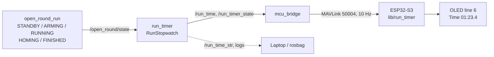

# The Run Timer Node, Explained

*A walkthrough of [`autonomy/run_timer.py`](../autonomy/run_timer.py) and the path it takes to the car's OLED, for anyone with basic Python knowledge and beginner-level ROS 2 knowledge.*

This node answers one question: **how long did that run take?** It starts a stopwatch the instant the car begins to drive, keeps it going through the return-to-start, freezes it the moment the car parks, and puts the result somewhere you can read it without a laptop — the OLED on the car itself.

It is deliberately the least important node in the stack. It subscribes to one topic, publishes three, and commands nothing. Delete it from the launch file and the car drives exactly as it did before; kill it mid-run and the car does not so much as twitch. That was the design constraint: a run timer is a nice thing to have, and nothing nice-to-have gets to sit anywhere near the steering.

## Why a separate node at all

The obvious alternative is a few lines inside `open_round_run`: note the time at GO, subtract at FINISHED, print it. That would have worked, and we did not do it for three reasons.

1. **The driving node has enough jobs.** It already runs a LiDAR pipeline, a wall-hugging controller, a lap counter client, a homing controller and six safety guards on two timers. Timing is unrelated to all of it.
2. **The number has to leave the Pi.** Getting the run time onto the OLED means a MAVLink frame, which means talking to `mcu_bridge`, which is a whole second concern to bolt onto a node whose control loop must never block.
3. **A stopwatch is trivially testable in isolation, and worthless if it is wrong.** Split out, the whole state machine is 60 lines with an injected clock and [40 tests](../test/test_run_timer.py) that run in twelve seconds. Buried inside the driving node, testing "does the clock start at exactly GO" would mean standing up a LiDAR.

The cost is one extra process and one extra topic subscription. On a Pi 4 running a LiDAR pipeline, that is not measurable.

## The whole path, end to end



Five hops, and every one of them fails safe: no `run_timer` means `mcu_bridge` never sends the frame, and the OLED keeps showing `Time --:--.-` on a line that was blank before this feature existed.

## How to run it

```bash
# It comes up with the open round launch file automatically:
ros2 launch launch/gorurgari_open_round.launch.py

# Or on its own, following whatever state machine is already running:
ros2 run autonomy run_timer --ros-args --params-file config/bot_config.yaml

# Watch the clock from anywhere on the network:
ros2 topic echo /run_time_str
```

## Topics

| Topic | Direction | Type | Purpose |
|---|---|---|---|
| `/open_round/state` | subscribes | `std_msgs/String` | the run state machine, once a second and on every transition |
| `/run_time` | publishes | `std_msgs/Float32` | elapsed seconds, live while running and frozen after |
| `/run_time_str` | publishes | `std_msgs/String` | the same thing as `MM:SS.d`, ready to read |
| `/run_timer_state` | publishes | `std_msgs/String` | `IDLE`, `RUNNING` or `STOPPED` |

All three go out together at 10 Hz, which is one message per displayed tenth of a second. `/run_timer_state` is published first in the tick, so anything reading the pair in arrival order can never latch the final time while still believing the clock is running.

## Parameters

| Parameter | Default | What it does |
|---|---|---|
| `state_topic` | `/open_round/state` | the state machine to follow |
| `start_states` | `["RUNNING"]` | entering any of these starts the clock |
| `stop_states` | `["FINISHED"]` | entering any of these freezes it |
| `reset_states` | `["STANDBY"]` | entering any of these re-arms it for the next run |
| `publish_rate_hz` | `10.0` | output rate |
| `log_period_sec` | `5.0` | seconds between progress lines, `0` for none |
| `state_timeout_sec` | `5.0` | silence on `state_topic` that means the driving node died, `0` to disable |

### Why the states are parameters

Hard-coding `RUNNING` and `FINISHED` would have been shorter. Making them lists means the same node times any state machine that publishes a string heartbeat — point `state_topic` at a different node, name its states, done. That matters here because the two rounds are not symmetric: `open_round_run` has a full `STANDBY → ARMING → RUNNING → HOMING → FINISHED` machine, while `disparity_extender` (obstacle round) stops at `RUNNING` and has no state topic at all yet. When it grows one, timing the obstacle round is a config change, not a code change.

The lists are validated at startup, and the node refuses to come up if the config cannot work:

- `start_states` empty — the clock could never start, so the node would sit there publishing zeros forever while looking healthy.
- The same state in two lists — `RUNNING` meaning both "start" and "stop" is a typo, not a policy, and guessing which one was meant is worse than saying so.

**Anything not in any of the three lists leaves the clock exactly as it is.** That is how `HOMING` keeps counting without being mentioned anywhere: driving back to the start is part of the run, and the rules time it, so the clock should not care that the phase changed. `ARMING` gets the same treatment from the other side — the countdown is not the run, so the clock stays at `00:00.0` through it.

## `RunStopwatch`: the part with no ROS in it

```python
class RunStopwatch:
    def __init__(self, clock):
        self._clock = clock
```

The clock is injected rather than called directly. In the node it is `self.get_clock().now()`, which follows `use_sim_time` so a Gazebo replay times correctly. In the tests it is a `FakeClock` the test moves by hand, so "what does the clock read after an hour" is a single line and takes no time at all to check.

`start()`, `stop()` and `reset()` each return `True` if they changed anything and `False` if they were a no-op, and each one is guarded:

- `start()` only works from `IDLE`. `open_round_run` repeats `RUNNING` on its heartbeat every second; without this guard the clock would reset to zero once a second for the whole run.
- `stop()` only works from `RUNNING`. A second `FINISHED` cannot move a time that is already final.
- `reset()` from anywhere. This is the between-runs path: restart `open_round_run`, it announces `STANDBY`, and the clock is armed again without anybody restarting this node.

### Why the clock cannot run backwards

```python
    def read(self):
        if self._state == self.RUNNING:
            now = self._clock()
            elapsed = now - self._start_mark
            if elapsed < self._elapsed:
                self._start_mark = now - self._elapsed
            else:
                self._elapsed = elapsed
        return self._elapsed
```

The ROS clock is the wall clock, and the Pi has no RTC. It boots believing it is some time in the past, and the moment WiFi comes up — during testing, when the radios are still on — NTP steps it forward by however long it was wrong. It can step backwards too.

A stopwatch that rewinds is worse than one that loses a few seconds, because a rewinding clock is obviously broken *and* unrecoverable: you have no idea what the real elapsed time was. So a backwards step is absorbed by re-hanging the start mark off the new clock: the face holds its reading and carries on from there. A forwards step is taken at face value, because there is genuinely no way to tell it from time passing.

### Stopping in the past

```python
    def stop(self, at=None):
        if at is None:
            self.read()
        else:
            self._elapsed = max(0.0, at - self._start_mark)
```

`stop()` normally freezes at now. The `at` argument exists for exactly one caller: the state timeout below, which discovers seconds *after* the fact that the run ended. Winding the face backwards is deliberate there and is the only place it is allowed, which is why it is an explicit argument rather than something the class decides for itself.

## Edge cases, and what each one is protecting against

| Situation | What happens | Why |
|---|---|---|
| Node started into a run already in progress | Times from the first `RUNNING` it sees, and logs a warning that the number is a lower bound | A run time that is quietly short is worse than one that says it is short |
| The 1 Hz heartbeat repeats `RUNNING` | Nothing; only transitions act | Otherwise the clock resets every second of every run |
| `FINISHED` arrives twice | Nothing the second time | The final time is final |
| `open_round_run` restarts between runs | Its `STANDBY` re-arms the clock at zero | Nobody should have to remember to restart the timer too |
| `open_round_run` dies mid-run | After `state_timeout_sec`, the clock freezes **at the last state message**, and logs an error | Counting up against a node that no longer exists turns a crashed run into a plausible-looking run time |
| Wall clock steps | The face never goes backwards | See above |
| A state the node does not recognise | Left alone, logged at debug | New states in the driving node must not break the timer |
| Contradictory or unstartable config | Refuses to start | A timer that silently never starts is the one failure you notice after the run |

## Getting it onto the OLED

`mcu_bridge` owns the serial port, so it is what puts the clock on the wire. It caches `/run_time` and `/run_timer_state` and sends a MAVLink frame on its own 10 Hz timer:

```xml
<message id="50004" name="gorur_gari_ros2_to_mcu_timer_msg">
    <field type="uint32_t" name="elapsed_ms">milliseconds since the run started</field>
    <field type="uint8_t" name="state">0 = idle, 1 = running, 2 = stopped</field>
</message>
```

Five bytes at 10 Hz, next to telemetry that already runs at 20 Hz and steering at 40 Hz. Two rules make the failure modes clean:

- **Nothing is sent until `/run_time` arrives for the first time.** A stack launched without `run_timer` leaves the wire byte-for-byte as it was, so this feature cannot have broken a car that is not using it.
- **Sending stops when `/run_time` goes stale** (a second of silence, ten missed frames). The firmware would rather admit its clock is stale than keep drawing a number nobody is updating.

On the MCU, [`lib/run_timer`](../../../firmware/lib/run_timer/run_timer.h) turns those five bytes into the sixth line of the display:

| State | Line |
|---|---|
| Idle, or nothing received yet | `Time --:--.-` |
| Running | `Time 01:23.4` |
| Running, frames stopped arriving | `Time 01:23.4 ?` |
| Stopped | `Time 01:23.4 END` |

The MCU never advances the clock itself. It cannot: it has no idea what state the run is in, and no way to know when homing has finished. It is a display, and treating it as one means there is exactly one clock in the system and therefore nothing that can disagree.

### Minutes are the largest unit

`MM:SS.d`, truncated rather than rounded. A WRO run is a few minutes at most, so hours would be two permanently dead characters on a 21-character line. Truncating matters more than it sounds: a stopwatch that rounds shows `1.0` when only `0.96` seconds have passed, which is a tenth of a second that has not happened yet.

The same rule is implemented twice — once in Python for `/run_time_str`, once in C++ for the panel — and the two are formatting different numbers (a float64 in one case, milliseconds that survived a `float32` topic and an integer truncation in the other). [`test_the_screen_and_the_logs_never_show_different_run_times`](../../controls/test/test_mcu_timer_msg.py) sweeps a five-minute run a millisecond at a time through the real `float32` round trip and checks the two agree at every step. They do, at all 300,000 of them.

## Testing

```bash
# The stopwatch, the formatter and the node (40 tests, no hardware)
cd ros2_ws/autonomy && python3 -m pytest test/test_run_timer.py -v

# The MAVLink message, checked against the C headers the firmware compiles
cd ros2_ws/controls && python3 -m pytest test/test_mcu_timer_msg.py -v

# The OLED line, on a desktop, from the repository root
g++ -std=c++17 -I firmware/tools/host_test -I firmware/lib/run_timer \
    firmware/lib/run_timer/run_timer.cpp \
    firmware/tools/host_test/run_timer_host_test.cpp -o /tmp/rt && /tmp/rt
```

The MAVLink test is the one worth knowing about. `mav_msg/ros2_to_mcu.xml` is compiled twice — into the pymavlink dialect the Pi imports and into the C headers the firmware includes — and nothing at runtime notices if only one of them was regenerated. The frames simply stop decoding, on a car, at a competition. So the test reads the C header off disk and checks its message ids and CRC extras against the Python dialect, and does the same for the state enum that `mcu_bridge` and the firmware each spell out by hand.
